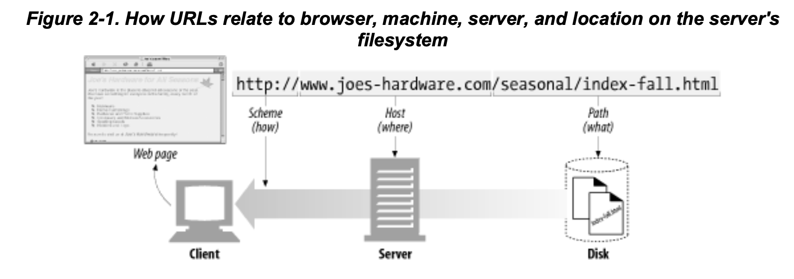

# 1장. HTTP 개관

## HTTP: 인터넷의 멀티미디어 배달부

HTTP는 신뢰성 있는 데이터 전송 프로토콜을 사용하기 때문에, 데이터가 지구 반대편에서 오더라도 전송 중 손상되거나 꼬이지 않음을 보장한다.

## 웹 클라이언트와 서버

HTTP 클라이언트와 HTTP 서버는 월드 와이드 웹의 기본 요소다.

## 리소스

- 가장 단순한 웹 리소스는 웹 서버 파일 시스템의 정적 파일
- 물론 요청에 따라 콘텐츠를 생산하는 프로그램 - 동적 콘텐츠 리소스

### 미디어 타입

MIME(Multipurpose Internet Mail Extensions, 다목적 인터넷 메일 확장)

- 멀티미디어 콘텐츠를 기술하고 라벨을 붙이기 위해 채택
- 웹 서버는 모든 HTTP 객체 데이터에 MIME 타입을 붙인다.

### URI (Uniform resource identifier, 통합 자원 식별자)

- URL
- URN

### URL (Uniform resource locator, 통합 자원 지시자)

- 특정 서버의 한 리소스에 대한 구체적인 위치를 서술
- 리소스가 정확히 어디에 있고 어떻게 접근할 수 있는지 분명히 알려준다.

### URN (Uniform resource name)

- 리소스의 위치에 영향을 받지않는 유일무이한 이름 역할

## 트랜잭션

HTTP 트랜잭션은 요청 명령(클라이언트에서 서버로 보내는)과 응답 결과(서버가 클라이언트에게 돌려주는)로 구성되어 있다.

### 메서드

모든 HTTP 요청 메시지는 하나의 메서드를 갖는다.

(GET, PUT, DELETE, ...)

### 상태 코드

모든 HTTP 응답 메시지는 상태 코드와 함께 반환된다.

(200, 400, 404, ...)

### 웹페이지는 여러 객체로 이루어질 수 있다

애플리케이션은 보통 하나의 작업을 수행하기 위해 여러 HTTP 트랜잭션을 수행한다.

## 메시지

HTTP 메시지는 단순한 줄 단위의 문자열이다 → 일반 텍스트이기 때문에 사람이 읽고 쓰기 쉽다

## TCP 커넥션

### TCP/IP

TCP는 다음을 제공한다.

- 오류 없는 데이터 전송
- 순서에 맞는 전달
- 조각나지 않는 데이터 스트림

→ TCP/IP는 각 네트워크와 하드웨어의 특성을 숨기고, 어떤 종류의 컴퓨터나 네트워크든 서로 신뢰성 있는 의사소통을 하게 해 준다.

## 웹의 구성요소

- 프락시 → 클라이언트와 서버 사이에 위치한 HTTP 중개자
- 캐시 → 많이 찾는 웹페이지를 클라이언트 가까이에 보관하는 HTTP 창고
- 게이트웨이 → 다른 애플리케이션과 연결된 특별한 웹 서버
- 터널 → 단순히 HTTP 통신을 전달하기만 하는 특별한 프락시
- 에이전트 → 자동화된 HTTP 요청을 만드는 준지능적 웹클라이언트

### 프락시

- 클라이언트와 서버 사이에 위치하여, 클라이언트의 모든 HTTP 오쳥을 받아 서버에 전달한다.
- 모든 웹 트래픽 흐름 속에서 신뢰할 만한 중개자 역항
- 요청과 응답을 필터링

### 캐시

- 웹캐시와 캐시 프락시는 자신을 거쳐가는 문서들 중 자주 찾는 것의 사본을 저장한다.
- 특별한 종류의 HTTP 프락시 서버

### 게이트웨이

- 다른 서버들의 중개자로 동작하는 특별한 서버
- HTTP 트래픽을 다른 프로토콜로 변환하기 위해 사용

### 터널

- 두 커넥션 사이에서 raw 데이터를 열어보지 않고 그대로 전달한다.
- 주로 비 HTTP 데이터를 하나 이상의 HTTP 연결을 통해 그대로 전송해주기 위해 사용

### 에이전트

- 사용자를 위해 HTTP 요청을 만들어주는 클라이언트 프로그램

---

# 2장. URL과 리소스

## 인터넷의 리소스 탐색하기

URL

- 브라우저가 정보를 찾는데 필요한 리소스의 위치를 가리킨다.
- 애플리케이션이 리소스에 접근할 수 있는 방법을 제공한다.

대부분의 URL은 동일하게 `scheme://server location/path` 구조로 이루어져 있다.

## URL 문법

대부분의 URL 스킴의 문법은 일반적으로 9개 부분으로 나뉜다.

`<scheme>://<u>ser:<password>@<host>:<port>/<path>;<params>?<query>#<frag>`

### Scheme: 사용할 프로토콜

- 주어진 리소스에 어떻게 접근하는지 알려주는 중요한 정보다.
- 어떤 프로토콜을 사용하여 리소스를 요청해야 하는지 알려준다.

### 호스트와 포트

- 호스트는 리소스를 가지고 있는 인터넷상의 호스트 장비를 가리킨다.
- 포트는 서버가 열어놓은 네트워크 포트를 가리킨다.

### 경로

- 리소스가 서버의 어디에 있는지 알려준다.
- 계층적 파일 시스템 경로와 유사한 구조를 가진다.

### 파라미터

- 애플리케이션이 서버에 정확한 요청을 하기 위해 필요한 입력 파라미터를 받는데 사용한다.

## 단축 URL

### 상대 URL

절대 URL은 리소스에 접근하는데 필요한 모든 정보를 가지고 있는 반면, 상대 URL은 그렇지 않다.

> ❗️상대 URL은 URL을 짧게 표기하는 방식이다.
> 
- base url 을 사용하여 상대적으로 짧게 리소스를 표시할 수 있다.

## 안전하지 않은 문자

안전한 전송이란, 정보가 유실될 위험 없이 URL을 전송할 수 있다는 것을 의미한다.

### URL 문자 집합

- US-ASCII 에서 사용이 금지된 문자들인 이스케이프 문자열을 쓸 수 있도록 설계하였다.

> 🤔 이 문제의 모든 결론은, 그냥 클라이언트에서 인코딩해서 보내면 된다는 것이다.
>

---

# 3장. HTTP 메시지

> ❗️ HTTP가 인터넷의 배달원이라면, HTTP 메시지는 무언가를 담아 보내는 소포와 같다.
> 

## 메시지의 흐름

- HTTP 메시지는 HTTP 애플리케이션 간 주고받은 데이터의 블록들이다.
- 메시지들은 클라이언트, 서버, 프락시 사이를 흘러다닌다.
- 인바운드, 아웃바운드, 업스트림, 다운스트림 전부 메시지의 방향을 나타내는 용어들이다.

### 메시지는 원 서버 방향을 인바운드로 하여 송신된다.

- 인바운드 → 메시지가 서버로 향하는 것
- 아웃바운드 → 메시지가 사용자 에이전트로 돌아오는 것

### 다운스트림으로 흐르는 메시지

> ❗️HTTP 메시지는 강물과 같이 흐른다. → 모든 메시지는 다운스트림으로 흐른다.
> 

## 메시지의 각 부분

HTTP 메시지는 단순한, 데이터의 구조화된 블록이다.

- 시작줄 → 어떤 메시지인지 서술
- 헤더 블록 → 속성
- 본문 → 데이터 (없을 수도 있음)

### 메시지 문법

- 요청 메시지
- 응답 메시지

### 시작줄

- 요청 메시지 → 무엇을 해야 하는지 말해준다.
    - 요청줄 = 메서드, 요청 URL, HTTP 버전 등을 가지고 있다.
    - 메서드 = 서버가 무엇을 해야하는지 알려준다.
- 응답 메시지 → 무슨 일이 일어났는지 말해준다.
    - 응답줄 = HTTP 버전, 상태코드, 수행 상태에 대한 사유 구절 등을 가진다.
    - 상태 코드 = 클라이언트에게 무엇이 일어났는지 말해준다.
    - 사유 구절 = 상태코드에 대한 글로 된 설명을 제공한다.

### 헤더

- 일반 헤더 → 요청과 응답 양쪽 모두 나타낼 수 있음
- 요청 헤더 → 요청에 대한 부가 정보를 제공
    - 요청이 최초 발생한 곳에서 누가, 혹은 무엇이 그 요청을 보냈는지에 대한 정보
    - 클라이언트의 선호나 능력에 대한 정보
- 응답 헤더 → 응답에 대한 부가 정보를 제공
    - 누가 응답을 보내는지
    - 응답자의 스펙이 어떻게 되는지
    - 응답에 대한 특별한 설명도 추가로 제공할 수 있음
- Entity 헤더 → 본문 크기와 콘텐츠, 혹은 리소스 그 자체를 서술
    - 메시지의 수신자에게 자신이 다루고 있는 것이 무엇인지 설명
- 확장 헤더 → 명세에 정의되지 않은 새로운 헤더

### 엔터티 본문

> ❗️HTTP 메시지의 화물
> 

## 메서드

비록 서버가 모든 메서드를 구현하지 않았다 하더라도 메서드는 대부분 제한적으로 사용될 것이다.

### 안전한 메서드

> 👉보통 GET, HEAD 메서드가 안전하다고 한다.
> 
- HTTP 요청의 결과로 인해 서버에서 일어나는 일이 아무것도 없을 때
- 서버에 작용을 유발하지 않는다는 보장은 없다.

**GET = 리소스 줘**

**HEAD = 헤더라도 줘**

**PUT = 문서 써 줘**

- 요청 URL의 이름대로 새 문서를 만들거나
- 이미 존재한다면 본문을 사용해서 교체한다.

**POST = 데이터 받아**

**TRACE = 어케 되는 중?**

**OPTIONS = 내가 뭐 할 수 있는지 알려줘**

**DELETE = 지워줘**

## 상태 코드

상태 코드는 클라이언트에게 그들의 트랜잭션을 이해할 수 있는 쉬운 방법을 제공한다.

**100-199 = 정보성 상태코드**

- 100-Continue 에 대해서 한번 더 책을 읽어보자. (클라이언트, 서버, 프락시)

**200-299 = 성공 상태코드**

**300-399 = 리다이렉션 상태 코드**

- HTTP 버전별로 지원하는 상태코드가 다르다.
- 그래서 가장 적절한 리다이렉트 상태코드를 선택하기 위해 클라이언트의 HTTP 버전을 검사할 필요가 있다.

**400-499 = 클라이언트 에러 상태 코드**

**500-599 = 서버 에러 상태 코드**

- 프락시는 클라이언트의 입장에서 서버와 대화를 시도할 때 자주 만난다.

---

# 4장. 커넥션 관리

## TCP 커넥션

> 👍 일단 커넥션이 맺어지면 클라이언트와 서버 컴퓨터 간에 주고받는 메시지들은 손실 혹은 손상되거나 순서가 바뀌지 않고 안전하게 전달된다.
> 

### 신뢰할 수 있는 데이터 전송 통로인 TCP

- HTTP 커넥션은 몇몇 사용 규칙을 제외하고는 TCP 커넥션에 불과하다.
- TCP는 HTTP에게 신뢰할 만한 통신 방식을 제공한다.

### TCP 스트림은 세그먼트로 나뉘어 IP 패킷을 통해 전송된다

- TCP는 IP 패킷이라고 불리는 작은 조각을 통해 데이터를 전송한다.
- HTTP가 메시지를 전송할 때, 연결된 TCP 커넥션을 통해 메시지를 순서대로 보낸다.

### TCP 커넥션 유지하기

컴퓨터는 항상 TCP 커넥션을 여러 개 가지고 있고, TCP는 포트 번호를 통해서 이런 여러 개의 커넥션을 유지한다.

`<source-IP-address, source-port, destination-IP-address, destination-port>`

> ❗️모두 똑같이 가리키고 있는 커넥션은 있을 수 없다!
> 

### TCP 소켓 프로그래밍

- 소켓 API를 사용하면, TCP endpoint 데이터 구조를 생성하고,
- 원격 서버의 TCP endpoint에 그 endpoint 데이터 구조를 연결하여 데이터 스트림을 읽고 쓸 수 있다.

## TCP의 성능에 대한 고려

> 🤔 HTTP는 TCP 바로 위에 있는 계층이기 때문에 HTTP 트랜잭션의 성능은 그 아래 계층인 TCP 성능에 영향을 받는다.
> 

### HTTP 트랜잭션 지연

트랜잭션을 처리하는 시간은 TCP 커넥션을 설정하고, 요청을 전송하고, 응답 메시지를 보내는 것에 비하면 상당히 짧은 것을 알 수 있다.

HTTP 트랜잭션을 지연시키는 원인은 여러가지가 있다.

1. 클라이언트는 URI에서 웹 서버의 IP 주소와 포트 번호를 알아내야 한다.
2. 클라이언트는 TCP 커넥션 요청을 서버에게 보내고 서버가 커넥션 허가 응답을 회신하기를 기다린다.
3. 요청 메시지가 인터넷을 통해 전달되고 서버에 의해 처리되는데 시간이 소요된다.
4. 웹 서버가 HTTP 응답을 보내는 것 또한 시간이 소요된다.

### TCP 커넥션 핸드쉐이크 지연

### 확인응답 지연

인터넷 자체가 패킷 전송을 완벽하게 보장하지는 않기 때문에

- TCP는 성공적인 데이터 전송을 보장하기 위해 자체 확인 체계를 가진다.
- 각 TCP 세그먼트는 순번과 데이터 무결성 체크섬을 가진다.

### TCP 느린 시작

### 네이글 알고리즘, TCP_NODELAY

- TCP가 작은 크기의 데이터를 포함한 많은 수의 패킷을 전송한다면 네트워크 성능이 크게 떨어진다.
- 네이글 알고리즘은 패킷을 전송하기 전, 많은 양의 TCP 데이터를 하나의 덩어리로 합친다.
    - 크기가 작은 HTTP 메시지는 패킷을 채우지 못해 계속 기다린다.
    - 확인응답 지연과 함께 쓰이면 형편이 없다.

### TIME_WAIT의 누적과 포트 고갈

보통은 이전 커넥션의 호스트와 포트번호를 저장해두고, 같은 커넥션이 한 번 닫히면 다시 열리는 것을 방지한다.

말그대로 하도 많이 저장해두거나 연결되어서 기다리는 시간이 쌓이고, 포트가 부족한 것이다.

## HTTP 커넥션 관리

### 흔히 잘못 이해하는 Connection 헤더

`Connection 헤더`

- HTTP 헤더 필드 명은, 이 커넥션에만 해당되는 헤더들을 나열
- 임시적인 토큰 값은, 커넥션에 대한 비표준 옵션을 의미한다.
- close 값은, 커넥션이 작업이 완료되면 종료되어야 함을 의미한다.

> ❗️지금 현재 커넥션만을 위한 정보이므로, 다음 커넥션에 전달되면 안된다!!
> 

→ Connection 헤더에 있는 모든 헤더 필드는 메시지를 다른 곳으로 전달하는 시점에 삭제되어야 한다.

### 순차적인 트랜잭션 처리에 의한 지연

→ 당연히 이미지 네 개 불러오는데, 하나씩 차례차례 불러오면 느리다. 그니까 또 병렬이 등장한다.

- 병렬 커넥션
- 지속 커넥션
- 파이프라인 커넥션
- 다중 커넥션

## 병렬 커넥션

> 👍 할당받은 각 TCP 커넥션상의 트랜잭션을 통해 병렬로 내려받는다.
> 

### 병렬 커넥션은 페이지를 더 빠르게 내려받는다.

- 트랜잭션들이 각각 병렬로 이루어지기 때문에 총 지연시간이 줄어든다.

### 병렬 커넥션이 항상 더 빠르지는 않다.

- 클라이언트의 네트워크 대역폭이 좁으면 안습이다.
- 사람이 많아지면? 100명이 100개의 커넥션? → 상상만해도 끔찍하다.

### 병렬 커넥션은 더 빠르게 ‘느껴질 수’ 있다.

> ❗️병렬 커넥션이 페이지를 항상 더 빠르게 로드하지는 않는다.
> 

## 지속 커넥션

처리가 완료된 후에도 계속 연결된 상태로 있는 TCP 커넥션

→ 커넥션을 다시 준비하는 시간을 아낄 수 있다.

### 지속 vs 병렬

**지속 커넥션의 장점**

- 커넥션을 맺기 위한 사전 작업과 지연을 줄인다.
- 튜닝된 커넥션을 휴지한다.
- 커넥션의 수를 줄여준다.

**지속 커넥션의 단점**

- 계속 연결된 상태로 있으면 커넥션이 쌓인다. → 리소스에 불필요한 소모를 발생시킴

> 🤔 이쯤되니 운영체제 할 때가 생각나지 않나? → 섞으면 제일 효과적이라는 것
> 

## 파이프라인 커넥션

몇 가지 제약사항이 있다.

- HTTP 클라이언트는 커넥션이 지속 커넥션인지 확인하기 전까지는 파이프라인을 이으면 안된다.
- HTTP 응답은 요청 순서와 같게 와야 한다.
- HTTP 클라이언트는 커넥션이 언제 끊어지더라도, 완료되지 않은 요청이 파이프라인에 있으면 언제든 다시 요청을 보낼 준비가 되어 있어야 한다.
- HTTP 클라이언트는 POST 요청같이 반복해서 보낼 경우 문제가 생기는 요청은 파이프라인을 통해 보내면 안 된다.

## 커넥션 끊기에 대한 미스터리

> 🤔 일단 언제 어떻게 커넥션을 끊는가에 대한 명확한 기준은 없다.
> 

### 마음대로 끊기

- HTTP 애플리케이션은 언제든지 지속 커넥션을 임의로 끊을 수 있다.
- 그런데, 서버가 그 유휴상태에 있는 커넥션을 끊는 시점에, 서버는 클라이언트가 데이터를 전송하지 않을 것이라고 확신하지 못한다.

### Content-Length와 Truncation

- 클라이언트나 프락시가 커넥션이 끊어졌다는 HTTP 응답을 받은 후
- 실제 전달된 엔터티의 길이와 Content-Length의 값이 일치하지 않거나
- Content-Length 자체가 존재하지 않으면 수신자는 데이터의 정확한 길이를 서버에게 물어봐야 한다.

### 커넥션 끊기의 허용, 재시도, 멱등성

- 커넥션은 심지어 에러가 없더라도 언제든지 끊을 수 있다.
- HTTP 애플리케이션은 예상치 못하게 커넥션이 끊어졌을 때 적절히 대응할 수 있는 준비가 되어 있어야한다.
- 클라이언트는 POST와 같이 멱등성이 아닌 요청은 파이프라인을 통해 요청하면 안된다.

### 우아한 커넥션 끊기

- 전체 끊기와 절반 끊기

- TCP 끊기와 리셋 에러
    - 보통은 커넥션의 출력 채널을 끊는 것이 안전하다.

- 우아하게 커넥션 끊기
    - 애플리케이션 자신의 출력 채널을 먼저 끊고, 다른 쪽에 있는 기기의 출력 채널이 끊기는 것을 기다린다.
    - 출력 채널에 절반 끊기를 하고 난 후에도 데이터나 스트림의 끝을 식별하기 위해 입력 채널에 대해 상태 검사를 주기적으로 해야한다.