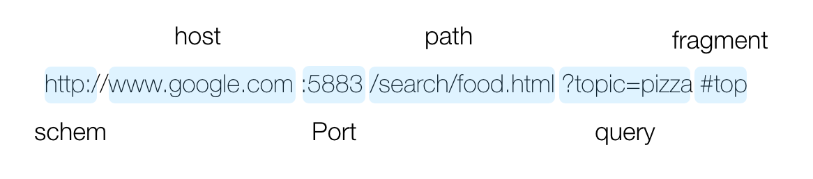
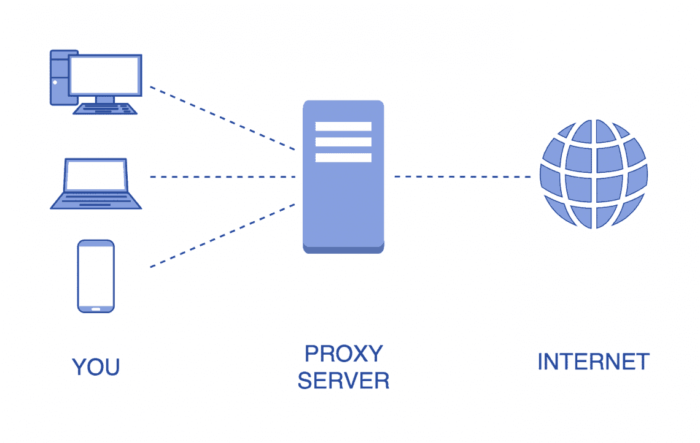
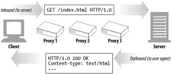
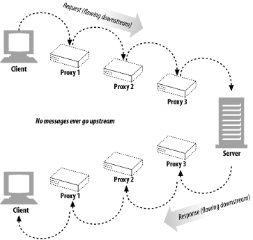
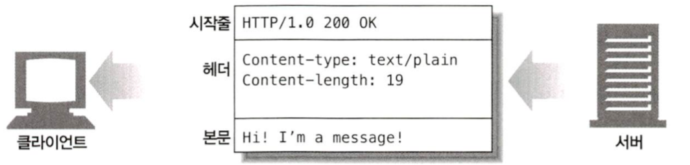
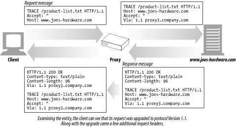

# chap 1-3 (HTTP 개요)

### HTTP: 인터넷의 멀티미디어 배달부

웹에서 통신할 때 데이터가 누락된 것이 없는지에 대한 걱정을 하지 않는다. 이것은 네트워크 차원에서 신뢰성을 보장하기 때문(신뢰성 있는 데이터 전송 프로토콜을 사용)

주고 받는 데이터의 포맷은 다양하다. (text, image, video 등)

### 웹 클라이언트와 서버

HTTP 프로토콜로 의사소통 하는 두 개의 주체를 HTTP 클라이언트, HTTP 서버라고 한다.

### 리소스

웹 서버가 제공하는 모든 콘텐츠, 어떤 종류의 콘텐츠 소스도 리소스가 될 수 있다.

**미디어 타입(Multipurpose Internet Mail Extensions : MIME)**

수천 가지의 데이터 타입을 정형화한 포맷

웹 서버는 모든 HTTP 객체 데이터에 MIME 타입을 붙인다.

**URI(uniform resource identifier)**

리소스를 고유하게 식별하고 위치를 지정하기 위한 이름

애플리케이션이 서버 리소스에 접근하기 위한 하나의 **통일된 인터페이스**이다.

fragment 라는 부분은 조금 생소할 수 있는데, 한 페이지 안에서 위치를 특정하기 위함이다. (깃헙 리드미에서도 사용할 수 있다.)

### 트랜잭션

클라이언트의 요청과 서버의 응답의 쌍을 하나의 트랜잭션이라고 한다. **HTTP 메시지** 라고 불리는 정형화된 데이터 덩어리를 이용해 이루어진다.

### TCP 커넥션

HTTP 로 신뢰성있는 메시지 송/수신이 가능한 이유

TCP/IP 가 보장해주는 것

- 오류 없는 데이터 전송
- 순서에 맞는 전달
- 조각나지 않는 데이터 스트림

TCP/IP는 TCP와 IP가 층을 이루는, 패킷 교환 네트워크 프로토콜의 집합이다. 각 네트워크와 하드웨어의 특성을 숨기고, 어떤 종류의 컴퓨터나 네트워크든 서로 **신뢰성 있는 의사소통**을 하게 도와준다.

### 프로토콜 버전

- HTTP/0.9
   - 심각한 디자인 결함 존재, 구식 클라이언트하고만 같이 사용할 수 있다.
   - GET 메소드만 지원, MIME 타입, HTTP 헤더, 버전 번호는 지원하지 않음.
- HTTP/1.0
   - 본격적으로 쓰이기 시작
   - 헤더, 추가 메서드, 멀티미디어 객체 처리 추가
   - 잘 정의된 명세는 아니다.
- HTTP/1.0+
   - keep-alive 커넥션
   - 가상호스팅 지원, 프락시 연결지원
- HTTP/1.1
   - 구조적 결함 교정, 성능 최적화, 잘못된 기능 제거
   - 현재 널리 쓰이는 HTTP 버전
- HTTP/2.0
   - HTTP/1.1 성능 개선
   - Multiplexing 으로 기존의 pipelining 의 단점 극복

### 웹의 구성요소

**프락시**

많이 찾는 웹페이지를 클라이언트 가까이에 보관하는 HTTP 창고

클라이언트의 모든 HTTP 요청을 받아 서버에 대신 전달하는 서버

**캐시**

많이 찾는 웹페이지를 클라이언트 가까이에 보관하는 HTTP 창고

웹캐시와 캐시 프락시는 자신을 거쳐가는 문서들 중 자주 찾는 것의 사본을 저장해두는 특별한 종류의 HTTP 프락시 서버

**게이트웨이**

다른 애플리케이션과 연결된 특별한 웹 서버

게이트웨이는 주로 HTTP 트래픽을 다른 프로토콜로 변환하기 위해 사용된다.

스스로가 리소스를 갖고 있는 **진짜 서버**인 것처럼 요청을 다룬다. 클라이언트는 자신이 게이트웨이와 통신하고 있음을 알아채지 못할 것이다.

**터널**

단순히 HTTP 통신을 전달하기만 하는 특별한 프락시

두 커넥션 사이에서 raw 데이터를 열어보지 않고 그대로 전달해주는 HTTP 애플리케이션

### 메시지의 흐름

**메시지는 원 서버 방향을 인바운드로 하여 송신된다.**

서버를 기준으로 들어가는 방향이 인바운드, 서버에서 외부로 나가는 방향을 아웃바운드라 한다.

**다운스트림으로 흐르는 메시지**

메시지는 결코 업스트림으로 흐르지 않는다. 메시지의 발송자는 수신자의 업스트림이다.

### HTTP 메시지의 각 부분

메시지는 시작줄, 헤더, 본문으로 구성된다.

- 시작줄 : 어떤 메시지인지 서술
- 헤더 : 속성
- 본문 : 데이터를 담는다. (아예 없을 수도 있다)

**시작줄**

모든 HTTP 메시지는 시작줄로 시작한다. 요청 메시지의 시작줄은 **무엇을 해야하는지** 말해준다. 응답 메시지의 시작줄은 **무슨 일이 일어났는지** 말해준다.

### 헤더

HTTP 헤더 필드는 요청과 응답 메시지에 추가 정보를 더한다.

- 일반 헤더 : 요청과 응답 양쪽에 모두 나타날 수 있음
- 요청 헤더 : 요청에 대한 부가 정보를 제공
- 응답 헤더 : 응답에 대한 부가 정보를 제공
- Entity 헤더 : 본문 크기와 콘텐츠, 혹은 리소스 그 자체를 서술
- 확장 헤더 : 명세에 정의되지 않은 새로운 헤더

[헤더에 관해 정리가 아주 잘된 블로그](https://gmlwjd9405.github.io/2019/01/28/http-header-types.html)가 있다.

### HTTP 메소드

[mdn doc 을 참고하자.](https://developer.mozilla.org/ko/docs/Web/HTTP/Methods)

TRACE 는 조금 생소하다.

**TRACE**

Client로 부터 Request Packet이 방화벽, Proxy Server, Gateway등을 거치면서 packet의 변조가 일어날 수 있는데, 이 때 **Server에 도달 했을 때의 최종 Packet의 Request Packet을 볼수 있다**.

- 즉, **Original Data와 서버에 도달했을 때의 비교본 Data를 서버의 응답 Body를 통해 확인 할 수 있다.**
- 요청의 최종 수신자는 반드시 **송신자에게 200(OK) 응답의 내용(Body)로 수신한 메세지를 반송**해야 한다.
- **최초 Client의 요청에는 Body가 포함될수 없다.**

