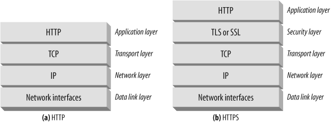
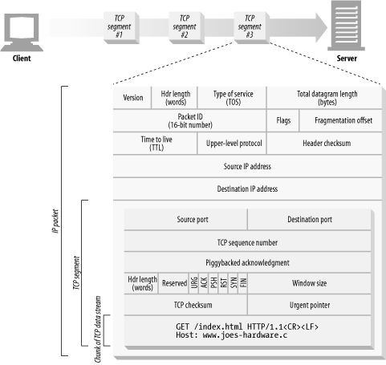
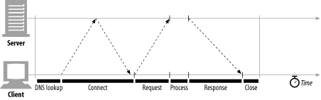
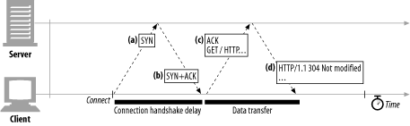
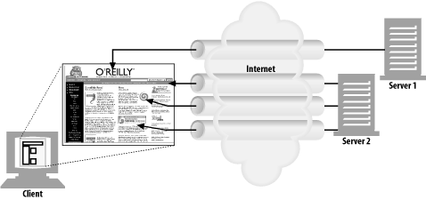
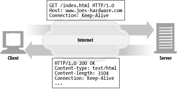
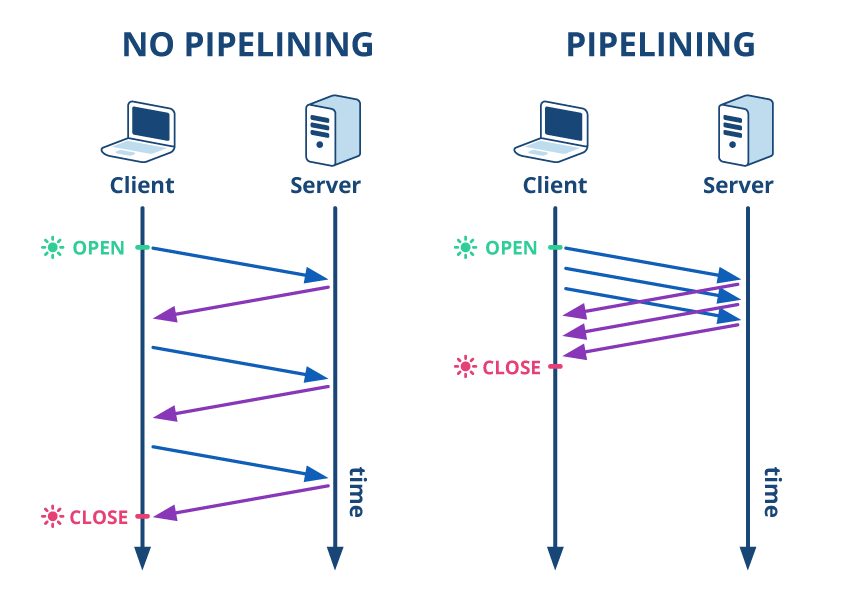
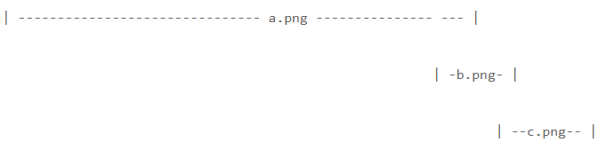
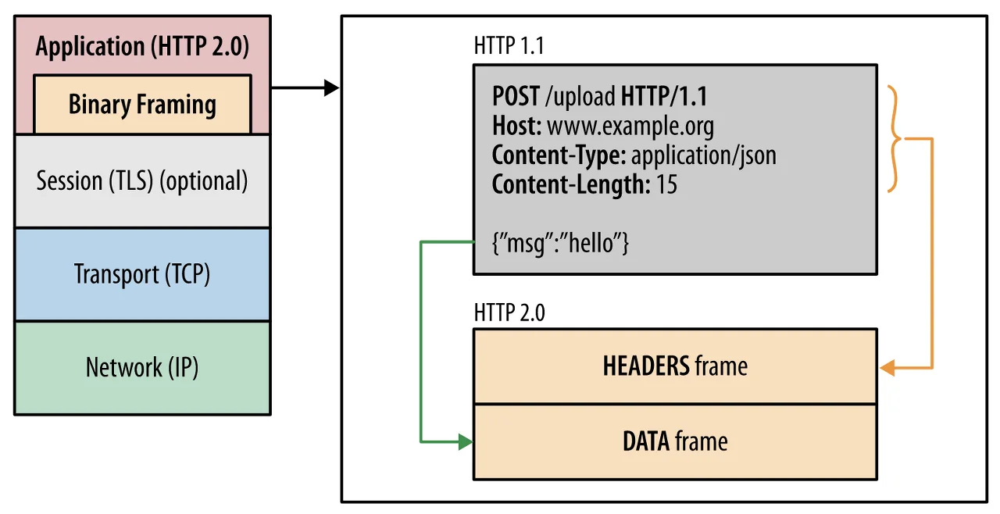
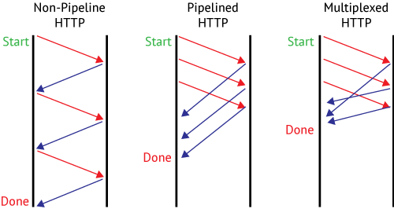

# chap 4 (커넥션 관리)

## TCP 커넥션

HTTP 통신은 네트워크 장비에서 사용하는 전송 프로토콜인 TCP/IP를 통해 이루어진다. TCP/IP 위에서 전송되기 때문에 메시지의 무결성, 순서 등을 보장할 수 있는데, 이러한 특징을 신뢰성 있는 연결이라 한다.

**브라우저가 HTTP 를 통해 웹서버에서 데이터를 받아오는 7단계**

URL : [http://www.joes-hardware.com:80/power-tools.html](http://www.joes-hardware.com/power-tools.html)

1. [www.joes-hardware.com이라는](http://www.joes-hardware.xn--com-f42mh0r1y0a/) 호스트 명을 추출한다.
2. 이 호스트 명에 대한 IP 주소를 찾는다.

[www.joes-hardware.com](http://www.joes-hardware.com/) -> 202.43.78.3

3. 포트번호(80)를 얻는다.
4. **202.43.78.3의 80포트로 TCP 커넥션을 생성한다.**
5. 서버로 HTTP GET 요청 메시지를 보낸다.
6. 서버에서 온 HTTP 응답 메시지를 읽는다.
7. 커넥션을 끊는다.

### HTTP 커넥션은 몇몇 사용 규칙을 제외하고는 TCP 커넥션에 불과하다.

### TCP 스트림은 세그먼트로 나뉘어 IP 패킷을 통해 전송된다.

TCP는 IP 패킷(또는 IP 데이터그램)이라고 불리는 데이터 조각으로 전송된다. 관계된 프로토콜 스택을 보면 아래와 같다.

HTTP는 `'IP, TCP, HTTP'`로 구성된 `프로토콜 스택`에서 최상위 계층이다.

TCP는 `세그먼트`라는 단위로 데이터 스트림을 잘게 나누고, 세그먼트를 IP 패킷이라고 불리는 봉투에 담아서 인터넷을 통해 데이터를 전달한다.

이 모든 것은 TCP/IP 소프트웨어에 의해 처리되며, 그 과정은 HTTP 프로그래머에게 보이지 않는다.

위 그림에서 제일 밑에 HTTP 메시지가 TCP 세그먼트의 일부로 들어가있다.

### TCP 커넥션 유지하기

컴퓨터는 항상 TCP 커넥션을 여러 개 가지고 있다. TCP는 포트 번호를 통해서 여러 개의 커넥션을 유지한다

커넥션은 네 가지 값으로 식별할 수 있다. `<발신지 IP주소, 발신지 포트, 수신지 IP주소, 수신지 포트>`

**그리고 서로 다른 두 개의 TCP 커넥션은 위 네가지 구성요소의 값이 모두 같을 수 없다.**

### TCP 소켓 프로그래밍

소켓 API를 사용하면, TCP 종단(endpoint) 데이터 구조를 생성하고, 원격 서버의 TCP 종단에 그 종단 데이터 구조를 연결하여 데이터 스트림을 읽고 쓸 수 있다.

**소켓 API 는 HTTP 프로그래머에게 TCP와 IP의 세부사항을 숨긴다. 통일된 인터페이스인 셈이다.**

먼저 유닉스 운영체제용으로 개발되었고, 지금은 다양한 구현체가 생겨났다.

### HTTP 통신은 TCP 성능에 절대적으로 의존한다

1. **HTTP 트랜잭션 지연**

트랜젝션을 처리하는 시간은 TCP 커넥션을 설정하고, 요청을 전송하고, 응답 메시지를 보내는 것에 비하면 상당히 짧다. 대부분의 HTTP 지연은 TCP 네트워크 지연 때문에 발생한다.

**위 그림에서 알 수 있듯이 처음 커넥션을 여는것과 Request, Response 데이터가 오고 가는데에 대부분의 시간을 다 소모한다.** 정작 실제 서버 데이터 처리 시간은 그에 비하면 매우 짧다.

2. **성능 관련 중요 요소**
- TCP 커넥션의 핸드셰이크 설정
- 인터넷의 혼잡을 제어하기 위한 TCP의 slow-start
- 데이터를 한데 모아 한 번에 전송하기 위한 nagle 알고리즘
- TCP의 piggyback, acknowledgment을 위한 확인응답 지연 알고리즘
- TIME_WAIT 지연과 포트 고갈
3. TCP 커넥션의 핸드셰이크 지연

어떤 데이터를 전송하든 새로운 TCP 커넥션을 열 때면, TCP 소프트웨어는 커넥션을 맺기 위한 조건을 맞추기 위해 연속으로 IP 패킷을 교환한다.

HTTP 프로그래머는 커넥션의 핸드셰이크를 보지 못한다. 그리고 총 세 번의 네트워크 비용이 발생하기 때문에 커넥션을 생성하는 것은 비용이 굉장히 큰 작업이다.

매번 커넥션을 만들지 않고 재활용 하자.

4. 확인응답 지연

TCP는 성공적인 데이터 전송을 보장하기 위해서 자체적인 확인 체계를 가진다.

각 TCP 세그먼트는 순번과 데이터 무결성 체크섬을 가진다. 각 세그먼트의 수신자는 세그먼트를 온전히 받았다는 의미로 확인응답(ACK) 패킷을 송신자에게 반환한다.

이 값은 하나의 비트기 때문에 이 비트 하나를 위한 패킷을 만들기에는 아깝다. 그렇기 때문에 방향이 같은 다른 패킷에 동승(piggyback)한다. 확인응답 지연은 효율적으로 확인응답을 보내기 위해 동승할 패킷을 위해 기다리는 행위이다. 기다리다 늦어지면 물론 별도의 패킷을 만들어야 한다.

5. TCP slow-start

TCP 커넥션은 시간이 지나면서 자체적으로 튜닝 되어서 처음에는 커넥션의 최대 속도를 제한하고 데이터가 성공적으로 전송됨에 따라서 속도 제한을 높여나간다.

네트워크의 대역폭은 미리 알수가 없기 때문에 데이터를 처음에는 낮은 속도로 보내다가, 조금씩 그 속도를 늘린다. 이 때문에 **TCP 커넥션이 열린 직후는 속도가 느릴 수 밖에 없고, 이를 slow-start라 부른다.**

6. Nagle 알고리즘과 TCP_NODELAY

네이글 알고리즘은 네트워크 효율을 위해서, 패킷을 전송하기 전에 많은 양의 TCP 데이터를 한 개의 덩어리로 합친다. 그러나, 네이글 알고리즘은 HTTP 성능 관련해 여러 문제를 발생시킨다.

- 앞으로 생기지 않을지 모르는 추가적인 데이터를 기다리며 지연될 것이다.
- 확인응답 지연과 함께 쓰일 경우, 형편없이 동작한다.

## HTTP 커넥션 관리

HTTP 커넥션의 성능을 향상시키기 위해서 다음 네 가지 전략을 생각해 냈다.

- 병렬 커넥션 - 여러 개의 TCP 커넥션을 통한 동시 HTTP 요청
- 지속 커넥션 - 커넥션을 맺고 끊는 데서 발생하는 지연을 제거하기 위한 TCP 커넥션의 재활용
- 파이프라인 커넥션 - 공유 TCP 커넥션을 통한 병렬 HTTP 요청
- 다중 커넥션 - 요청과 응답들에 대한 중재

### Connection 헤더에 대한 잘못된 이해를 바로잡자

HTTP 메시지는 클라이언트에서 서버까지 중개 서버들을 하나하나 거치면서 전달된다. 그리고 두 개의 인접한 HTTP 애플리케이션이 현재 맺고 있는 커넥션에만 적용될 옵션을 지정해야 할 때가 있다.

HTTP Connection 헤더 필드는 해당 옵션을 표현하며, 그 값들은 다른 커넥션에 전달되지 않는다.

**즉, Connection 헤더에 있는 모든 헤더 필드는 메시지를 다른곳으로 전달하는 시점에 삭제되어야 한다.**

Connection 헤더가 포함된 메시지를 전달받은 HTTP 애플리케이션은 요청에 기술되어 있는 모든 옵션을 적용하고, 다음 홉(hop)에 메시지를 전달하기 전에 Conneciton 헤더와 Connection 헤더에 기술되어 있던 모든 헤더를 삭제해야한다.

### 병렬 커넥션

클라이언트가 여러 개의 커넥션을 맺음으로써 여러 개의 HTTP 트랜잭션을 병렬로 처리할 수 있게 한다.

병렬 커넥션의 특징을 다음과 같다.

- 페이지를 더 빠르게 내려받는다
   - 세 개의 트랜젝션이 각각 별도의 커넥션에서 동시에 처리된다. 이미지를 병렬로 내려받아 커넥션 지연이 겹쳐짐으로써 **총 지연시간이 줄어든다**
- 하지만 병렬 커넥션이 항상 더 빠르지는 않다
   - 네트워크 대역폭 자체가 제한된 경우 성능상 이점이 없다.
   - 다수의 커넥션은 메모리를 많이 소모하고 자체적인 성능 문제를 발생시킨다.
   - 그래서 브라우저는 실제로 병렬 커넥션을 사용하긴 하지만 **적은 수(6~8)의 병렬 커넥션만을 허용**한다.
- 병렬 커넥션은 더 빠르게 '느껴질 수' 있다
   - 병렬 커넥션이 페이지를 항상 더 빠르게 로드하는 것은 아니지만, 사용자 입장에서 동시에 내려받는 것을 보면 더 빠르게 내려받고 있는 것 처럼 느낄 수 있다

### 지속 커넥션

HTTP/1.0+ 이상의 기기는 처리가 완료된 후에도 TCP 커넥션을 유지하여 앞으로 있을 HTTP 요청에 재사용할 수 있다. 이처럼 계속 연결된 상태로 있는 TCP 커넥션을 `지속 커넥션` 이라고 부른다.

**새로운 TCP 핸드셰이크를 하는 비용을 아끼고, TCP의 성능 향상을 기대할 수 있다.**

### 지속 커넥션 vs 병렬 커넥션

앞서 병렬 커넥션에는 다음과 같은 단점이 있었다.

- 각 트랜젝션마다 새로운 커넥션을 맺고 끊기 때문에 시간과 대역폭 소요된다,
- 각각의 새로운 커넥션은 TCP 의 slow-start 특성때문에 성능이 떨어진다.
- 실제로 연결할 수 있는 병렬 커넥션의 수에는 제한이 있다.

지속 커넥션은 위의 제한을 어느정도 극복할 수 있기 때문에 **병렬 커넥션과 지속 커넥션을 함께 사용한다.**

지속 커넥션은 두 가지 타입이 있다. HTTP/1.0+ 에는 `keep-alive` 커넥션이 있고 HTTP/1.1에는 `지속` 커넥션이 있다.

**HTTP/1.0+의 Keep-Alive 커넥션**

HTTP/1.0 에서 지속 커넥션을 구현하기 위해 Keep-Alive 커넥션이라는 개념을 도입했다. 이 개념은 설계에 문제가 있어서 HTTP/1.1 부터는 사용되지 않지만 아직도 많은 클라이언트와 서버는 이 초기 keep-alive 핸드셰이크를 활용한 지속 커넥션 방식을 사용하고 있다. 떄문에 우리가 만들 HTTP 애플리케이션 또한 그것을 처리할 수 있게 개발해야한다.

**Keep-Alive 동작 방식**

- 지속 커넥션을 요청하기 위해 클라이언트는 헤더필드에 `Connection:Keep-Alive` 헤더를 포함시킨다.
- 서버가 요청을 받고 그 다음 요청도 이 커넥션을 통해 받고자 한다면, 응답 메시지에도 같은 헤더를 포함시켜 응답한다.
- 서버의 응답에 Connection: Keep-Alive 헤더가 없으면 클라이언트는 서버가 keep-alive를 지원하지 않으며 커넥션이 끊길 것이라 생각한다.

**Keep-Alive 커넥션 제한과 규칙**

- Keep-Alive는 HTTP/1.0에서 기본 값은 아니다.
- 클라이언트가 지속 커넥션을 요청했더라도 이를 행할지는 서버의 결정이다.
- 커넥션을 계속 유지하려면 모든 메시지에 헤더를 포함해야 한다.

**HTTP/1.1의 지속 커넥션**

HTTP/1.1에서는 Keep-Alive 커넥션을 지원하지 않는 대신 설계가 더 개선된 `지속 커넥션`을 지원한다. 별도 설정을 하지 않는 한, 모든 커넥션을 지속커넥션으로 취급한다.

Keep-Alive 와는 다르게 지속 커넥션은 기본적으로 활성화되어 있다. 지속 커넥션을 끊으려면 Conneciton: close 헤더를 명시해야 한다.

Connection: close 헤더가 없으면 응답 후에도 커넥션은 유지하자는 것으로 추정하지만 클라이언트와 서버는 언제든 커넥션을 끊을 수 있다. **Connection: close 헤더를 보내지 않는 것이 서버가 커넥션을 영원히 유지하겠다는 것을 뜻하지는 않는다.**

**지속 커넥션의 제한과 규칙**

- 클라이언트가 요청에 Connection: close 헤더를 포함해 보냈으면, 클라이언트는 그 커넥션으로 추가적인 요청을 보낼 수 없다.
- 클라이언트는 추가적인 요청이 없다면 마지막 요청에 Connection: close 헤더를 포함해 보내야 한다.
- HTTP/1.1 기기는 Connection 헤더의 값과는 상관없이 언제든지 커넥션을 끊을 수 있다.

### 파이프라인 커넥션(HTTP/1.1 Pipelining)

HTTP Pipelining 이란 HTTP1.1 로 스펙이 업그레이드 되면서 클라이언트와 서버 간의 지속 커넥션의 효율성을 개선하기 위해 만들어진 개념이다.

위 그림에서 왼쪽이 http 1.0 에서 커넥션 하나를 유지하면서 리퀘스트를 여러개 보낼 때의 동작 과정이다. 리퀘스트 하나가 끝나야(리스폰스를 받아야) 그 다음 리퀘스트를 보낼 수 있다. **파이프라이닝은 여기서 한 단계 더 나아간 개념이다.** 오른쪽 그림을 보자.

파이프라이닝은 앞선 리퀘스트의 응답조차도 기다리지 않고 그 다음 요청을 연속적으로 보내서 네트워크 지연을 더욱 줄인다.

모든 종류의 HTTP 요청이 파이프라인으로 처리될 수 있는 것은 아니다: [`GET`](https://developer.mozilla.org/ko/docs/Web/HTTP/Methods/GET), [`HEAD`](https://developer.mozilla.org/ko/docs/Web/HTTP/Methods/HEAD), [`PUT`](https://developer.mozilla.org/ko/docs/Web/HTTP/Methods/PUT) 그리고 [`DELETE`](https://developer.mozilla.org/ko/docs/Web/HTTP/Methods/DELETE) 메서드같은 [idempotent](https://developer.mozilla.org/ko/docs/Glossary/Idempotent) 메서드만 가능하다. POST 와 같은 non-idempotent 메서드는 반복 요청 시 문제가 발생할 수 있기 때문이다.

> **HTTP 파이프라이닝은 모던 브라우저에서 기본적으로 활성화되어있지 않습니다:**

- > 버그가 있는 [프록시](https://en.wikipedia.org/wiki/Proxy_server)들이 여전히 많은데, 이들은 웹 개발자들이 쉽게 예상하거나 분석하기 힘든 이상하고 오류가 있는 동작을 야기합니다.
- > 파이프라이닝은 정확히 구현해내기 복잡합니다: 전송 중인 리소스의 크기, 사용될 효과적인 [RTT](https://en.wikipedia.org/wiki/Round-trip_delay_time), 그리고 효과적인 대역폭은 파이프라인이 제공하는 성능 향상에 직접적으로 영향을 미칩니다. 이런 내용을 모른다면, 중요한 메시지가 덜 중요한 메시지에 밀려 지연될 수 있습니다. 중요성에 대한 생각은 페이지 레이아웃 중에도 진전됩니다. 그러므로 파이프라이닝은 대부분의 경우 미미한 수준의 향상만을 가져다 줍니다.
- > 파이프라이닝은 [HOL](https://en.wikipedia.org/wiki/Head-of-line_blocking)(Head Of Line blocking) 문제를 야기합니다.

이런 이유들로, **파이프라이닝은 더 나은 알고리즘인 멀티플렉싱으로 대체되었는데**, 이는 HTTP/2에서 사용된다.

오늘날, 모든 HTTP/1.1 호환 프록시와 서버들은 파이프라이닝을 지원해야 하지만, 실제로는 많은 프록시와 서버들은 제한을 가지고 있다. **모던 브라우저가 이 기능을 기본적으로 활성화하지 않는 이유이다.**

[https://developer.mozilla.org/ko/docs/Web/HTTP/Connection_management_in_HTTP_1.x](https://developer.mozilla.org/ko/docs/Web/HTTP/Connection_management_in_HTTP_1.x)

### HOL 문제

파이프라이닝은 완전한 멀티플렉싱이 아닌 응답처리를 미루는 방식이고, 각 응답의 처리는 순차적이어야 하기에 후순위의 응답은 지연될 수 밖에 없다.

이를 **HTTP의 Head Of Line Blocking(HOL)** 이라 부르며 Pipelining 의 큰 문제점이다.

## HTTP/2 Multiplexing

HTTP/1.1 의 Pipelining 이 가진 문제를 해결하기 위해 HTTP/2 에서는 Multiplexing 이라는 방식을 고안하였다. 이를 이해하기 이전에 HTTP/2 를 짧게 이해하고 넘어가자.

HTTP 1.1이 발표된 시점은 1997년도이고 HTTP 2가 공개된 시점은 2015년이다. 이 두 버전 사이에는 16년이라는 세월의 간극이 존재하고 그 간극 사이에 웹의 환경은 많이 바뀌었다.

웹에서 평균적으로 다운로드 받는 리소스의 양은 60배이상 증가했고, 대부분의 웹페이지는 동적으로 작동하는 방식으로 바뀌었다. 그래서 HTTP/2 는 HTTP/1.1 에서 불완전한 설계 해결과 더불어 속도를 더 빠르고 효율적으로 만드는 것에 중점을 두었다.

[HTTP/2 의 공식 깃허브를 한번 보도록 하자.](https://http2.github.io/)

> "HTTP/2 is a replacement for how HTTP is expressed “on the wire.” It is **not** a ground-up rewrite of the protocol; HTTP methods, status codes and semantics are the same, and it should be possible to use the same APIs as HTTP/1.x (possibly with some small additions) to represent the protocol. The focus of the protocol is on performance; specifically, end-user perceived latency, network and server resource usage. One major goal is to allow the use of a single connection from browsers to a Web site."

위는 해당 깃허브의 서문이다. **HTTP/2 는 기존 HTTP 를 처음부터 다시 작성하는 것이 아니라 기존 HTTP/1,x 와 완벽히 호환이 가능한 버전이며, 퍼포먼스 해결에 중점을 둔 버전이라는 것을 강조하고 있다.**

HTTP/2 는 Google 이 2000년대에 진행했던 SPDY 라는 프로젝트를 근간으로 한다.

**SPDY(스피디)** 란 Google이 개발한 비표준 네트워크 프로토콜로 패킷 압축, Multiplexing 을 기반으로 인터넷에서의 Latency 를 줄이기 위해 고안된 프로토콜로, 초창기 크롬 브라우저에 탑재되어 높은 로딩 속도를 자랑하게 했던 구글의 자체 프로토콜이다.

HTTP/2 는 바로 이 SPDY 에 기반을 둔 HTTP 프로토콜 Layer 하위의 TCP 통신 레이어에 새로운 Binary 계층을 도입하여 HTTP 의 기반이 되는 TCP 연결의 호율성을 추구하였다.

HTTP/2 의 특징을 모두 다루기에는 이번 장의 경계를 벗어나는 것 같으니 기존 HTTP/1.1 에서 Pipelining 의 HOL 문제를 해결한 Multiplexing 기법을 살펴보자.

### 바이너리 프레임 레이어

커다란 HTTP 메시지를 한번에 받고 응답하던 HTTP/1.1 과는 달리 HTTP/2 에서는 메시지들을 바이너리 단위로 나누어 더 작은 프레임이라는 단위로 쪼개서 통신한다. 그리고 클라이언트는 이렇게 잘게 나누어진 프레임을 다시 조립해야한다.

이 바이너리 프레임 레이어가 HTTP/2 의 Multiplexing 이 가능한 이유이다.

패킷을 Frame 단위로 세분화하여 순서에 상관없이 받는쪽에서 조립하도록 설계하였기 때문에 각 요청과 응답을 비동기하게 병렬로 주고받을 수 있다. HOL 문제를 해결한 것이다.

<reference: [https://kemptechnologies.com/es/solutions/http2/](https://kemptechnologies.com/es/solutions/http2/)>

HTTP/2 에 대한 자세한 내용은 [구글 개발자 블로그](https://web.dev/performance-http2/)를 참고하자.

[HTTP/1.1 과 HTTP/2 의 지속 커넥션을 애니메이션으로 비교한 글](https://freecontent.manning.com/animation-http-1-1-vs-http-2-vs-http-2-with-push/)

