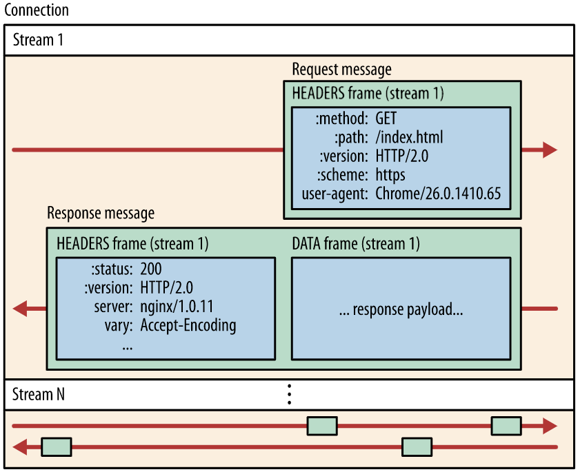

# 10장. HTTP/2.0

## HTTP/2.0의 등장배경

**HTTP/1.1**

- 메시지 포맷의 구현이 단순성과 접근성에 주안점을 두고 최적화되었다.
- 성능을 어느 정도 희생시키지 않을 수 없었다.

→ 커넥션 하나를 통해 요청 하나를 보내고 그에 대해 응답 하나만을 받는 HTTP의 메시지 교환 방식은 단순함 면에서는 더할 나위 없었지만, 응답을 받아야만 그 다음 요청을 보낼 수 있기 때문에 심각한 회전 지연을 피할 수 없었다.

## 개요

**동작**

클라이언트가 초기화하는 TCP 커넥션 위에서 동작한다.

**처리**

한 개의 스트림이 한 쌍의 요청과 응답을 처리하며, 하나의 커넥션 위에 여러 개의 스트림이 동시에 만들어 질 수 있으니, 여러 개의 요청과 응답을 동시에 처리하는 것 역시 가능하다.

또한, 스트림에 대한 흐름 제어와 우선순위 부여 기능도 제공한다.

**서버 푸시**

서버는 클라이언트에게 필요하다고 생각하는 리소스라면 그에 대한 요청을 명시적으로 받지 않더라도 능동적으로 클라이언트에게 보내줄 수 있다.

**호환성**

기존 웹 애플리케이션들과 호환성을 유지하기 위해, 요청과 응답 메시지의 의미를 HTTP/1.1과 같도록 유지하고 있다.

## HTTP/1.1과의 차이점

### 프레임

> HTTP/2.0에서 모든 메시지는 프레임에 담겨 전송된다.
> 

### 스트림과 멀티플렉싱

> 스트림은 HTTP/2.0 커넥션을 통해 클라이언트와 서버 사이에서 교환되는 프레임들의 독립된 양방향 시퀀스다.
> 

- 한 쌍의 HTTP 요청과 응답은 하나의 스트림을 통해 이루어진다.
- 하나의 커넥션에서 여러 개의 스트림이 동시에 열릴 수 있다.
- 스트림은 우선순위도 가질 수 있다.
- 모든 스트림은 31비트의 unsigned 정수로 된 고유한 식별자를 갖는다.
    - 이전에 만들어졌거나 예약된 스트림들의 식별자보다 커야한다.
- 서버와 클라이언트는 상대방과의 협상 없이 일방적으로 스트림을 만든다.
    - TCP 패킷을 주고받는 시간을 낭비하지 않아도 된다.
- 한번 사용한 스트림 식별자는 다시 사용할 수 없다.

### 헤더 압축

> 헤더의 크기가 회전 지연과 대역폭 양쪽 모두에 실질적인 영향을 끼치기 때문에 압축이 필요하다.
> 
- HPACK 명세에 정의된 헤더 압축 방법으로 압축한 뒤, ‘헤더 블록 조각’들로 쪼개져서 전송된다.
    - [RFC 7541 - HPACK: Header Compression for HTTP/2 (ietf.org)](https://datatracker.ietf.org/doc/html/rfc7541)
    - [twitter/hpack: Header Compression for HTTP/2 (github.com)](https://github.com/twitter/hpack)
- 받는 쪽에서는 이 조각들을 이은 뒤 압축을 풀어 원래의 헤더 집합으로 복원한다.

### 서버 푸시

> 서버가 하나의 요청에 대해 응답으로 여러 개의 리소스를 보낼 수 있도록 해준다.
> 
- 클라이언트가 HTML 문서를 파싱해서 필요한 리소스를 다시 요청하여 발생하는 트래픽과 회전 지연을 줄여준다.

## 알려진 보안 이슈

### 중개자 캡슐화 공격(Intermediary Encapsulation Attacks)

HTTP/2.0 메시지를 중간 프락시가 HTTP/1.1 메시지로 변환할 때 메시지의 의미가 변질될 가능성이 있다.

### 긴 커넥션 유지로 인한 개인정보 누출 우려

HTTP/2.0은 사용자가 요청을 보낼 때의 회전 지연을 줄이기 위해 클라이언트와 서버 사이의 커넥션을 오래 유지하는데, 이는 개인정보 유출에 악용될 가능성이 있다.