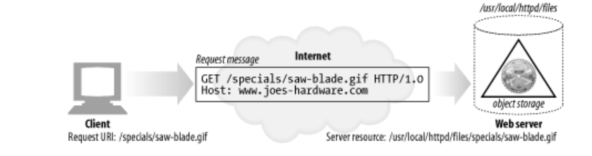

# 5장. 웹 서버

# 다채로운 웹 서버

웹 서버는 HTTP 요청을 처리하고 응답을 제공한다.

→ 모든 웹 서버는 리소스에 대한 HTTP 요청을 받아 콘텐츠를 클라이언트에게 돌려준다.

## 웹 서버 구현

> 웹 서버는 HTTP 및 그와 관련된 TCP 처리를 구현한 것이다.
> 

웹 서버는 운영체제와 TCP 커넥션 관리에 대한 책임을 나눠 갖는다.

- 웹 서버
    - HTTP 프로토콜을 구현
    - 웹 리소스를 관리
    - 웹 서버 관리 기능을 제공
- 운영체제
    - 컴퓨터 시스템의 하드웨어를 관리
    - TCP/IP 네트워크 지원
    - 파일 시스템과 프로세스 관리를 제공

## 다목적 소프트웨어 웹 서버

> 네트워크에 연결된 표준 컴퓨터 시스템에서 동작한다.
> 

웹 서버 소프트웨어는 거의 모든 컴퓨터와 운영체제에서 동작한다.

## 임베디드 웹 서버

> 일반 소비자용 제품에 내장될 목적으로 만들어진 작은 웹 서버이다.
> 

# 간단한 펄 웹 서버

> 최소한으로 기능하는 HTTP 서버라면, 펄(Perl) 코드로도 웹 서버를 만들 수 있다.
> 

`type-o-serve`

→ 클라이언트와 프락시 간의 상호작용 테스트에 유용한 진단 툴이다.

→ HTTP 기능 대부분을 구현하지는 않았지만, 서버 응답 메시지를 생성할 수 있게 해준다.

# 진짜 웹 서버가 하는 일

1. 커넥션을 맺는다 → 클라이언트의 접속을 받아들이거나, 원치 않는 클라이언트라면 닫는다.
2. 요청을 받는다 → HTTP 요청 메시지를 네트워크로부터 읽어 들인다.
3. 요청을 처리한다 → 요청 메시지를 해석하고 행동을 취한다.
4. 리소스에 접근한다 → 메시지에서 지정한 리소스에 접근한다.
5. 응답을 만든다 → 올바른 헤더를 포함한 HTTP 응답 메시지를 생성한다.
6. 응답을 보낸다 → 응답을 클라이언트에게 돌려준다.
7. 트랜잭션을 로그로 남긴다 → 로그파일에 트랜잭션 완료에 대한 기록을 남긴다.

# 단계 1: 클라이언트 커넥션 수락

클라이언트가 이미 서버에 대해 열려있는 지속적 커넥션을 갖고 있다면, 요청을 보내기 위해 그 커넥션을 사용할 수 있다. 그렇지 않다면 클라이언트는 서버에 대한 새 커넥션을 열 필요가 있다.

## 새 커넥션 다루기

일단 새 커넥션이 맺어지고 받아들여지면, 서버는 새 커넥션을 커넥션 목록에 추가하고 커넥션에서 오가는 데이터를 지켜보기 위한 준비를 한다.

> 웹 서버는 어떤 커넥션이든 마음대로 거절하거나 즉시 닫을 수 있다.
> 

## 클라이언트 호스트 명 식별

> 웹 서버는 클라이언트 호스트 명을 구체적인 접근 제어와 로깅을 위해 사용할 수 있다.
> 

→ 많은 대용량 웹 서버는 호스트 명 분석을 꺼두거나 특정 콘텐츠에 대해서만 켜놓는다.

## ident를 통해 클라이언트 사용자 알아내기

몇몇 웹 서버는 또한 `IETF ident` 프로토콜을 지원한다.

### ident 프로토콜

- 서버에게 어떤 사용자 이름이 HTTP 커넥션을 초기화했는지 찾아낼 수 있다.
- 웹 서버 로깅에서 유용하다.

- 조직 내부에서는 잘 사용할 수 있지만, 공공 인터넷에서는 다음을 포함한 여러 이유로 잘 동작하지 않는다.
    - 많은 클라이언트 PC는 identd 신원확인 프로토콜 데몬 소프트웨어를 실행하지 않는다.
    - ident 프로토콜은 HTTP 트랜잭션을 유의미하게 지연시킨다.
    - 방화벽이 ident 트래픽이 들어오는 것을 막는 경우가 많다.
    - ident 프로토콜은 안전하지 않고 조작하기 쉽다.
    - ident 프로토콜은 가상 IP 주소를 잘 지원하지 않는다.
    - 클라이언트 사용자 이름의 노출로 인한 프라이버시 침해의 우려가 있다.

# 단계 2: 요청 메시지 수신

커넥션에 데이터가 도착하면, 웹 서버는 네트워크 커넥션에서 그 데이터를 읽어 들이고 파싱하여 요청 메시지를 구성한다.

요청 메시지를 파싱할 때, 웹 서버는 다음과 같은 일을 한다.

- 요청줄을 파싱하여 요청 메서드, 지정된 리소스의 식별자(URI), 버전 번호를 찾는다.
- 메시지 헤더들을 읽는다.
- 헤더의 끝을 의미하는 CRLF로 끝나는 빈 줄을 찾아낸다.
- 요청 본문이 있다면, 읽어 들인다.

> 네트워크 커넥션은 언제라도 무효화될 수 있다.
> 

→ 웹 서버는 파싱해서 이해하는 것이 가능한 수준의 분량을 확보할 때까지 데이터를 네트워크로부터 읽어서 메시지 일부분을 메모리에 임시로 저장해 둘 필요가 있다.

## 메시지의 내부 표현

> 몇몇 웹 서버는 요청 메시지를 쉽게 다룰 수 있도록 내부의 자료 구조에 저장한다.
> 

## 커넥션 입력/출력 처리 아키텍처

> 요청은 언제라도 도착할 수 있기 때문에, 항상 새로운 요청을 주시하고 있다.
> 

### (a) 단일 스레드 웹 서버

- 한 번에 하나씩 요청을 처리한다.
- 트랜잭션이 완료되면, 다음 커넥션이 처리된다.

### (b) 멀티프로세스와 멀티스레드 웹 서버

- 여러 요청을 동시에 처리하기 위해 여러 개의 프로세스 혹은 고효율 스레드를 할당한다.
- 스레드/프로세스는 필요할 때 마다 만들어질 수도 있고, 미리 만들어질 수도 있다.

### (c) 다중 I/O 서버

- 대량의 커넥션을 지원
- 모든 커넥션이 동시에 활동을 감시당한다.

### (d) 다중 멀티스레드 웹 서버

- 여러 개의 스레드가 각각 열려있는 커넥션을 감시하고 작업한다.

# 단계 3: 요청 처리

웹 서버가 요청을 받으면, 서버는 요청으로부터 메서드, 리소스, 헤더, 본문을 얻어내 처리한다.

> 앞으로 한참 다룰 것이니까, 지금은 스킵한다. 😨😨😨
> 

# 단계 4: 리소스의 매핑과 접근

> 웹 서버는 리소스 서버다.
> 

## Docroot

웹 서버는 여러 종류의 리소스 매핑을 지원한다. 그 중에 가장 단순한 형태는 요청 URI를 웹 서버의 파일 시스템 안에 있는 파일 이름으로 사용하는 것이다.

- 웹 서버 파일 시스템의 특별한 폴더를 웹 콘텐츠를 위해 예약해 둔 것
- 상대적인 url이 docroot를 벗어나 파일 시스템의 docroot 이외의 부분이 노출되는 일을 막아야한다.

### 가상 호스팅된 docroot

각 사이트에 그들만의 분리된 문서 루트를 주는 방법으로, 하나의 웹 서버에서 여러 개의 웹 사이트를 호스팅한다.

→ 하나의 웹 서버 위에서 두 개의 사이트가 완전히 분리된 콘텐츠를 갖고 호스팅될 수 있다.

### 사용자 홈 디렉터리 docroots

사용자들이 한 대의 웹 서버에서 각자의 개인 웹 사이트를 만들 수 있도록 해주는 것

## 디렉터리 목록

> 웹 서버는 경로가 파일이 아닌 디렉터리를 가리키는 디렉터리 URL에 대한 요청을 받을 수 있다.
> 

클라이언트가 디렉터리 URL을 요청하면 웹 서버가 하는 행동은 다음과 같이 몇 가지로 설정할 수 있다.

- 에러를 반환한다.
- 디렉터리 대신 index 파일을 반환한다.
- 디렉터리를 탐색해서 그 내용을 담은 HTML 페이지를 반환한다.

## 동적 콘텐츠 리소스 매핑

> 웹 서버는 URI를 동적 리소스에 매핑할 수도 있다.
> 

→ 즉, 요청에 맞게 콘텐츠를 생성하는 프로그램에 URI를 매핑하는 것이다.

- 대부분의 웹 서버는 동적 리소스를 식별하고 매핑할 수 있는 기본적인 매커니즘을 갖고 있다.

## 서버사이드 인클루드 (Server-Side Includes, SSI)

[[펌] SSI (Server Side Include) 란](https://blog.naver.com/PostView.nhn?isHttpsRedirect=true&blogId=kss9424&logNo=120005229656&parentCategoryNo=&categoryNo=10&viewDate=&isShowPopularPosts=true&from=search)

> 일반적인 HTML 태그외에 웹 서버에서 제공하는 특별히 확장된 기능들로, HTML을 보완하려는 의미에서 개발된 것
> 

## 접근 제어

> 웹 서버는 또한 각각의 리소스에 접근 제어를 할당할 수 있다.
> 
- 웹 서버는 클라이언트 IP 주소에 근거하여 접근을 제어할 수 있다.
- 리소스에 접근하기 위한 비밀번호도 물어볼 수 있다.

# 단계 5: 응답 만들기

> 서버가 리소스를 식별하면, 서버는 요청 메서드로 서술되는 동작을 수행한 뒤 응답 메시지를 반환한다.
> 

## 응답 엔터티

본문이 있다면 주로 다음이 포함된다.

- 본문의 MIME 타입을 서술하는 `Content-Type` 헤더
- 본문의 길이를 서술하는 `Content-Length` 헤더
- 실제 응답 본문의 내용

## MIME 타입 결정하기

### mime.types

- MIME 타입을 나타내기 위해 파일 이름의 확장자를 사용할 수 있다.

### Magic typing

아파치 웹 서버는 각 파일의 MIME 타입을 알아내기 위해 파일의 내용을 검사해서 알려진 패턴에 대한 테이블에 해당하는 패턴이 있는지 찾아볼 수 있다.

### Explicit typing

특정 유형의 MIME 타입을 갖도록 웹 서버를 설정할 수 있다.

### Type negotiation

하나의 리소스가 여러 종류의 문서 형식에 속하도록 설정할 수 있다.

이 때, 웹 서버가 사용자와의 협상을 통해 사용하기 가장 좋은 형식을 판별할 것인지의 여부도 설정할 수 있다.

또한 웹 서버는 특정 파일이 특정 MIME 타입을 갖게끔 설정할 수도 있다.

## 리다이렉션

### 영구히 리소스가 옮겨진 경우

- `301 Moved Permanently`

### 임시로 리소스가 옮겨진 경우

- `303 See Other`
- `307 Temporary Redirect`

### URL 증강

종종 문맥 정보를 포함시키기 위해 재 작성된 URL로 리다이렉트

- `303 See Other`
- `307 Temporary Redirect`

### 부하 균형

과부화된 서버가 요청을 받을 때

- `303 See Other`
- `307 Temporary Redirect`

### 친밀한 다른 서버가 있을 때

- `303 See Other`
- `307 Temporary Redirect`

### 디렉터리 이름 정규화

슬래시 빠트렸을 때, 슬래시 추가해서 리다이렉트한다.

# 단계 6: 응답 보내기

서버는 여러 클라이언트에 대한 많은 커넥션을 가질 수 있다.

- 아무것도 안하는 애
- 서버로 데이터 보내고 있는 애
- 클라이언트로 돌려줄 응답 데이터 실어 나르는 애

> 서버는 커넥션 상태를 추적해야 하며, 지속적인 커넥션은 특별히 주의해서 다루어야 한다.
> 

# 단계 7: 로깅

트랜잭션이 완료되면, 웹 서버는 어떻게 수행되었는지에 대한 로그를 로그파일에 기록한다.