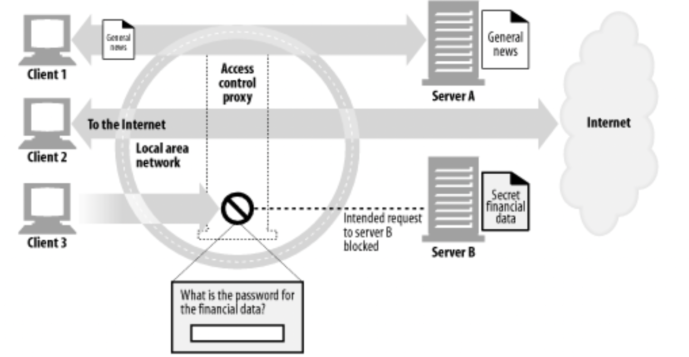

# 6장. 프락시

> 웹 프락시 서버는 중개자다.
> 

# 웹 중개자

> HTTP 프락시 서버는 웹 서버이기도 하고 웹 클라이언트이기도 하다.
> 

- 클라이언트에게 HTTP 요청을 받으니 웹 서버라고 할 수 있다.
- 서버에게 HTTP 요청을 하게되니 웹 클라이언트라고도 할 수 있다.

## 개인 프락시와 공유 프락시

### 공용 프락시

- 대부분의 프락시는 공용이며, 공유된 프락시이다.
- 중앙 집중형 프락시를 관리하는 것이 더 비용효율이 높고 쉽다.

### 개인 프락시

- 흔하지는 않지만, 클라이언트 컴퓨터에서 직접 실행되는 형태로 꾸준히 사용되고 있다.

## 프락시 vs 게이트웨이

> 이전 시간에 궁금했다 👍👀
> 

프락시

- 같은 프로토콜을 사용하는 둘 이상의 애플리케이션을 연결한다.

게이트웨이

- 서로 다른 프로토콜을 사용하는 둘 이상의 애플리케이션을 연결한다.

사실 둘의 차이는 모호하다.

- 브라우저와 서버는 다른 버전의 HTTP를 구현하기 때문에, 프락시는 때로는 프로토콜 변환을 하기도 한다.
- 상용 프락시 서버는 SSL 보안 프로토콜, SOCKS 방화벽 FTP 접근, 웹 기반 애플리케이션 지원을 위해 게이트웨이 기능을 구현해야 한다.

# 왜 프락시를 사용하는가?

> 프락시 서버는 실용적이고 유용한 것이라면 뭐든 한다.
> 
- 보안을 개선
- 성능을 높임
- 비용을 절약
- 트래픽을 감시하고 수정

### 어린이 필터

### 문서 접근 제어자

- 각각의 조직에서 관리되는 다양한 웹 서버들에 대한 접근 제어를 수시로 갱신할 필요 없이, 중앙 프락시 서버에서 접근 제어를 설정할 수 있다.

### 보안 방화벽

- 조직 안에 들어오거나 나가는 응용 레벨 프로토콜의 흐름을 네트워크의 한 지점에서 통제한다.

### 웹 캐시

- 인기 있는 문서의 로컬 사본을 관리하고 해당 문서에 대한 요청이 오면 빠르게 제공, 느리고 비싼 인터넷 커뮤니케이션을 줄인다.

### 대리 프락시(Surrogate)

> 어떤 프락시들은 웹 서버인 것처럼 위장한다.
> 
- 공용 콘텐츠에 대한 느린 웹 서버의 성능을 개선하기 위해 사용한다.

### 콘텐츠 라우터

- 인터넷 트래픽 조건과 콘텐츠의 종류에 따라 요청을 특정 웹 서버로 유도할 수 있다.

### 트랜스 코더

- 콘텐츠를 클라이언트에게 전달하기 전, 본문 포맷을 수정할 수 있다.

### 익명화 프락시(Anonymizer)

- HTTP 메시지에서 신원을 식별할 수 있는 특성들을 제거함으로써 개인정보 보호와 익명성 보장에 기여한다.

# 프락시는 어디에 있는가?

## 프락시 서버 배치

### 출구 프락시

> 로컬 네트워크의 출구에 위치
> 
- 로컬 네트워크와 더 큰 인터넷 사이를 오가는 트래픽 제어

### 접근 프락시

> ISP 접근 지점에 위치
> 
- 고객으로부터의 모든 요청을 종합적으로 처리

### 대리 프락시

> 네트워크의 가장 끝에 있는 웹 서버들의 바로 앞에 위치
> 
- 웹 서버로 향하는 모든 요청을 처리하고 필요할 때만 웹 서버에게 자원을 요청

### 네트워크 교환 프락시

> 네트워크 사이의 인터넷 피어링 교환 지점에 위치
> 
- 캐시를 이용해 인터넷 교차로의 혼잡을 완화하고 트래픽 흐름을 감시

## 프락시 계층

- 메시지는 최종적으로 `original server` 에 도달할 때 까지 프락시와 프락시를 거친다.
- 프락시 서버들은 부모와 자식의 관계를 가진다.

***프락시 계층 콘텐츠 라우팅***

> 계층이 반드시 정적이어야 하는 것은 아니다.
> 

→ 메시지를 다양하고 유동적인 프락시 서버와 오리지널 서버들의 집합에 보낼 수 있다.

### 부하 균형

- 부하를 분산하기 위해 현재 부모들의 작업량 수준에 근거하여 부모 프락시를 고른다.

### 지리적 인접성에 근거한 라우팅

- 원 서버의 지역을 담당하는 부모를 선택할 수도 있다.

### 프로토콜/타입 라우팅

- URI에 근거하여 다른 부모나 원 서버로 라우팅 할 수 있다.

### 유료 서비스 가입자를 위한 라우팅

- URI를 따로 대형 캐시나 성능 개선을 위한 압축 엔진으로 라우팅할 수 있다.

## 어떻게 프락시가 트래픽을 처리하는가

> 어떻게 HTTP 트래픽이 프락시로 향하는 길을 찾아내는지 설명할 필요가 있다.
> 

클라이언트 트래픽이 프락시로 가도록 만드는 방법은 다음 네 가지가 있다.

### 클라이언트를 수정한다

- 프락시를 사용하도록 설정하면 원 서버가 아닌 프락시로 간다.

### 네트워크를 수정한다

> 인터셉트 프락시 → 클라이언트는 모른다.
> 
- 네트워크 인프라를 가로채서 웹 트래픽을 프락시로 가도록한다.

### DNS namespace 를 수정한다

- DNS 이름 테이블을 수동으로 편집
- 사용할 적절한 프락시나 서버를 계산해주는 특별한 동적 DNS 서버를 이용

### 웹 서버를 수정한다

- HTTP 리다이렉션 명령을 반환하여 클라이언트가 프락시로 리다이렉션 하도록 설정
- 리다이렉트를 받는 즉시 클라이언트는 프락시와의 트랜잭션을 시작한다.

# 클라이언트 프락시 설정

### 수동

- 많은 웹 클라이언트가 프락시를 수동으로 설정할 수 있도록 하고있다.

### PAC 파일

- 프락시 설정을 그때그때 상황에 맞게 계산해주는 자바스크립트 프로그램

### WPAD

- 브라우저에게 알맞는 PAC 파일을 자동으로 찾아주는 알고리즘

# 프락시 요청의 미묘한 특징들

## 프락시 URI는 서버 URI와 다르다

> 클라이언트가 프락시 대신 서버로 요청을 보내면 요청의 URI가 달라진다.
> 

- 원래의 HTTP 설계에서는 클라이언트는 단일 서버와 직접 대화를했다.
- 프락시는 목적지 서버와 커넥션을 맺어야 하기 때문에, 그 서버의 이름을 알 필요가 있다.
    - 프락시에 부분 URI를 보내면 프락시는 어디 서버로 가는건지 모른다.
    - 그래서 프락시와 서버를 구분지어 URI를 보내야한다.

## 가상 호스팅에서 일어나는 같은 문제

> 가상으로 호스팅 되는 웹 서버는 여러 웹 사이트가 같은 물리적 웹 서버를 공유한다.
> 
- 명시적인 프락시는 요청 메시지가 완전한 URI를 갖도록 함으로써 이 문제를 해결했다.
- 가상으로 호스팅 되는 웹 서버는 호스트와 포트에 대한 정보가 담겨 있는 Host 헤더를 요구한다.

## 인터셉트 프락시는 부분 URI를 받는다

- 클라이언트는 자신이 프락시와 대화하고 있음을 항상 알고 있는 것은 아니다.
- 클라이언트는 자신이 웹 서버와 대화하고 있다고 생각하고 완전한 URI를 보내지 않을 것이다.

## 프락시는 프락시 요청과 서버 요청을 모두 다룰 수 있다

- 트래픽이 프락시 서버로 리다이렉트 될 수 있는 여러 가지 방법이 존재하기 때문에, 다목적 프락시 서버는 요청 메시지의 완전한 URI와 부분 URI를 모두 지원해야 한다.
- 프락시는 명시적인 프락시 요청에 대해서는 완전한 URI를 사용하고, 아니면 부분 URI를 사용해야 한다.
- 웹 서버 요청의 경우에는 가상 Host 헤더를 사용해야 한다.

완전 URI와 부분 URI를 사용하는 규칙은 다음과 같다.

- 완전한 URI가 주어지면 프락시는 그것을 사용해야 한다.
- 부분 URI가 주어지고 Host 헤더가 있다면, Host 헤더를 이용해 원 서버의 이름과 포트 번호를 알아내야 한다.
- 부분 URI가 주어졌으나 Host 헤더가 없다면, 다음의 방법으로 원 서버를 알아내야 한다.
    - 프락시가 원 서버를 대신하는 대리 프락시라면, 프락시에 실제 서버의 주소와 포트 번호가 설정되어 있을 수도 있다.
    - 이전에 어떤 인터셉트 프락시가 가로챘던 트래픽을 받았고, 그 인터셉트 프락시가 원 IP 주수와 포트번호를 사용할 수 있도록 해두었다면, 그 IP 주소와 포트번호를 사용할 수 있다.
    - 모두 실패했다면, 프락시는 원 서버를 알아낼 수 있는 충분한 정보를 갖고 있지 못한 것이므로 반드시 에러 메시지를 반환해야 한다.

## 전송 중 URI 변경

> 프락시 서버는 요청 URI의 변경에 매우 신경을 써야 한다.
> 

무해해 보이는 사소한 URI 변경이라도 다운스트림 서버와 상호운용성 문제를 일으킬 수 있다.

- 일반적으로 프락시 서버는 가능한 관대해야 한다.

## URI 클라이언트 자동확장과 호스트명 분석

> 브라우저는 프락시의 존재 여부에 따라 요청 URI를 다르게 분석한다.
> 
- 프락시가 없다면 사용자가 타이핑한 URI를 가지고 그에 대응하는 IP 주소를 찾는다.
- 호스트명이 발견되면 그에 대응하는 IP 주소들을 연결해 성공할 때까지 시도해본다.
- 호스트가 발견되지 않으면, 사용자가 호스트명의 약어를 타이핑한 것으로 보고 다음과 같이 시도한다.
    - ‘www.’ 와 ‘.com’ 을 붙인다.
    - 서드파티 사이트로 넘기기도 한다.
    - 대부분은 호스트명의 앞부분만 입력하면 자동으로 도메인을 검색하도록 설정되어있다.

## 프락시 없는 URI 분석

> 브라우저는 명시적인 프락시가 존재하지 않는 경우 부분 호스트 명을 자동으로 확장한다.
> 

## 명시적인 프락시를 사용할 때의 URI 분석

> 명시적인 프락시가 있는 경우 브라우저는 부분 호스트 명을 자동 확장하지 않는다.
> 

명시적인 프락시를 사용하면 브라우저는 이와 같이 편리한 확장들 중 그 무엇도 사용할 수 없다.

→ 브라우저의 URI가 프락시를 그냥 지나치기 때문이다.

## 인터셉트 프락시를 이용한 URI 분석

> 인터셉트 프락시를 사용하고 있는 브라우저는 죽은 서버의 IP 주소를 탐지할 수 없다.
> 

# 메시지 추적

프락시가 점점 더 흔해지면서, 서로 다른 스위치와 라우터를 넘나드는 IP 패킷의 흐름을 추적하는 것 못지않게 프락시를 넘나드는 메시지의 흐름을 추적하고 문제점을 찾아내는 것도 필요한 일이 되었다.

## Via 헤더

> 메시지가 지나는 각 중간 노드(프락시나 게이트웨이)의 정보를 나열
> 

- 메시지의 전달을 추적
- 메시지 루프를 진단
- 요청을 보내고 응답을 돌려줄 때 관여하는 모든 메시지 발송자들의 프로토콜을 다루는 능력을 알아보기 위해 사용
- 네트워크의 라우팅 루프를 탐지하기 위해 사용

### Via 요청과 응답 경로

> 요청 메시지와 응답 메시지 모두 프락시를 지나므로 둘 다 Via 헤더를 가진다.
> 

### Via와 게이트웨이

- Via 헤더는 프로토콜 변환을 기록하기 때문에 HTTP 애플리케이션은 프락시 연쇄에서 프로토콜 능력과 변환이 있었는지를 알아챌 수 있다.

> HTTP/FTP 게이트웨이는 받은 프로토콜(FTP)에 대한 로그를 남기면서 Via 헤더를 생성한다.
> 

### Server 헤더와 Via 헤더

- Server 응답 헤더 필드는 원 서버에 의해 사용되는 소프트웨어를 알려준다.
- 응답 메시지가 프락시를 통과할 때, 프락시는 Server 헤더를 수정해서는 안된다.
- Server 헤더는 원 서버를 위해 존재한다.
- 프락시는 Via 항목을 추가한다.

### Via가 개인정보 보호와 보안에 미치는 영향

- 프락시 서버가 네트워크 방화벽의 일부인 경우
    - 프락시는 방화벽 뒤에 숨어있는 호스트의 이름과 포트를 전달하면 안된다.
- Via 노드 이름 전달이 가능하지 않다면
    - 보안 경계선의 일부분인 프락시는 호스트 명을 그 호스트에 대한 적당한 가명으로 교쳬해야 한다.

## TRACE 메서드

요청 메시지를 프락시의 연쇄를 따라가면서 어떤 프락시를 지나가고 어떻게 각 프락시가 요청 메시지를 수정하는지 관찰/추적할 수 있도록 해준다.

# 프락시 인증

> 접근 제어 장치로서 제공될 수 있다.
> 
- HTTP는 사용자가 유효한 접근 권한자격을 프락시에 제출하지 않는 한 콘텐츠에 대한 요청을 차단하는 프락시 인증이라는 메커니즘을 정의하고 있다.
- 인증에 참여하는 프락시가 프락시 연쇄상에 여러 개 있을 때 일반적으로 잘 동작하지 않는다.

# 프락시 상호운용성

## 지원하지 않는 헤더와 메서드 다루기

> 프락시 서버는 넘어오는 헤더 필드들을 모두 이해하지 못할 수도 있다.
> 
- 프락시는 이해할 수 없는 헤더 필드는 반드시 그대로 전달해야 한다.
- 같은 이름의 헤더 필드가 여러 개 있는 경우에는 그들의 상대적인 순서도 반드시 유지해야 한다.
- 어떤 메서드와 친숙하지 않다면, 가능한 그 메시지를 다음 홉으로 전달해야한다.

## OPTIONS: 어떤 기능을 지원하는지 알아보기

> OPTIONS를 이용해서 서버의 능력을 먼저 알아보자
> 

## Allow 헤더

- 요청 URI에 의해 식별되는 자원에 대해 지원되는 메서드들이나 서버가 지원하는 모든 메서드를 열거한다.
- 새 리소스가 지원했으면 하는 메서드를 추천하기 위해서도 사용한다.
- 프락시는 Allow 헤더 필드를 수정할 수 없다.