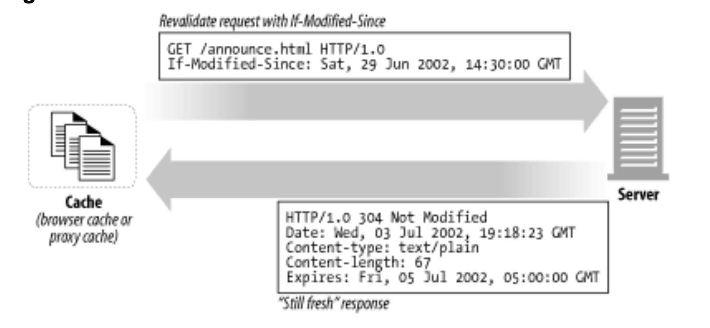

# 캐시
- [캐시](#캐시)
  - [캐시가 해결해주는 문제들](#캐시가-해결해주는-문제들)
    - [불필요한 데이터 전송](#불필요한-데이터-전송)
      - [캐시를 사용하지 않는 경우](#캐시를-사용하지-않는-경우)
      - [캐시를 사용하는 경우](#캐시를-사용하는-경우)
    - [대역폭 병목](#대역폭-병목)
    - [급격한 트래픽 증가(Flash Crowds)](#급격한-트래픽-증가flash-crowds)
    - [거리로 인한 지연](#거리로-인한-지연)
  - [적중(Hit)과 부적중(Miss)](#적중hit과-부적중miss)
    - [재검사(Revalidation)](#재검사revalidation)
      - [GET If-Modified-Since 상황](#get-if-modified-since-상황)
        - [서버 컨텐츠가 변경되지 않은 경우(재검사 적중)](#서버-컨텐츠가-변경되지-않은-경우재검사-적중)
        - [서버 컨텐츠가 변경된 경우](#서버-컨텐츠가-변경된-경우)
        - [객체가 삭제된 경우](#객체가-삭제된-경우)
      - [적중률](#적중률)
      - [바이트 적중률](#바이트-적중률)
      - [적중과 부적중의 구별](#적중과-부적중의-구별)
  - [캐시 포폴로지](#캐시-포폴로지)
    - [개인 캐시](#개인-캐시)
    - [공용 캐시](#공용-캐시)
    - [프록시 캐시 계층](#프록시-캐시-계층)
      - [캐시망, 콘텐츠 라우팅, 피어링](#캐시망-콘텐츠-라우팅-피어링)
  - [캐시 처리 단계](#캐시-처리-단계)
    - [step 1. 요청 받기](#step-1-요청-받기)
    - [step 2. 파싱](#step-2-파싱)
    - [step 3. 검색](#step-3-검색)
    - [step 4. 신선도 검사](#step-4-신선도-검사)
    - [step 5. 응답 생성](#step-5-응답-생성)
    - [step 6. 전송](#step-6-전송)
    - [step 7. 로깅](#step-7-로깅)
  - [사본을 신선하게 유지하기](#사본을-신선하게-유지하기)
    - [문서 완료](#문서-완료)
    - [유효기간과 나이](#유효기간과-나이)
    - [서버 재검사](#서버-재검사)
    - [조건부 메서드와의 재검사](#조건부-메서드와의-재검사)
    - [약한 검사기와 강한 검사기](#약한-검사기와-강한-검사기)
  - [캐시 제어](#캐시-제어)
    - [no-cache & no-store](#no-cache--no-store)
    - [must-revalidate](#must-revalidate)
    - [휴리스틱 만료](#휴리스틱-만료)
  - [캐시 제어 설정](#캐시-제어-설정)
    - [아파치로 HTTP 헤더 제어하기](#아파치로-http-헤더-제어하기)
    - [HTTP-EQUIV를 통한 HTML 캐시 제어](#http-equiv를-통한-html-캐시-제어)

## 캐시가 해결해주는 문제들
### 불필요한 데이터 전송
> 캐시는 불필요한 데이터 전송을 줄여서, 네트워크 비용을 줄여준다.

#### 캐시를 사용하지 않는 경우
1. 여러 클라이언트가 원서버로 같은 데이터 요청
2. 원서버는 각 클라리언트에게 응답
3. 네이트워크 대역폭을 차지
4. 전송이 느려짐
5. 웹 서버에 부하

#### 캐시를 사용하는 경우
1. 서버의 응답을 캐시에 보관
2. 캐시된 사본을 다른 클라이언트로 응답
3. 원서버의 부하 감소

### 대역폭 병목
> 캐시는 대역폴을 늘리지 않고 페이지 응답 속도를 높인다.

- 대부분 원격 서버보다 로컬 클라이언트에 더 넓은 대역폭 제공
- WAN보다 빠른 LAN에서 데이터를 가져온다면 캐싱 성능 향상 가능

### 급격한 트래픽 증가(Flash Crowds)
> 캐시는 원서버에 대한 요청을 줄여 서버 부허를 줄이고 빠른 응답 가능

- 급격히 트래픽이 증가한경우 캐시가 대신 응당해줄 수 있다.
  
### 거리로 인한 지연
> 캐시는 거리로 인한 지연시간을 줄여준다.

- 물리적인 거리로 인해서 지연시간이 발생한다. 클라이언트와 가까운 곳에 캐시가 있다면 가깝기 때문에 빠른시간에 응답 가능

## 적중(Hit)과 부적중(Miss)
- Hit: 요청받은 데이터가 캐시에 있는 경우
- Miss: 요청 받은 데이터가 캐시에 없는 경우 -> 원서버로 요청 전달

### 재검사(Revalidation)
> 캐시는 원서버의 최신 데이터를 가지고 있어야한다.

- 재검사: 캐시된 데이터가 원서버의 최신 데이터와 같은지 검사
- 대부분 캐시는 클라이언트가 사본을 요청하였을 때 사본이 오래된 경우 재검사
- 캐시가 원서버로 재검사 요청시 변경되지 않았다면 `304 Not Modified`를 반환
  - 재검사 적중, 느린 적중
  - 순수 캐시 적중보다 느리지만  부적중 보다는 빠르다.
- `If-Modified-Since` Header: 서버에게 GET 요청에 해당 헤더를 추가하면 캐시된 시간 이후에 벼경된 경우에만 사본을 보내라는 의미

#### GET If-Modified-Since 상황
##### 서버 컨텐츠가 변경되지 않은 경우(재검사 적중)

- 클라이언트에 `HTTP 304 Not Modified` 전송
##### 서버 컨텐츠가 변경된 경우
- 콘텐츠 전체와 `HTTP 200 OK`
##### 객체가 삭제된 경우
- `HTTP 404 Not Found` 전달 후 캐시 사본 삭제

#### 적중률
- 캐시가 요청을 처리하는 비율
- 40% 정도면 유효한 편

#### 바이트 적중률
- 트래픽이 절감된 정도
- 대역폭 절약 최적화
  
#### 적중과 부적중의 구별
- 응답코드와 바디로는 클라이언트가 해당 응답이 캐시에서 왔는지 원서버에서 왔는지 알 수 없음
- 상용 프록시중에서 Via 헤더를 통해서 확인할 수 있다.
- Date 헤더가 현제 시간보다 오래됐으면 캐시에서 온 응답
- Age 헤더를 통해서 응답이 얼마나 오래됐는지 알 수 있다.

## 캐시 포폴로지
- 개인 캐시(Private Cache): 1명만을 위한 캐시
- 공용 캐시(Public Cache): 공유되는 캐시

### 개인 캐시
- 웹 브라우저는 개인 전용 캐시를 내장
- 익스플로러의 "임시파일"

### 공용 캐시
- 캐시 프록시 서버, 프록시 캐시
- 로컬 캐시에서 문서를 제공
  - 로컬 캐시에게 운서를 제공 아닌가?
- 사용자의 입장에서 버서에 접근
- 여러 사용자가 접근하기 때문에 불필요한 트래픽을 줄일 수 있따.
  - 클라이언트에서 원서버로 요청을 보내서 가져오는 것 보다. 캐시에서 전달 받는 것이 빠르고 트래픽도 적다.

### 프록시 캐시 계층
- 캐시에서 부적중이 발생했을 때 상위 캐시에서 트래픽을 처리하도록 계층을 적용한다.
- 클라이언트 주위에는 작은 캐시를 사용하고 상단에는 많은 사용자들을 처리하는 캐시를 둔다.
- 캐시 계층이 너무 깊어지면 부적중했을 때 성능 저하가 발생한다.

#### 캐시망, 콘텐츠 라우팅, 피어링
- 캐시망
  - 수직 계층이 아닌 서로 연결되어 있는 망
  - 부적중이 생겼을 때의 정책을 설정할 수 있다.
  - 기능
    - URL을 통해 부모 캐시와 원 서버 중 하나를 동적으로 선택
    - URL을 통해 특정 부모 캐시를 동적으로 선택
    - 부모 캐시로 요청하기 전에 캐시된 사본을 로컬에서 찾음
    - 다른 캐시들이 부분적으로 접근할 수 있도록 허용하지만 해당 캐시를 통한 `인터넷 트랜짓(Internet Transit)`은 불허
  - 형제 캐시: 선택적인 피어링 지원
    - http는 형제 캐시를 지원하지 않기 때문에 `인터넷 캐시 프로토콜(ICP)` 또는 `하이퍼텍스트 캐시 프로토콜(HTCP)`을 이용

## 캐시 처리 단계
> 7단계로 구성
1. 요청 받기: 캐시는 네트워크로부터 도착한 요청 메시지를 읽음
2. 파싱: 메시지를 파싱하여 URL와 헤더 추출
3. 검색: 로컬 복사본이 있는지 검사하고 사본이 없으면 서버에 요청
4. 신선도 검사: 캐시된 사본이 오래되었다면 새로운 내용이 있는지 서버에 요청
5. 응답 생성: 새로운 헤더와 캐시된 본문으로 응답 메시지 생성
6. 발송: 네트워크를 통해 응답
7. 로깅: 선택적으로 로그 생성

### step 1. 요청 받기
- 네트워크 커넥션에서 활동을 감지하고 들어오는 데이터를 읽어드림

### step 2. 파싱
- 요청 메시지를 파싱하여 헤더를 조작하기 쉬운 자료구조에 담는다.

### step 3. 검색
- URL을 통해서 로컬 사본이 있는지 확인
- 로컬 복사본이 메모리 또는 디스크 혹은 다른 컴퓨터에 있다면 전달
- 캐시된 데이터가 없다면 원서버에 요청
- 캐시된 객체는 서버 응답 본문과 원 서버 응답 헤더를 포함 -> 서버의 응답 헤더 전달 가능
  
### step 4. 신선도 검사
- 캐시된 사본이 오래되었다면 "신선하지 않다"라고 간주하고 원서버에 요청

### step 5. 응답 생성
- 원서버의 응답 헤더를 토대로 헤더 생성
- 캐시가 전달하는 헤더는 클라이언트가 요청하는 프로토콜과 버전을 만족해야한다.
- 메타데이터 포함

### step 6. 전송
- 응답 헤더와 함께 클라이언트로 응답
- 클라이언트와 커넥션을 유지해야한다.

### step 7. 로깅
- 캐시 트랜잭션 완료 후 적중과 부적중 횟수에 대한 통계를 갱신
- 로그 포맷으로 스퀴드 로그 포맷, 넷스케이프 확장 공용 로그 포맷 주로 사용, 커스텀 포맷도 많이 사용

## 사본을 신선하게 유지하기
### 문서 완료
- HTTP는 `Cache-Control`과 `Expires` 헤더를 사용해서 문서에 유효기간을 붙임
- 캐시된 문서가 만료되기 전에 요청을 받으면 사본을 제공한다.
- 만료되면 서버에 변경되었는지 확인

### 유효기간과 나이
- `Cache-Control: max-age`: 문서의 최대 나이 정의
- `Expires`: 절대 유효기간을 명시

### 서버 재검사
- 캐시된 데이터가 신선한지 검사

### 조건부 메서드와의 재검사
- HTTP에서 캐시가 서버에게 `조건부 GET` 요청을 할수 있다.
- 서버가 가지고 있는 문서가 캐시가 가지고있는 것과 다르면 객체 본문을 보내달라고 하는 것이다.
- GET에 헤더를 추가하여 조건부 GET을 사용할 수 있다.
- `If-Modified-Since : <date>`: 문서가 주어진 날짜 이후로 수정되었으면 새 문서 전달
- `If-None-Match: <tags>`: 일련번호와 같은 태그를 사용해서 서버에 있는 문서의 태그와 다르면 새 문서

### 약한 검사기와 강한 검사기
- 약한 검사기: 조금 수정된거는 무시, `/W` 접두사 사용
- 강한 검사기: 조금이라도 수정되면 재요청

## 캐시 제어
- Cache-Control: no-store 
- Cache-Control: no-cache 
- Cache-Control: must-revalidate
- Cache-Control: max-age
- Expires
- No header

### no-cache & no-store
- 캐시가 검증되지 않은 캐시된 객체로 응답하는 것을 막음
- no-store: 응답의 사본을 만드는 것을 금지
- no-cache: 응답은 로컬 캐시 저장소에 저장, 서버와 재검사를 없이 클라이언트에 제공 불가

### must-revalidate
- 캐시가 신선하지 않은 사본을 원 서버와 최초 재검사 없이 제공하지 앟음

### 휴리스틱 만료
- 경험적으로 최대 나이를 계산
- 문서가 오래전에 변경되었으면 자주 변경되지 않는 문서일 확률이 높다.
- 최근에 변경되었으면 자주 변경되기 때문에 짧은 주기로 재검사 해야한다.

## 캐시 제어 설정
### 아파치로 HTTP 헤더 제어하기
- 아파치 웹 서버는 HTTP 캐시 제어 헤더를 설정할 수 있는 여러가지 메커니즘 제공
- mod_headers
  - 개별 헤더를 설정 가능
  - 아파치 설정 파일에 설정을 추가
- mod_expires
  - 적절한 말료 날짜가 담긴 Expires 헤더 자동 생성
- mod_cern_meta
  - HTTP 헤더들의 파일을 특정 객체와 연결

### HTTP-EQUIV를 통한 HTML 캐시 제어
- 문서의 만료와 캐시 제어 정보를 돌려주기 위해 사용
- HTTP 2.0의 <META_HTTP_EQUIV>: 웹 서버 설정 파일과의 상호작용 없이도 쉽게 HTML 문서에 HTTP 정보를 부여
- HTML 문서 최 상단에 위치
- 해당 태그를 파싱해서 http 응답에 정해진 헤더를 삽입
- HTML을 제외한 다른 타입의 파일은 지원하지 않음