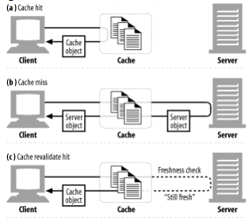
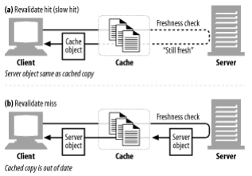
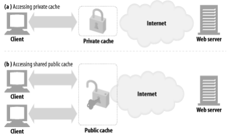
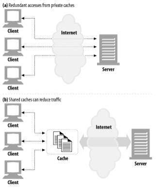
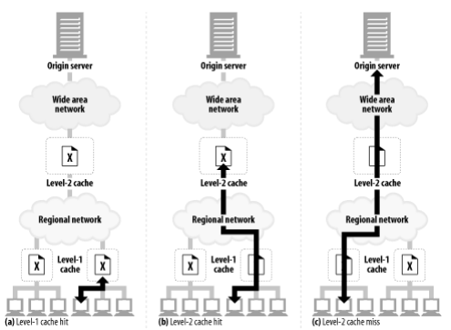
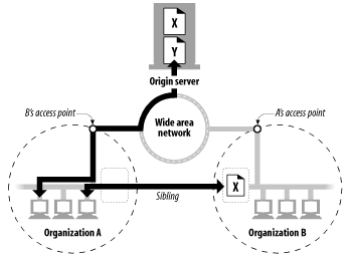
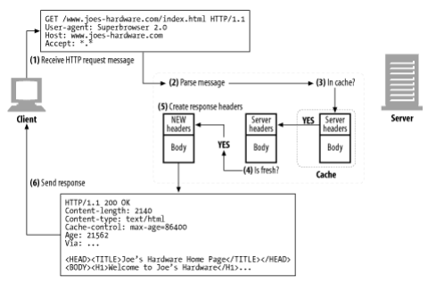
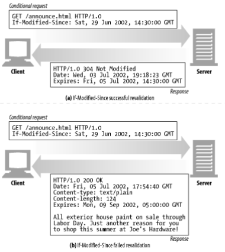
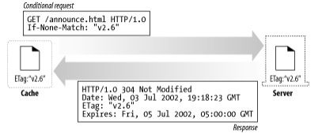

# 7장. 캐시

> 자주 쓰이는 문서의 사본을 자동으로 보관하는 HTTP 장치
> 

## 불필요한 데이터 전송

여러 클라이언트에게 캐시 없이 원 서버가 직접 페이지를 제공한다면

- 네트워크 대역폭을 잡아먹는다.
- 전송을 느리게 한다.
- 웹 서버에 부하를 준다.

캐시를 이용하게 되면

- 첫 번째 서버 응답은 캐시에 보관된다.
- 그 후의 요청들이 캐시된 사본으로 응답된다.
- 원 서버가 중복해서 트래픽을 주고받는 낭비가 줄어들게 된다.

## 대역폭 병목

> 캐시는 네트워크 병목도 줄여준다.
> 
- 많은 네트워크가 원격 서버보다 로컬 네트워크 클라이언트에 더 넓은 대역폭을 제공한다.
- 클라이언트들이 서버에 접근할 때의 속도는, 그 경로에 있는 가장 느린 네트워크의 속도와 같다.
- 클라이언트가 빠른 LAN에 있는 캐시로부터 사본을 가져온다면 성능을 개폭 개선할 수 있다.

## 갑작스런 요청 쇄도(Flash Crowds)

> 캐싱은 갑작스런 요청의 쇄도에 대처하기 위해 특히 중요하다.
> 

## 거리로 인한 지연

> 비록 대역폭이 문제가 되지 않더라도, 거리가 문제가 될 수도 있다.
> 

모든 네트워크 라우터는 제각각 인터넷 트래픽을 지연시키고, 클라이언트와 서버 사이에 라우터가 그리 많지 않더라도 빛의 속도 그 자체가 유의미한 지연을 유발한다.

→ 기계실 근처에 캐시를 설치한다면 문서가 전송되는 거리를 수천 킬로미터에서 수십 미터로 줄일 수 있다.

## 적중과 부적중

> 캐시가 세상의 모든 문서의 사본을 저장하지는 않는다...!
> 
- 캐시 적중(cache hit)
    - 캐시에 요청에 대응하는 사본이 있다면 그걸로 요청을 처리한다.
- 캐시 부적중(cache miss)
    - 사본이 없다면 원 서버로 전달되기만 한다.

### 재검사(Revalidation)

원 서버의 콘텐트가 변경될 수 있기 때문에, 캐시는 반드시 그들이 갖고 있는 사본이 여전히 최신인지 서버를 통해 때때로 점검해야 한다.

캐시는 스스로 원할 때 언제든지 사본을 재검사할 수 있지만, 충분히 오래된 경우에만 재검사를 한다.

- 가장 많이 쓰이는 방식은 `If-Modified-Since` 헤더이다.

**재검사 적중**

- 만약 서버 객체가 변경되지 않았다면, 서버는 `HTTP 304 Not Modified` 응답을 보낸다.

**재검사 부적중**

- 캐시의 사본과 원 서버의 컨텐츠가 다르면, 해당 컨텐츠와 함께 `HTTP 200 OK` 응답을 보낸다.

**객체 삭제**

- 서버 객체가 삭제되었다면, 서버는 `404 Not Found` 응답을 보내고, 캐시는 사본을 삭제한다.

### 적중률

> 캐시가 요청을 처리하는 비율
> 
- 적중률이 조금 낮아보여도, 성능을 상당히 개선할 수 있다.
- 얼마나 많은 웹 트랜잭션을 외부로 내보내지 않았는지 보여주는 지표
- 문서 적중률을 개선하면 전체 대기시간이 줄어든다.

### 바이트 적중률

> 캐시를 통해 제공된 모든 바이트의 비율을 표현한다.
> 
- 얼마나 많은 바이트가 인터넷으로 나가지 않았는지 보여주는 지표
- 바이트 단위 적중률을 개선하면 대역폭 절약을 최적화할 수 있다.

### 적중과 부적중의 구별

> HTTP는 클라이언트에게 응답이 캐시 적중이었는지 원 서버에 접근했는지 안알랴줌ㅠ
> 
- 프락시라면 `Via` 헤더를 사용할 수도 있다.
- `Date` 헤더를 사용하여 날짜를 확인한다.
- `Age` 헤더를 사용하여 얼마나 오래되었는지 확인한다.

## 캐시 토폴로지

> 캐시는 한 명의 사용자에게만 할당될 수도 있고, 반대로 수천 명의 사용자들 간에 공유될 수도 있다.
> 

### 개인 전용 캐시

> 한 명에게만 할당된 캐시, 한 명의 사용자가 자주 찾는 페이지를 담는다.
> 
- 많은 에너지나 저장 공간이 필요없으니 작고 저렴하다.
- 웹브라우저가 개인 전용 캐시를 내장하고 있다.

### 공용 프락시 캐시

> 사용자 집단에게 자주 쓰이는 페이지를 담는다.
> 
- 로컬 캐시에서 문서를 제공하거나, 혹은 사용자의 입장에서 서버에 접근한다.
- 여러 사용자가 접근하기 때문에, 불필요한 트래픽을 줄일 수 있는 더 많은 기회가 있다.

### 프락시 캐시 계층들

작은 캐시에서 캐시 부적중이 발생했을 때 더 큰 부모 캐시가 남겨진 트래픽을 처리하도록 하는 계층을 만드는 방식이 합리적인 경우가 많다.

→ 클라이언트 주위에는 작고 저렴한 캐시를 사용하고, 계층 상단에는 더 크고 강력한 캐시를 사용하자는 것이다.

→ 사실 프락시 연쇄가 또 길어질수록 각각의 중간 프락시들은 현저한 성능 저하가 발생할 것이다.

### 캐시망, 콘텐츠 라우팅, 피어링

**캐시망 내의 콘텐츠 라우팅을 위해 설계된 캐시들**

- URL에 근거하여, 부모 캐시와 원 서버 중 하나를 동적으로 선택한다.
- URL에 근거하여 특정 부모 캐시를 동적으로 선택한다.
- 부모 캐시에게 가기 전, 캐시된 사본을 로컬에서 찾아본다.
- 다른 캐시들이 그들의 캐시된 콘텐츠에 부분적으로 접근할 수 있도록 허용하되, 그들의 캐시를 통한 `internet transit` 은 허용되지 않는다.

선택적인 피어링을 지원하는 캐시는 형제 캐시라고 불린다. 

→ HTTP는 형제 캐시를 지원하지 않기 때문에, `ICP`나 `HTCP`와 같은 프로토콜을 이용해 HTTP를 확장했다.

## 캐시 처리 단계

1. 요청 받기 → 캐시는 네트워크로부터 도착한 요청 메시지를 읽는다.
2. 파싱 → 캐시는 메시지를 파싱하여 URL과 헤더들을 추출한다.
3. 검색 → 캐시는 로컬 복사본이 있는지 검사하고, 사본이 없다면 사본을 받아온다.
4. 신선도 검사 → 캐시는 캐시된 사본이 충분히 신선한지 검사하고, 신선하지 않다면 변경사항이 있는지 서버에게 물어본다.
5. 응답 생성 → 캐시는 새로운 헤더와 캐시된 본문으로 응답 메시지를 만든다.
6. 발송 → 캐시는 네트워크를 통해 응답을 클라이언트에게 돌려준다.
7. 로깅 → 선택적으로, 캐시는 로그파일에 트랜잭션에 대해 서술한 로그 하나를 남긴다.

### 단계 1: 요청 받기

- 캐시는 네트워크 커넥션에서의 활동을 감지하고, 들어오는 데이터를 읽어들인다.

### 단계 2: 파싱

- 캐시는 요청 메시지를 여러 부분으로 파싱하여 헤더 부분을 조작하기 쉬운 자료 구조에 담는다.

### 단계 3: 검색

- 캐시는 URL을 알아내고 그에 해당하는 로컬 사본이 있는지 검사한다.

### 단계 4: 신선도 검사

- HTTP는 캐시가 일정 기간동안 서버 문서의 사본을 보유할 수 있도록 해준다.
- 그러나 오래되었다면 이 사본은 ‘신선하지 않은’ 문서가 되어 재검사를 요청해야 한다.

### 단계 5: 응답 생성

- 캐시는 서버 응답 헤더를 토대로 응답 헤더를 생성해야 한다.
- 캐시는 클라이언트에 맞게 이 헤더를 조정해야 하는 책임이 있다.

### 단계 6: 전송

- 응답 헤더가 준비되면, 캐시는 응답을 클라이언트에게 돌려준다.

### 단계 7: 로깅

- 로그 파일과 캐시 사용에 대한 통계를 유지해야 한다.

## 사본을 신선하게 유지하기

> 캐시된 사본 모두가 서버의 문서와 항상 일치하는 것은 아니다.
> 

### 문서 만료

- HTTP는 `Cache-Control` 과 `Expires` 헤더를 사용해 원 서버가 각 문서에 유효기간을 붙일 수 있게 해준다.

### 유효기간과 나이

- 서버는 응답 본문과 함께 하는, `HTTP/1.0+ Expires` 나 `HTTP/1.1 Cache-Control: max-age` 응답 헤더를 이용해서 유효기간을 명시한다.

### 서버 재검사

- 재검사 결과 컨텐츠가 변경되었다면, 캐시는 그 문서의 새로운 사본을 가져와서 오래된 데이터 대신 저장하고 클라이언트에게도 보내준다.
- 재검사 결과 컨텐츠가 변경되지 않았다면, 캐시는 새 만료일을 포함한 새 헤더들만 가져와서 캐시 안의 헤더들을 갱신한다.

**HTTP 프로토콜을 캐시가 다음 중 하나를 반환하는 적절한 행동을 할 것을 요구한다.**

- ‘충분히 신선한’ 캐시된 사본
- 원 서버가 재검사되었기 때문에, 충분히 신선하다고 확신할 수 있는 캐시된 사본
- 에러 메시지
- 경고 메시지가 부착된 캐시된 사본

### 조건부 메서드와의 재검사

> HTTP는 캐시가 서버에게 ‘조건부 GET’이라는 요청을 보낼 수 있도록 해준다.
> 

→ 서버가 갖고 있는 문서가 캐시가 갖고 있는 것과 다른 경우에만 객체 본문을 보내달라고 하는 것

### If-Modified-Since: 날짜 재검사

> 서버에게 리소스가 특정 날짜 이후로 변경된 경우에만 요청한 본문을 보내달라고 한다.
> 

### If-None-Match: 엔터티 태그 재검사

> 문서를 변경하고, 문서의 엔터티 태그를 새로운 버전으로 변경하였을 때 캐시는 새 문서의 사본을 얻기 위해 `If-None-Match` 조건부 헤더를 사용할 수 있다.
> 

### 약한 검사기와 강한 검사기

**약한 검사기**

- 진짜 뭐 안바꿨을 때 “그 정도면 같지” 라고 서버가 말할 수 있도록 해준다.

**강한 검사기**

- 뭐든 바꾸면 그냥 바뀐다.

## 캐시 제어

> HTTP는 문서가 만료되기 전까지 얼마나 오랫동안 캐시될 수 있게 할 것인지 서버가 설정할 수 있는 여러 가지 방법을 정의한다.
> 
- `Cache-Control: no-store` 헤더를 응답에 첨부할 수 있다.
    - 캐시가 그 응답의 사본을 만드는 것을 금지한다.
- `Cache-Control: no-cache` 헤더를 응답에 첨부할 수 있다.
    - 로컬 캐시 저장소에 저장될 수는 있지만, 먼저 서버와 재검사를 하지 않고서는 클라이언트로 제공할 수 없다.
- `Cache-Control: must-revalidate` 헤더를 응답에 첨부할 수 있다.
    - 캐시가 이 객체의 신선하지 않은 사본을 원 서버와의 최초의 재검사 없이는 제공해서는 안 됨을 의미한다.
- `Cache-Control: max-age` 헤더를 응답에 첨부할 수 있다.
    - 신선하다고 간주됬던 문서가 서버로부터 온 이후로 흐른 시간을 초로 나타낸다.
- `Expires` 날짜 헤더를 응답에 첨부할 수 있다.
    - 실제 만료 날짜를 명시한다.
- 아무 만료 정보도 주지 않고, 캐시가 스스로 체험적인 방법으로 결정하게 할 수 있다.
    - 사실 되게 흔하다.