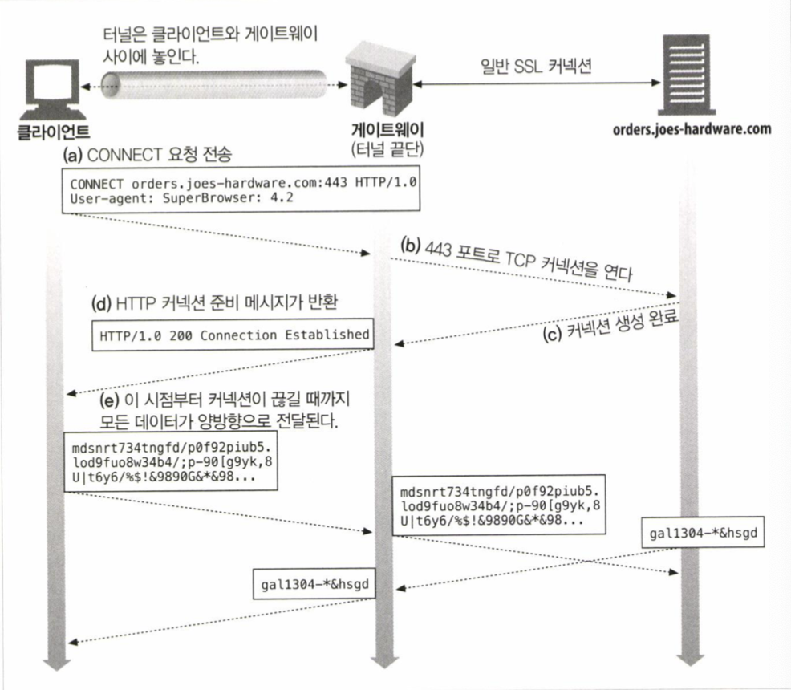
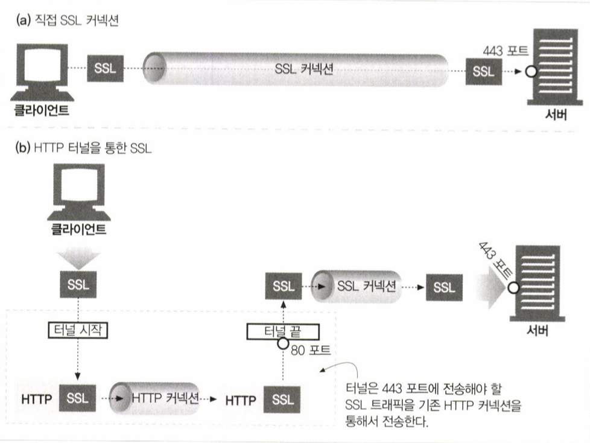

# 게이트웨이, 터널, 릴레이
- [게이트웨이, 터널, 릴레이](#게이트웨이-터널-릴레이)
  - [게이트웨이](#게이트웨이)
    - [클라이어트 측 게이트웨이와 서버측 게이트웨이](#클라이어트-측-게이트웨이와-서버측-게이트웨이)
    - [프로토콜 게이트웨이](#프로토콜-게이트웨이)
      - [종류](#종류)
    - [리소스 게이트웨이](#리소스-게이트웨이)
    - [공용 게이트웨이 인터페이스(CGI)](#공용-게이트웨이-인터페이스cgi)
    - [서버확장 API](#서버확장-api)
  - [터널](#터널)
    - [CONNECT로 HTTP 커넥션 맺기](#connect로-http-커넥션-맺기)
    - [데이터 터널링, 시간, 커넥션 관리](#데이터-터널링-시간-커넥션-관리)
    - [SSL 터널링](#ssl-터널링)
    - [SSL 터널링 vs HTTP/HTTPS 게이트웨이](#ssl-터널링-vs-httphttps-게이트웨이)
    - [터널 인증](#터널-인증)
    - [터널 보안](#터널-보안)
  - [릴레이](#릴레이)
## 게이트웨이
- 리소스를 받기 위한 경로를 안내하는 역할
### 클라이어트 측 게이트웨이와 서버측 게이트웨이
> <클라이언트 프로토콜>/<서버 프로토콜>
ex) HTTP/FTP
- 서버 측 게이트웨이는 클라이언트와 HTTP로 통신 서버와는 다른 프로토콜로 통신
- 클라이언트 측 게이트웨이는 클라이언트와는 외래 프로토콜로 통신, 서버와는 HTTP로 통신
### 프로토콜 게이트웨이
- 프로코톨 게이트웨이: 클라이언트와 서버 사이에서 프토토콜을 변환해준다.
#### 종류
- HTTP/*: 서버측 웹 게이트웨이
- HTTP/HTTPS: 서버측 보안 게이트웨이
- HTTPS/HTTP: 클라이언트 측 보안 가속 게이트웨이

### 리소스 게이트웨이
- 리소스를 중계해주는 게이트웨이

### 공용 게이트웨이 인터페이스(CGI)
- 클라이언트는 해당 인터페이스만으로 원하는 결과를 얻을 수 있다.
- 클라이언트는 어떻게 처리되는지 알수 없다.
- 서버를 보호한다.
- Fast CGI: 부하가 적다. 데몬으로 동작함으로써 새로운 프로세스를 만들고 제거하는 문제가없다.

### 서버확장 API 
- 서버 자첵의 동작을 바꿀 수 있다.
- 서버 처리능력을 향상 시킬수 있다.

## 터널
- HTTP 프로토콜을 지원하지 않는 앱에 HTTP 앱을 사용해 접근하는 방법 제공
- 다른 프로토콜을 HTTP 위에 올릴 수 있다.

### CONNECT로 HTTP 커넥션 맺기
- HTTP의 CONNECT로 웹 터널 사용 가능

1. 터널을 연결하기 위해 CONNECT 요청
2. TCP 커넥션 형성
3. TCP 커넥션 형성 완료 후, HTTP 200 Connection Established 전송
4. 터널 연결 완료

- CONNECT 요청
```
CONNECT hostname:443 HTTP/1.0
User-agent: Mozilla/4.0
```
- CONNECT 응답
```
HTTP/1.0 200 Connection Established
Proxy-agent: Netscape-Proxy/1.1
```

### 데이터 터널링, 시간, 커넥션 관리
- 터널을 통해 전달되는 데이터는 게이트웨이에서 볼 수 없다.
- 게이트웨이는 패킷의 순서나 흐름에 대한 가정을 할 수 없다.
- 클라이언트는 성능 향상을 위해 CONNECT 요청을 보낸 다음 응답을 밥기 전에 터널 데이터를 정송할 수 있따.
- 서버에 데이터를 더 빨리 보내는 방법이지만 게이트웨이가 요청에 이어서 데이터를 적절하게 처리할 수 있어야한다.
- 게이트웨이는 커넥션이 맺어지면 헤더를 포함해서 모든 데이터를 서버에 전송
- 클라이언트는 인정 요구 또는 200외의 응답이 왔을 때 데이터를 다시 보낼 수 있어야한다.

### SSL 터널링

- 웹 터널은 방화벽을 통해서 암호화된 SSL 트래픽을 전달하려도 개발됨
- SSL같이 암호화된 프로토콜은 정보가 암호화되어있기 때문에 낡은 방식의 프록시에서는 처리되지 않음

### SSL 터널링 vs HTTP/HTTPS 게이트웨이
- HTTPS 프로토콜은 다른 프로토콜과 같은 방식으로 게이트웨이를 통과한다.
- 원격 HTTPS 서버와 SSL 세션을 시작하는 게이트웨이를 두고 클라이언트 측 HTTPS 트랜잭션을 수행하는 방식
- 응답은 프록시가 받아서 복호화하고, HTTP를 통해서 클라이언트로 전달

### 터널 인증
- 프록시 인증 기능은 클라이언트가 터널을 사용할 수 있는 권한을 검사하는 용도로 사용
  
### 터널 보안
- 터널 게이트웨이는 통신하고 있는 프로토콜이 터널을 올바른 용도로 사용하는지 검증할 수없다.
- 터널의 오용을 최소화하기 위해 HTTPS 전용 포트인 443 같은 특정 포트만 허용해야한다.

## 릴레이
- HTTP 명세를 "대충 준수하는" 간단한 HTTP 프록시
- 바이트를 "무지성" 전달한다.
- 무지성 전달하면 `멍청한 프록시`가 생길 수 있다.