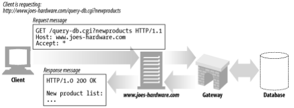
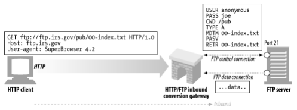
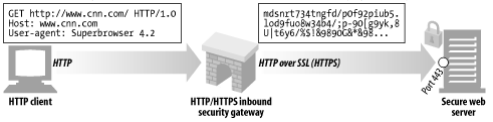
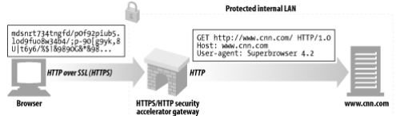
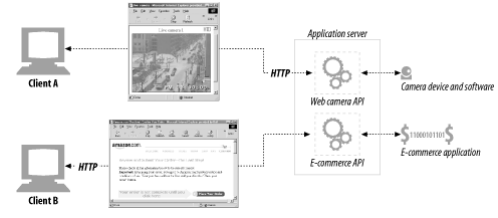
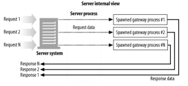
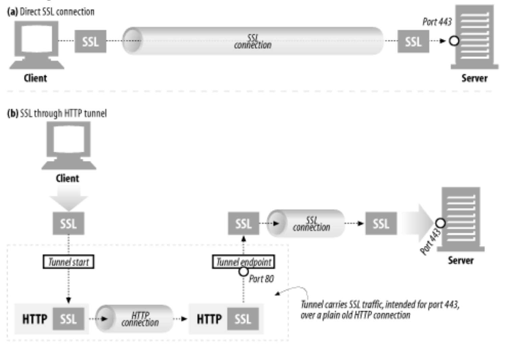
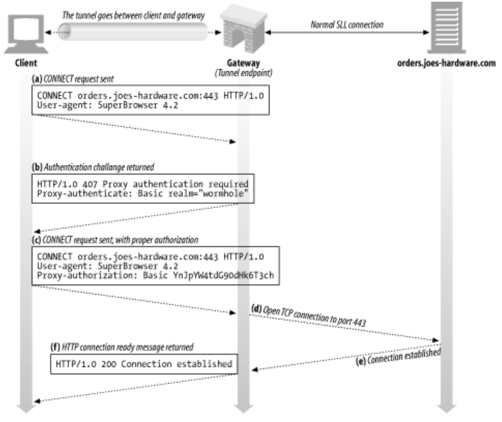
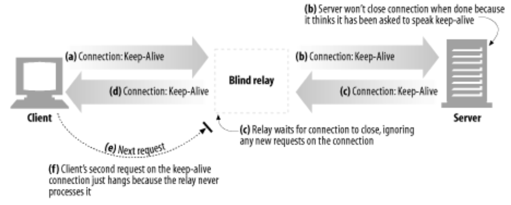

# 8장. 통합점: 게이트웨이, 터널, 릴레이

- 게이트웨이: 서로 다른 프로토콜과 애플리케이션 간의 HTTP 인터페이스이다.
- 애플리케이션 인터페이스: 서로 다른 형식의 웹 애플리케이션이 통신하는 데 사용한다.
- 터널: HTTP 커넥션을 통해서 HTTP가 아닌 트래픽을 전송하는 데 사용한다.
- 릴레이: 일종의 단순한 HTTP 프락시로, 한 번에 한 개의 홉에 데이터를 전달하는 데 사용한다.

## 게이트웨이

> 리소스와 애플리케이션을 연결하는 역할을 한다. 또한 동적인 콘텐츠를 생성하거나 데이터베이스에 질의를 보낼 수 있다.
> 

- HTTP 트래픽을 다른 프로토콜로 자동으로 변환하여, HTTP 클라이언트가 다른 프로토콜을 알 필요 없이 서버에 접속할 수 있게 한다.

### 클라이언트 측 게이트웨이와 서버 측 게이트웨이

웹 게이트웨이는 한쪽에서 HTTP로 통신하고, 다른 한쪽에서는 HTTP가 아닌 다른 프로토콜로 통신한다.

`<클라이언트 프로토콜>/<서버 프로토콜>`

- 서버 측 게이트웨이는 클라이언트와 HTTP로 통신하고, 서버와는 외래 프로토콜로 통신한다.
- 클라이언트 측 게이트웨이는 클라이언트와 외래 프로토콜로 통신하고, 서버와는 HTTP로 통신한다.

## 프로토콜 게이트웨이

> 프락시에 트래픽을 바로 보내는 것과 같이 게이트웨이에도 HTTP 트래픽을 바로 보낼 수 있다.
> 

### HTTP/*: 서버 측 게이트웨이

서버 측 웹 게이트웨이는 클라이언트로부터 HTTP 요청이 원 서버 영역으로 들어오는 시점에 클라이언트 측의 HTTP 요청을 외래 프로토콜로 전환한다.

### HTTP/HTTPS: 서버 측 보안 게이트웨이

모든 웹 요청을 암호화하여 개인 정보 보호와 보안을 제공하는 게이트웨이를 사용할 수 있다.

### HTTPS/HTTP: 클라이언트 측 보안 가속 게이트웨이

보안 HTTPS 트래픽을 받아서 복호화하고, 웹 서버로 보낼 일반 HTTP 요청을 만든다.

- 원 서버보다 더욱 효율적으로 보안 트래픽을 복호화하는 암호화 하드웨어를 내장해서 원 서버의 부하를 줄여주기도 한다.
- 근데 게이트웨이에서 원 서버 간에 암호화되지 않은 트래픽을 전송해서 위험하다.

## 리소스 게이트웨이

**애플리케이션 서버**

- HTTP를 통해서 클라이언트와 통신하고 서버 측에 있는 애플리케이션 프로그램에 연결하는 서버 측 게이트웨이다.

→ 애플리케이션 서버는 HTTP 클라이언트를 여러 백엔드 애플리케이션으로 연결한다.

→ 서버 게이트웨이 애플리케이션의 동작

### 공용 게이트웨이 인터페이스(CGI)

거의 모든 리소스 형식과 서버의 접점에 있으면서, 필요에 따라 어떤 변형이든 처리해내는 단순한 기능을 제공한다.

- 문제가 많은 확장으로부터 서버를 보호한다는 점에서 훌륭하다
- 하지만 이런 분리 때문에 성능과 관련된 비용이 발생한다.
    - 모든 CGI 요청마다 새로운 프로세스를 만들어야 한다.
    - CGI를 사용하는 서버의 성능을 제한하며, 서버 장비에 부담을 준다.

### 서버 확장 API

> 웹의 모듈을 직접 HTTP와 연결할 수 있는 인터페이스
> 

## 터널

> HTTP 프로토콜을 지원하지 않는 애플리케이션에 HTTP 애플리케이션을 사용해 접근하는 방법을 제공한다.
> 
- HTTP 커넥션을 통해서 HTTP가 아닌 트래픽을 전송할 수 있고, 다른 프로토콜을 HTTP 위에 올릴 수 있다.
- HTTP 커넥션 안에 HTTP가 아닌 트래픽을 얹는다.

### CONNECT로 HTTP 터널 커넥션 맺기

> 웹 터널은 HTTP의 CONNECT 메서드를 사용하여 커넥션을 맺는다.
> 
- 터널 게이트웨이가 임의의 목적 서버와 포트에 TCP 커넥션을 맺고, 클라이언트와 서버 간에 오는 데이터를 무조건 전달하기를 요청한다.

### 데이터 터널링, 시간, 커넥션 관리

- 터널을 통해 전달되는 데이터는 게이트웨이에서 볼 수 없다.
    - 게이트웨이는 패킷의 순서나 흐름에 대한 어떤 가정도 할 수 없다.
    - 일단 터널이 연결되면, 데이터는 언제 어디로든 흘러가버릴 수 있다.
- 클라이언트는 CONNECT 요청을 보낸 다음, 응답을 받기 전에 터널 데이터를 전송할 수 있다.
    - 게이트웨이가 요청에 이어서 데이터를 적절하게 처리할 수 있어야 함을 전제로한다.
    - 게이트웨이는 네트워크 I/O 요청이 헤더 데이터만을 반환해줄 거라고 가정할 수 없다.
    - 게이트웨이는 커넥션이 맺어지는 대로 헤더를 포함해서 읽어들인 모든 데이터를 서버에 전송해야 한다.
    - 요청 후 터널을 통해 데이터를 전송한 클라이언트는 인증요구나 200 이외의 응답이 왔을 때 요청 데이터를 다시 보낼 준비가 되어 있어야 한다.
- 터널의 끝단 어느 부분이든 커넥션이 끊어지면, 그 끊어진 곳으로부터 온 데이터는 반대편으로 전달된다.
    - 그 다음 커넥션이 끊어졌던 터널의 끝단 반대편의 커넥션도 프락시에 의해 끊어질 것이다.
    - 커넥션이 끊긴 한쪽에 아직 전송하지 않은 데이터는 버려진다.

### SSL 터널링

> HTTP에 터널링 기능을 추가하여 HTTP 메시지에 암호화된 raw 데이터를 담고 일반 HTTP 채널을 통해 데이터를 전송한다.
> 

- 터널은 HTTP가 아닌 트래픽이 포트를 제한하는 방화벽을 통과할 수 있게 해준다.
    - 보안 SSL 트래픽이 방화벽을 통과하는 데 유용하게 사용될 수 있다.
    - 하지만 악의적인 트래픽이 유입되는 경로가 될 수도 있다.

### SSL 터널링 vs HTTP/HTTPS 게이트웨이

> 원격 HTTPS 서버와 SSL 세션을 시작하는 게이트웨이를 두고, 클라이언트 측의 HTTPS 트랜잭션을 수행하는 방식으로 게이트웨이를 통과할 수 있다.
> 

→ 위의 접근은 몇 가지 단점이 있다.

- 클라이언트-게이트웨이 사이에는 보안이 적용되지 않은 일반 HTTP 커넥션이 맺어져 있다.
- 프락시가 인증을 담당하고 있기 때문에, 클라이언트는 원격 서버에 SSL 클라이언트 인증을 할 수 없다.
- 게이트웨이는 SSL을 완벽히 지원해야 한다.

### 터널 인증

> 프락시 인증 기능은 클라이언트가 터널을 사용할 수 있는 권한을 검사하는 용도로 터널에서 사용할 수 있다.
> 

### 터널 보안에 대한 고려사항들

→ 보통 터널 게이트웨이는 통신하고 있는 프로토콜이 터널을 올바른 용도로 사용하고 있는지 검증할 방법이 없다.

→ 그래서 게이트웨이는 잘 알려진 특정 포트만 터널링할 수 있게 허용해야 한다.

## 릴레이

> HTTP 명세를 완전히 준수하지는 않는 간단한 HTTP 프락시다.
> 

→ 커넥션을 맺기 위한 HTTP 통신을 한 다음, 바이트를 맹목적으로 전달한다.

**맹목적 릴레이가 Connection 헤더를 제대로 처리하지 못해 keep-alive 커넥션이 hang에 걸리는 것**

- (a) `Connection: Keep-Alive` 헤더를 보내, 릴레이에 요청 메시지를 전송하고 응답을 기다린다.
- (b-1) 릴레이가 HTTP 요청을 받았지만, 헤더를 이해하지 못하고 요청을 서버로 넘긴다.

→ 여기서부터 문제가 발생한다.

- (b-2) 서버는 릴레이가 keep-alive 하기 바란다고 잘못된 결론을 내리고, 연결을 닫지 않는다.
- (c-1) 그래서 서버는 릴레이에 `Connection: Keep-Alive` 응답 헤더로 응답한다.
- (c-2) 근데 릴레이는 커넥션이 닫히기를 기다리며, 해당 커넥션으로 오는 새로운 요청들을 다 씹어버린다.
- (d) 릴레이는 웹 서버로부터 받은 `Connection: Keep-Alive` 응답을 클라이언트에게 전달한다.
- (e) 클라이언트는 계속 커넥션이 유지되었다고 전달받았으니까 새로운 다음 요청을 계속 보낸다.
- (f) 클라이언트는 응답을 받고 다음 요청을 릴레이에 전달하지만, 릴레이는 반응을 하지 못한다.

> 릴레이를 사용하는 것보다는.... HTTP를 제대로 준수하는 프락시를 쓰자!
>