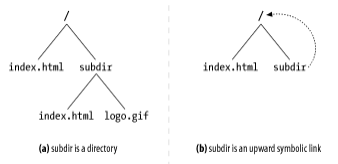

# 9장. 웹 로봇

> 사람과의 상호작용 없이 연속된 웹 트랜잭션들을 자동으로 수행하는 소프트웨어 프로그램
> 

## 크롤러와 크롤링

> 크롤러: 웹 페이지를 타고타고 계속해서 재귀적으로 가져오는 작업을 하는 로봇
> 
- 인터넷 검색엔진은 웹을 돌아다니면서 그들이 만나는 모든 문서를 끌어오기 위해 크롤러를 사용한다.

### 어디에서 시작하는가: ‘루트 집합’

> 루트 집합: 크롤러가 방문을 시작하는 URL들의 초기 집합
> 

- 위 그림에서는 A, G, S 가 루트집합에 있기만 하면 모든 페이지에 도달할 수 있다.
- 좋은 루트 집합
    - 크고 인기 있는 웹 사이트
    - 새로 생성된 페이지들의 목록
    - 자주 링크되지 않는 잘 알려지지 않은 페이지들의 목록

### 링크 추출과 상대 링크 정상화

크롤러가 계속해서 웹을 탐색한다면 크롤링할 페이지들의 목록이 급격히 확장된다.

이를 위해 크롤러들은 간단한 HTML 파싱을 해서 링크를 추출하고 `상대 링크`를 `절대 링크`로 변환할 필요가 있다.

### 순환 피하기

> 루프나 순환에 빠지지 않도록 매우 조심해야 한다.
> 

- (a) → 로봇은 A를 가져와서 B가 A에 링크되어 있는 것을 보고 B를 가져온다.
- (b) → 로봇은 B를 가져와서 C가 B에 링크되어 있는 것을 보고 C를 가져온다.
- (c) → 로봇은 C를 가져와서 A가 C에 링크되어 있는 것을 본다.

→ 여기서 다시 A를 가져오게 된다면 루프가 생긴다. 그래서 우리는 로봇이 어디를 방문했는지 알고 있어야 한다.

### 루프와 중복

- 순환은 크롤러를 루프에 빠뜨려서 꼼짝 못하게 만들 수 있다.
- 크롤러가 같은 페이지를 반복해서 가져오면 고스란히 웹 서버의 부담이 된다.
- 크롤러가 많은 수의 중복된 페이지를 가져오게 되면, 크롤러의 애플리케이션은 자신을 쓸모없게 만드는 중복된 컨텐츠로 넘쳐나게 된다.

### 빵 부스러기의 흔적

> 불행히도, 방문한 곳을 지속적으로 추적하는 것은 쉽지 않다.
> 

어떤 URL을 방문했는지 빠르게 판단하기 위해서는 복잡한 자료구조를 사용할 필요가 있으며, 이 자료구조는 속도와 메모리 사용 면에서 효과적이어야 한다.

- **트리와 해시 테이블**
- **느슨한 존재 비트맵**
    - 공간 사용을 최소화
    - `present bit`를 사용
- **체크포인트**
- **파티셔닝**
    - 분리된 한 대의 컴퓨터인 로봇들이 동시에 일한다.

### 별칭(alias)과 로봇 순환

> URL이 별칭을 가지게 되면 이전에 방문했는지 알려주는게 쉽지 않다.
> 

### URL 정규화하기

> URL들을 ‘정규화’함으로써 다른 URL과 같은 리소스를 가리키고 있음이 확실한 것들을 미리 제거하려고 시도한다.
> 
1. 포트 번호가 명시되지 않았다면, 호스트 명에 `:80`을 추가한다. 
2. 모든 이스케이핑된 문자들(`%xx`)을 대응되는 문자로 변환한다.
3. `#` 태그들을 제거한다.

### 파일 시스템 링크 순환

> 파일 시스템의 심볼릭 링크는 사실상 아무것도 존재하지 않으면서도 끌없이 깊어지는 디렉터리 계층을 만들 수 있기 때문에, 매우 교묘한 종류의 순환을 유발할 수 있다.
> 

(a) 에서 크롤러는 아래와 같이 동작할 것이다.

1. `GET http://www.foo.com/index.html` → `/index.html`을 가져와서, `subdir/index.html`로 이어지는 링크를 발견
2. `GET http://www.foo.com/subdir/index.html` → `subdir/index.html`을 가져와서, `subdir/logo.gif`로 이어지는 링크를 발견
3. `GET http://www.foo.com/subdir/logo.gif` → `subdir/logo.gif`를 가져오고, 더 이상 링크가 없으므로 완료된다.

(b) 에서 크롤러는 다음과 같이 동작할 것이다.

1. `GET http://www.foo.com/index.html` → `/index.html`을 가져와서, `subdir/index.html`로 이어지는 링크를 발견
2. `GET http://www.foo.com/subdir/index.html` → `subdir/index.html`을 가져왔지만 같은 `index.html`로 되돌아간다.
3. `GET http://www.foo.com/subdir/subdir/index.html` → `subdir/subdir/index.html`를 가져온다.
4. `GET http://www.foo.com/subdir/subdir/subdir/index.html` → `subdir/subdir/subdir/index.html`를 가져온다.

(b)에서의 문제는 URL이 다르기 때문에 로봇이 URL만으로 문서가 같다는 것을 모른다는 점이다.

### 동적 가상 웹 공간

> 악의적인 웹 서버는 불쌍한 로봇을 무한한 가상 웹 공간 너머에 있는 이상한 나라의 앨리스의 세계로 여행을 보내버린다.
> 
- 심지어 웹 서버가 실제로는 파일을 하나도 갖고 있지 않았을 수도 있다.
- URL과 HTML은 매번 달라보일 수 있기 때문에 로봇이 순환을 감지하기 매우 어렵다.

- 나쁜 뜻이 없음에도 심벌릭 링크나 동적 콘텐츠를 통한 크롤러 함정을 만든다.

### 루프와 중복 피하기

> 모든 순환을 피하는 완벽한 방법은 없다.
> 

*trade-off*

경험적인 방법으로 문제를 회피하는 것 vs 약간의 손실을 유발하는 것

**URL 정규화**

- URL을 표준 형태로 변환함으로써, 같은 리소스를 가리키는 중복된 URL이 생기는 것을 일부 회피한다.

**Breadth-first 크롤링**

- depth first 보다 순환의 영향을 최소화 할 수 있다.

**Throttling**

- 로봇이 웹 사이트에서 일정 시간동안 가져올 수 있는 페이지의 숫자를 제한한다.

**URL 크기 제한**

- 일정 길이를 넘는 URL의 크롤링을 거부할 수 있다.
- 하지만 못가져오는 콘텐츠들도 틀림없이 있을 것이다.

**URL/사이트 블랙리스트**

- 문제를 일으키는 곳이 있다면 블랙리스트에 추가한다.

**패턴 발견**

- 파일 시스템의 심볼릭 링크를 통한 순환과 그와 비슷한 오설정들은 일정 패턴을 따르는 경향이 있다.

**콘텐츠 지문(fingerprint)**

- 페이지의 콘텐츠에서 몇 바이트를 얻어내어 체크섬(checksum)을 계산한다.
- 이전에 봤던 체크섬을 가져오면, 크롤링 하지 않는다.

**사람의 모니터링**

- 로봇이 못하는 것이 분명히 있을 것.... 그럼 사람이 해야죠....
- 안그러면 화가 난 누리꾼들이 험악한 이메일을 보낼 것....

## 로봇의 HTTP

> 그들이 찾는 콘텐츠를 요청하기 위해 필요한 HTTP를 최소한으로만 구현하려고 한다.
> 

### 요청 헤더 식별하기

- 잘못된 크롤러의 소유자를 찾아낼 때
- 서버에게 로봇이 어떤 종류의 콘텐츠를 다룰 수 있는지에 대한 정보를 줄 때

로봇의 능력, 신원, 출신을 알려주는 기본적인 몇 가지 헤더를 사이트에게 보내주는 것이 좋다.

**User-Agent**

→ 서버에게 요청을 만든 로봇의 이름을 말해준다.

**From**

→ 로봇의 사용자/관리자의 이메일 주소를 제공한다.

**Accept**

→ 서버에게 어떤 미디어 타입을 보내도 되는지 말해준다.

**Referer**

→ 현재의 요청 URL을 포함한 문서의 URL을 제공한다.

### 가상 호스팅

가상 호스팅이 만연한 현실 세계에서, `Host` 헤더를 포함하지 않으면 로봇이 어떤 URL에 대해 잘못된 콘텐츠를 찾게 만든다.

### 조건부 요청

> 어떤 조건을 걸어, 로봇이 검색하는 콘텐츠의 양을 최소화한다.
> 

### 응답 다루기

상태 코드

- 일반적인 상태 코드나 예상할 수 있는 상태 코드를 다룰 수 있어야 한다.

엔터티

- HTTP 헤더에 임베딩된 정보를 따라 로봇들은 엔터티 자체의 정보를 찾을 수 있다.

### User-Agent targeting

> 웹 관리자들은 많은 로봇이 그들의 사이트를 방문하게 될 것임을 명심하고, 그 로봇들로부터의 요청을 예상해야 한다.
> 

## 부적절하게 동작하는 로봇들

로봇들이 저지르는 실수 몇가지와 그로 인한 결과들을 알아보자.

**폭주하는 로봇**

- 로봇은 웹 서핑을 하는 사람보다 훨씬 빠르게 HTTP 요청을 만들 수 있다.
- 만약 로봇이 논리적인 에러를 가지거나 순환에 빠진다면

→ 웹 서버에 극심한 부하를 안길 수 있고, 서버에 과부하를 유발한다.

**오래된 URL**

- 몇몇의 로봇이 오래되어 존재하지 않게된 URL에 대한 요청을 보낼 수 있다.

→ 에러 로그가 채워지거나, 에러 페이지를 제공하는 부하로 인해 웹 서버의 요청에 대한 수용 능력이 감소될 수 있다.

**길고 잘못된 URL**

- 순환이나 프로그래밍상의 오류로 인해 로봇은 웹 사이트에게 크고 의미 없는 URL을 요청할 수 있다.

→ 웹 서버의 처리 능력에 영향을 주고, 웹 서버의 접근 로그를 어지럽게 채우고, 고장을 일으키게 할 수도 있다.

**호기심이 지나친 로봇**

- 사적인 콘텐츠에 대한 이미 존재하는 하이퍼링크를 로봇이 따라갈 수 있다.

→ 명시적으로는 하이퍼링크가 존재하지도 않는 문서들을 디텍터리의 콘텐츠를 가져오는 등의 방법으로 긁어올 수도 있다.

**동적 게이트웨이 접근**

- 언제나 그들이 접근하고 있는 것에 대해 잘 알고 있는 것은 아니다.
- 게이트웨이 애플리케이션의 콘텐츠에 대한 URL로 요청할 수도 있다.

→ 보통은 특수 목적을 위한 것이므로 처리 비용이 많이 든다.

## 로봇 차단하기

> `robots.txt` → 로봇의 접근을 제어하는 정보를 저장하는 파일
> 
- 어떤 웹 서버는 서버의 문서 루트에 `robots.txt`라고 이름 붙은 선택적인 파일을 제공
- 어떤 로봇이 서버의 어떤 부분에 접근할 수 있는지에 대한 정보가 담겨있다.

## 검색엔진

> 웹 로봇을 가장 광범위하게 사용하는 것은 인터넷 검색엔진이다. 인터넷 검색엔진은 사용자가 전 세계의 어떤 주제에 대한 문서라도 찾을 수 있게 해 준다.
> 
- 웹 크롤러들은 마치 먹이를 주듯 검색엔진에게 웹에 존재하는 문서들을 가져다주어, 검색엔진이 어떤 문서에 어떤 단어들이 존재하는지에 대한 색인을 생성할 수 있게 한다.

### 현대적인 검색엔진의 아키텍처

오늘날 검색엔진들은 그들이 갖고 있는 전 세계의 웹페이지들에 대해 `full-text indexes`라는 복잡한 로컬 데이터베이스를 생성한다. 이 색인은 웹의 모든 문서에 대한 일종의 카드 카탈로그처럼 동작한다.

- Full-Text Index → 단어 하나를 입력받아 그 단어를 포함하고 있는 문서를 즉각 알려줄 수 있는 데이터베이스

