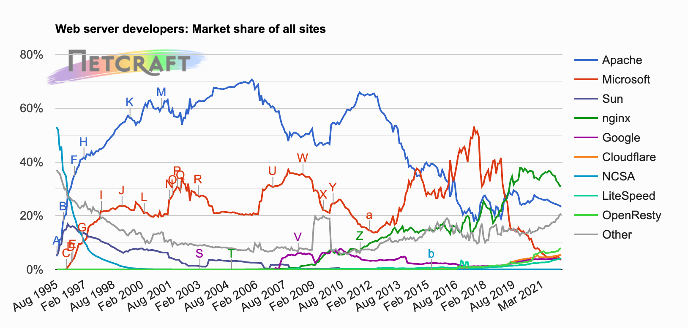

# chap 5 (웹 서버)

## 웹 서버

웹 서버는 HTTP 요청을 처리하고 응답을 제공한다. 웹 서버는 기능, 형태, 크기가 다양하다. 기능은 달라도 모든 웹 서버는 리소스에 대한 HTTP 요청을 받아서 콘텐츠를 클라이언트에게 돌려준다.

- 웹 서버는 HTTP 및 그와 관련된 TCP 처리를 구현한 것이다.
- 웹 서버는 HTTP 프로토콜로 구현하고, 웹 리소스를 관리하고, 웹 서버 관리 기능을 제공한다.

여유가 된다면 nginx 에 대해 한번 공부를 해봐야겠다.

## 웹 서버가 하는 일

- 커넥션을 맺는다–클라이언트의 접속을 받아들이거나, 원치 않는 클라이언트면 닫는다
- 요청을 받는다–HTTP 요청 메시지를 네트워크로부터 읽어들인다
- 요청을 처리한다–요청 메시지를 해석하고 행동을 취한다
- 리소스에 접근한다–메시지에서 지정한 리소스에 접근한다
- 응답을 만든다–올바른 헤더를 포함한 HTTp 응답 메시지를 생성한다.
- 응답을 보낸다–응답을 클라이언트에게 돌려준다
- 트랜젝션을 로그로 남긴다–로그파일에 트랜젝션 완료에 대한 기록을 남긴다.
1. ### 클라이언트 커넥션 수락

클라이언트가 이미 서버에 대해 열려있는 지속적 커넥션이 있다면, 있는 것을 사용하고 없다면 새 커넥션을 생성해야 한다.

**새 커넥션 다루기**

서버는 연결된 클라이언트의 IP 정보를 기반으로 커넥션을 생성한다. IP 주소를 검증하여 필요에 따라 커넥션을 닫을 수 있다.

**클라이언트 호스트 명 식별**

역방향 DNS를 통해 IP로 부터 호스트명을 얻고 호스트명을 분석한다.

**ident를 통해 클라이언트 사용자 알아내기**

서버에서 ident를 확인하는 것인데 113번 포트를 사용한다고 한다. 그런데 많은 소프트웨어가 지원하지 않아서 잘 안 사용하는 듯하다.

2. ### 요청 메시지 수신

요청 메시지를 파싱할 때, 웹 서버는 다음과 같은 일을 한다.

- 요청줄을 파싱하여도 요청 메서드, 지정된 리소스의 식별자, 버전 번호를 찾는다.

요청줄은 캐리지 리턴 줄바꿈 문자열(CRLF)로 끝난다

- 메시지 헤더들을 읽는다(각 헤더는 CRLF로 끝남)
- 헤더의 끝을 의미하는 CRLF로 끝나는 빈 줄을 찾아낸다(존재한다면)
- 요청 본문이 있다면, 읽어 들인다

**커넥션 입력/출력 처리 아키텍처**

***단일 스레드 웹 서버***

- 한 번에 하나씩 요청을 처리하기 때문에, 트랜잭션이 완료되면 다음 커넥션을 처리한다.
- 성능상 문제를 만들어내므로 로드가 적은 서버나 type-o-serve 같은 진단도구에서만 적당하다.

***멀티프로세스와 멀티스레드 웹 서버***

- 여러 요청을 동시에 처리하기 위해 여러 개의 프로세스 혹은 고효율 스레드를 할당한다.
- 서버가 수천, 수만 개의 동시 커넥션을 처리할 때 만들어진 수많은 프로세스나 스레드는 너무 많은 리소스를 소비한다.
- 그러므로 스레드/프로세스의 최대 개수에 제한을 건다.

***다중 I/O 서버***

- 대량의 커넥션을 지원하기 위해 많은 웹 서버는 다중 아키텍처를 채택했다.
- 다중 아키텍처에서는, 모든 커넥션은 동시에 활동을 감시당한다.
- 어떤 커넥션에 대해 작업을 해야하는 것은, 실제로 해야 할 일이 있을 때 뿐이기 때문에 스레드와 프로세스는 유휴 상태의 커넥션에 대해 매여있을 필요가 없다.

***다중 멀티스레드 웹 서버***

- 여러 개의 스레드는 각각 열려있는 커넥션을 감시하고 각 커넥션에 대해 작업을 수행한다.
3. ### 요청 처리

웹 서버가 요청을 받으면, 서버는 요청으로부터 메서드, 리소스, 헤더, 본문(없을 수도)을 얻어내어 처리한다.

4. ### 리소스의 매핑과 접근

URI에 접근하면 그것와 매핑되는 컨텐츠를 제공한다.

5. ### 응답 만들기

서버는 요청에 대해 적절한 응답을 만들어서 보내야 한다.

**응답 엔티티**

- 트랜잭션이 응답 본문을 생성한다면, 응답 메시지와 함께 돌려보낸다.
- 응답 메시지에 주로 포함되는 것
   1. 응답 본문의 MIME 타입을 서술하는 Content-Type 헤더
   2. 응답 본문의 길이를 서술하는 Content-Length 헤더
   3. 실제 응답 본문의 내용
- 응답 본문의 MIME 타입을 결정하는 것은 웹 서버의 책임

**리다이렉션**

- 웹 서버는 요청을 수행하기 위해 브라우저가 다른 곳으로 가도록 리다이렉트 할 수 있다.
- Location 응답 헤더는 콘텐츠의 새로운 혹은 선호하는 위치에 대한 URI를 포함한다.
6. ### 응답 보내기

커넥션에 응답을 보낸다. 커넥션의 수는 제한적이기 때문에 커넥션을 잘 관리해야하며 지속적인 커넥션이라면 Content-Length를 올바른 값으로 주도록 유의해야한다.

7. ### 로깅

트랜젝션이 완료되면 웹 서버는 트랜젝션이 어떻게 수행되었는지에 대한 로그를 로그파일에 기록한다.

