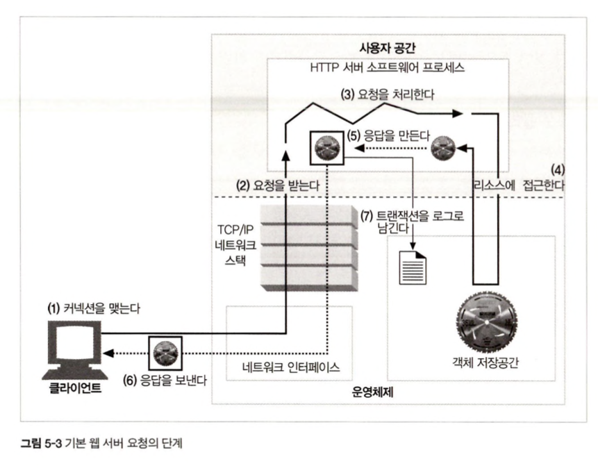
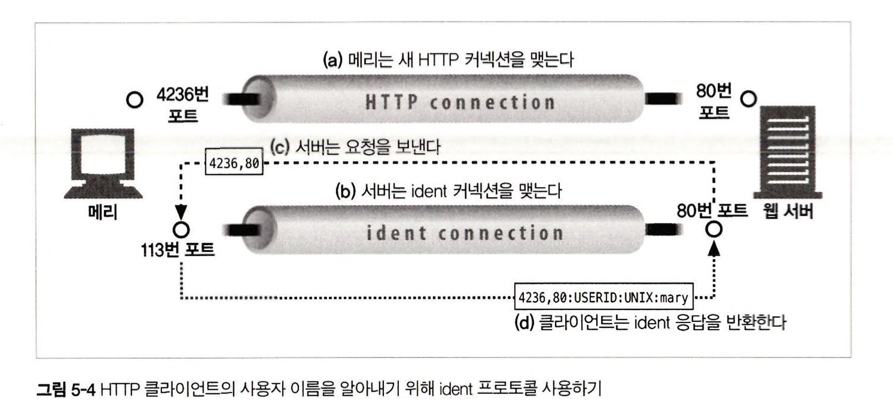
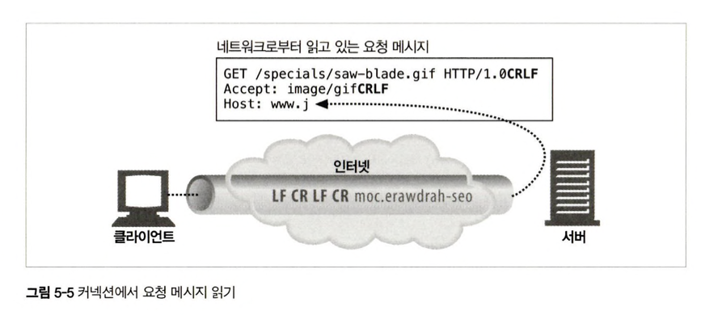
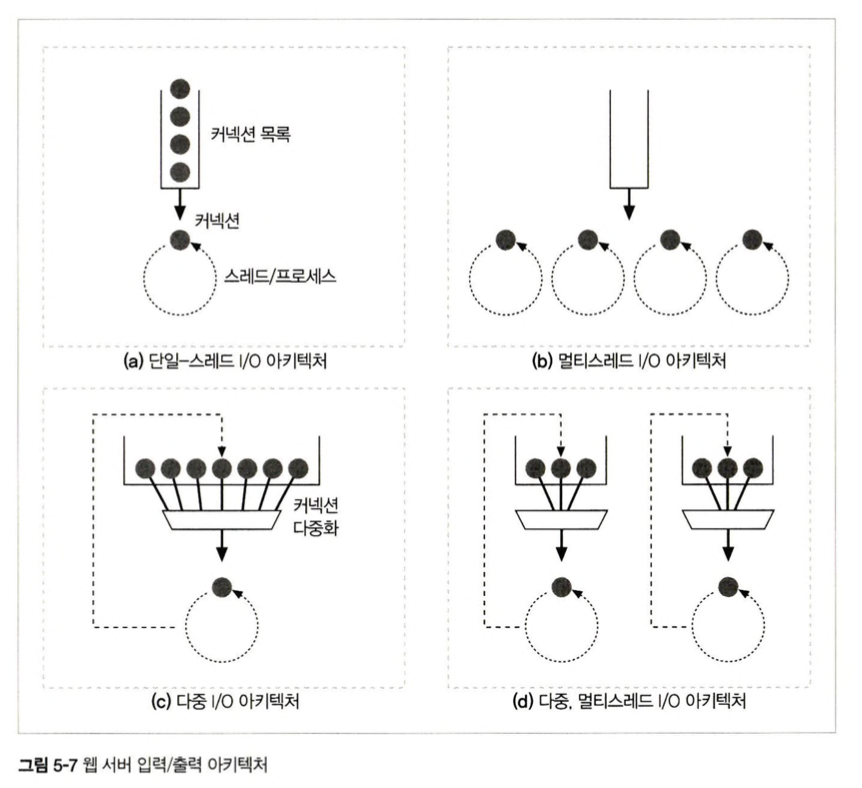

# 웹 서버
- [웹 서버](#웹-서버)
  - [웹 서버란](#웹-서버란)
    - [다목적 소프트웨어 웹 서버](#다목적-소프트웨어-웹-서버)
    - [임베디드 웹 서버](#임베디드-웹-서버)
  - [펄을 사용한 간단한 웹 서버 구현](#펄을-사용한-간단한-웹-서버-구현)
  - [웹 서버가 하는 일](#웹-서버가-하는-일)
    - [step 1. 커넥션 형성](#step-1-커넥션-형성)
      - [새 커넥션 형성](#새-커넥션-형성)
      - [클라이언트 호스트 명 식별](#클라이언트-호스트-명-식별)
      - [ident를 통해 클라이언트 알아내기](#ident를-통해-클라이언트-알아내기)
    - [step 2. 요청 읽기](#step-2-요청-읽기)
      - [메시지 내부 표현](#메시지-내부-표현)
      - [커넥션 입출력 처리](#커넥션-입출력-처리)
        - [단일 스레드 웹 서버](#단일-스레드-웹-서버)
        - [멀티프로세스와 멀티스레드 웹 서버](#멀티프로세스와-멀티스레드-웹-서버)
        - [다중 I/O 서버](#다중-io-서버)
        - [다중 멀티 스레드 웹 서버](#다중-멀티-스레드-웹-서버)
    - [step 3. 요청 처리](#step-3-요청-처리)
    - [step 4. 리로스 접근](#step-4-리로스-접근)
      - [Docroot](#docroot)
        - [가상 호스팅된 docroot](#가상-호스팅된-docroot)
        - [사용자 홈 디렉터리 docroots](#사용자-홈-디렉터리-docroots)
      - [디렉터리 목록](#디렉터리-목록)
      - [동적 콘텐츠 리소스 매핑](#동적-콘텐츠-리소스-매핑)
      - [서버사이드 인클루드(Server-Side Includes, SSI)](#서버사이드-인클루드server-side-includes-ssi)
      - [접근 제어](#접근-제어)
    - [step 5. 응답 만들기](#step-5-응답-만들기)
      - [응답 엔티티](#응답-엔티티)
      - [Redirection](#redirection)
    - [step 6. 응답 전송](#step-6-응답-전송)
    - [step 7. 로깅](#step-7-로깅)

## 웹 서버란
`웹 서버`
- 소프트웨어와 웹페이지 제공에 특화된 장비 양쪽 모두를 지칭
- 리소스에 대한 HTTP 요청을 클라이언트로 응답
- HTTP와 TCP 처리를 구현한 것
- TCP 커넥션 관리에 대한 책임을 운영체제와 나눔
### 다목적 소프트웨어 웹 서버
- 네트워크에 연결된 표준 컴퓨터 시스템에서 동작
- 아파치, W3C의 직소, nginx 같은 소프트웨어를 의미
- 웹 서버 소프트웨어는 거의 모든 컴퓨터와 운영체제에서 동작
### 임베디드 웹 서버
- 제품에 내장될 목적으로 만들어진 작은 웹 서버(프린터, 가전제품 등)

## 펄을 사용한 간단한 웹 서버 구현
```perl
use Socket;
use Carp;
use FileHandle;

# 따로 입력받지 않으면 디폴트로 8080 포트 사용
$port = (@ARGV ? $ARGV[0] : 8080); 

# 로컬 tcp 소켓을 생성하고 커넥션을 기다리도록 설정
$proto = getprotobyname('tcp')
socket(S, PF_INET, SOCK_STREAM, $proto) || die;
setsockept(S, SOL_SOCKET, SO_REUSEADDR, pack("l", 1)) || die;
bind(S, sockaddr_in($port, INADDR_ANY)) || die;
listen(S, SOMAXCONN) || die; 

# 시작 메시지 출력
printf("-----Type-O-Serve Accepting on Port %d-----\n\n", $port);

while(1)
{
    # 커넥션 C를 기다림
    $cport_caddr = accept(C, S);
    ($cport, $caddr) = sockaddr_in($cport_caddr);
    C->autoflush(1);

    # 커넥션 대상 출력
    $cname = gethostbyaddr($caddr,AF_INET);
    printf("-----request from '%s'----\n", $cname);

    # 빈줄이 나올때까지 요청메시지 읽기
    while($line = <C>)
    {
        print $line;
        if($line =~ /^\r/) {last;}
    }

    # 응답 메시지를 위함 프롬프트를 만들고 응답줄을 입력 받음
    # "." 하나만으로 되어있는 줄이 입력되기 전까지 입력된 줄을 클라이언트에 보냄
    printf("-----type response followed by '.'-----\n");

    while($line = <STDIN>)
    {
        $line =~ s/\r//;
        $line =~ s/\n//;
        if($line =~ /^\./) {last;}
        print C $line . "\r\n";
    }
    Close(C);
}
```
- 관리자는 특정 포트로 수신하는 진단 서버를 시작
- 서버가 실행되면 브라우저를 통해서 접근 가능
- 서버는 브라우저로부터 HTTP 요청을 받아서 내용을 화면에 출력한뒤 관리자가 마침표 하나 뿐인 줄로 끝나는 응답 메시지를 입력할때까지 기다림
- 서버는 HTTP 응답 메시지를 브라우저에게 돌려주고 브라우저는 응답 메시지 본문 출력
  
## 웹 서버가 하는 일

1. 커넥션 형성  : 클라이언트의 접속을 받거나 원치 않는 커넥션 거부
2. 요청 읽기    : HTTP 요청 메시지를 네트워크로부터 읽는다.
3. 요청 처리    : 요청 메시지를 해석하고 처리
4. 리소스 접근  : 메시지에서 지정한 리소스에 접근
5. 응답 생성    : 올바른 헤더를 포함한 HTTP 응답 메시지 생성
6. 응답 전송    : 응답을 클라이언트로 전송
7. 트랜잭션 로그 생성   : 로그 파일에 트랜잭션 완료 기록 생성

### step 1. 커넥션 형성
클라이언트가 서버로 요청을 보내기 위해서 미리 생성된 지속 커넥션을 사용하거나 새 커넥션을 형성해야한다.
#### 새 커넥션 형성
1. 클라이언트가 웹 서버에 TCP 커넥션 요청
2. 웹 서버는 해당 커넥션을 형성하고 TCP 커넥션에서 IP 주소를 추출하여 클라이언트 확인
3. 서버는 새 커넥션을 커넥션 목록에 추가하고 데이터 수신 준비

#### 클라이언트 호스트 명 식별
- 대부분 웹 서버는 `역방향 DNS(reverse DNS)`를 사용해서 클라이언트의 IP 주소를 호스트명으로 변환
- 웹 서버는 클라이언트 호스트 명을 구체적인 접근 제어와 로깅을 위해 사용
- 호스트명 룩업(hostname lookup)은 많은 시간을 소비하기 때문에 웹 트랜잭션을 느려지게 할 수 있다.
- 대용량 웹 서버는 호스트명 분석을 꺼두거나 특정 콘텐츠에서만 사용
- 아파치는 HostnameLookups 설정으로 호스트명 룩업 설정 가능
  
#### ident를 통해 클라이언트 알아내기
- ident 프로토콜을 사용해서 사용자 이름을 찾을 수 있음
- 로깅에서 유용하게 사용
- 클라이언트가 ident 프로토콜을 지원할 경우
  - 클라이언트는 Ident 결과를 위해 113번 포트를 열어둠
  - 서버는 자신의 커넥션을 클라이언트의 identd 서버 포트를 향해 열어둠
  - 서버는 클라이언트에 사요자 이름을 묻는 요청을 보냄

- ident는 조직 내부에서 주로 사용되고 공공 인터넷에서는 잘 사용하지 않는다.
  - 대부분의 클라이언트 PC는 identd 신원확인 프로토콜 데몬 소프트웨어를 지원하지 않음
  - ident 프로토콜은 HTTP 트랜잭션을 지연시킴
  - 방화벽이 ident 프로토콜을 막는 경우가 많음
  - 안전하지 않고 조작하기 쉽다.
  - 가상 ip 주소를 잘 지원하지 않음
  - 프라이버시 침해의 우려
- 아파치는 IdentityCheck 지시어를 사용해서 ident 룩업을 사용할 수 있다.
  - 정보가 없으면 "-"으로 대체한다.
  - 일반 로그 포맷의 두번째 필드가 "-"로 돼있다면 ident 정보가 없는 것
### step 2. 요청 읽기

- 요청줄을 파싱하여 요청 메서드, URI, 버전 번호를 찾는다.
  - 각 값은 공백으로 분리되어있음
  - 요청줄은 캐리지 리턴 줄바꿈(CRLF) 문자열로 끝남
  - 그냥 줄 바꿈 문자열인 LF도 줄의 끝으로 인식한다. -> 실수하는 사람이 많아서 
- 메시지 헤더를 읽음, CRLF로 끝남
- 요청 본문이 있으면 읽음
  - 길이는 Content-Length로 정의

#### 메시지 내부 표현
요청 메시지를 쉽게 다룰 수 있도록 자료구조에 저장하여 사용할 수 있다.

#### 커넥션 입출력 처리
웹 서버의 구조 차이에 따라서 요청을 처리하는 방식도 달라진다.

##### 단일 스레드 웹 서버
- 한 번에 하나씩 요청을 처리
- 트랜잭션이 완료된 후 다음 커넥션을 처리
- 하나의 요청을 처리 중에 다른 요청은 무시
##### 멀티프로세스와 멀티스레드 웹 서버
- 여러 요청 동시에 처리 가능
- 매 커넥션 마다 스레드/프레세스를 하나씩 할당하지만 사용자가 몰릴 경우 메모리 낭비 발생
  - 많은 멀티스레드 웹 서비스는 스레드/프로세스의 최대 개수를 제한함
##### 다중 I/O 서버
- 대량의 커넥션 지원
- 커넥션의 상태가 바뀌면 해당 커넥션에 대해 처리 수행
- 스레드와 프로세스는 유휴 상태의 커넥션을 기다리느라 리소스를 낭비하지 않는다.
##### 다중 멀티 스레드 웹 서버
- 멀티 cpu의 이점을 살리기 위해 멀티스레딩과 다중화를 결합
- 여러개의 스레드는 각각 열려있는 커넥션을 감시 및 처리 수행
### step 3. 요청 처리
- 서버는 요청으로부터 메서드, 리소스, 헤더, 본문을 추출하여 처리
### step 4. 리로스 접근
웹 서버는 요청에 대한 리소스를 처리하여 반환해야한다.
#### Docroot
문서의 위치를 사용하여 요청을 받음
> DocumentRoot /usr/local/https/files
> 
> GET /specials/saw-blade.gif

문서의 root 폴더를 지정하면 웹서버가 받아드린 파일의 위치에 접근하여 파일을 가져온다.
##### 가상 호스팅된 docroot
가상 호스팅 웹서버는 사이트별로 분리된 문서 루트(docroot)를 설정한다. `www.joes-hardware.com`과 `www.marys-anitques.com`을 사용하여 호출하면 같은 서버에 접근하더라도 다른 docroot의 파일을 전달해줄 수 있다.

##### 사용자 홈 디렉터리 docroots
사용자들이 한 대의 웹 서버에서 각자의 개인 웹사이트를 만들 수 있도록 해준다. 보통 `/`과 `~` 다음에 사용자를 지칭하는 uri를 사용하여 해당 사용자의 개인 문서 루트를 가리킨다.
> 완전 초기의 웹서버를 기준으로 하는 것 같다.

`GET /~bob/index.html`과 `GET /~betty/index.html`을 사용하여 접근하면 각각 다른 폴더에서 리소스를 참조할 수 있다.
#### 디렉터리 목록
대부분의 웹 서버는 요청한 URL에 대응되는 디렉터리에서 index.html을 찾아서 반환한다. 아파치에서는 DirectoryIndex 설정 지시자를 사용해서 기본 디렉터리 파일로 사용될 이름의 집합을 설정할 수 있다. 
#### 동적 콘텐츠 리소스 매핑
디렉토리에 접근하는 것이 아닌 외부 서버에 요청을 보내거나 특정 프로그램을 실행하도록 해줄 수 도 있다.
#### 서버사이드 인클루드(Server-Side Includes, SSI)
서버사이드 인클루드는 웹 서버에서 다른 파일 내용을 읽어서 삽입하는 것을 의미한다.
#### 접근 제어
인가/인증을 통해서 리소스 접근에 대한 제어를 할 수 있다.
### step 5. 응답 만들기
#### 응답 엔티티
- 구성
  - Content-Type: MIME 타입 
  - Content-Length: 본문의 길이 서술
  - 본문
- Content-Type
  - mime.types: 파일 이름의 확장자 사용가능
  - 매직 타이핑(Magic typing): 아파치 웹 서버는 파일의 내용을 검사해서 타입을 찾음
  - 명시적 타입(Explicit typing): 파일의 확장자나 내용에 상관없이 MIME 타입을 갖도록 설정 가능
  - 타입 협상(Type Negotiation):  여러 종류의 문서 형식에 속하도록 설정 가능
#### Redirection
- 성공 메시지 대신 리다이렉션을 반환할 수 있다.
- 3xx 상태 코드를 가짐
- 유형
  - 영구히 리소스가 옮겨진 경우
  - 임시로 리소스가 옮겨진 경우
  - URL 증강
  - 부하 균형
  - 친밀한 다른 서버가 있을 때
  - 디렉터리 이름 정규화
### step 6. 응답 전송
서버는 커넥션 상태를 추적하고 지속적인 커넥션은 주의해서 다루어야한다. 
- 지속 커넥션 형성
  - 서버가 `Context-Length` 헤더를 바르게 계산하기 위해 특별한 주의를 필요하는 경우
  - 클라이언트가 응답이 언제 끝나는지 알 수 없는 경우
### step 7. 로깅
트랙잭션이 완료되었을 때 수행된 과정을 로그로 남긴다.
