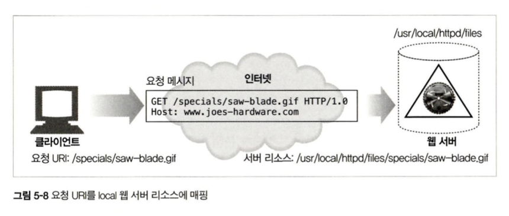
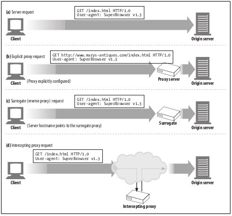
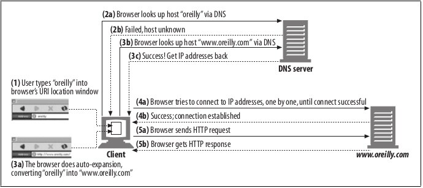
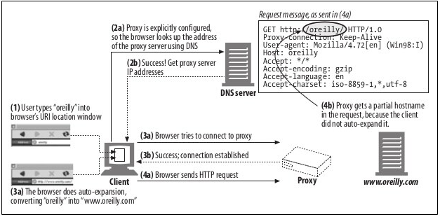
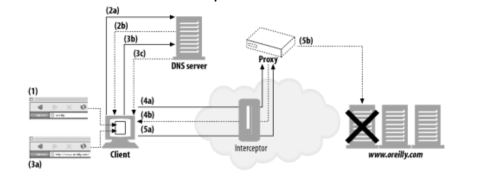
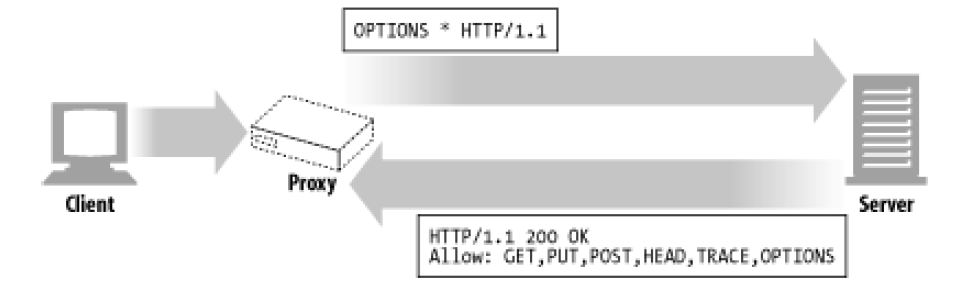

# 프록시(Proxy)
프록시는 중개자라는 의미를 가진다.
- [프록시(Proxy)](#프록시proxy)
  - [웹 중개자](#웹-중개자)
    - [개인 프록시](#개인-프록시)
    - [공용 프록시](#공용-프록시)
    - [Proxy vs Gateway](#proxy-vs-gateway)
  - [프록시를 사용하는 이유](#프록시를-사용하는-이유)
    - [프록시의 위치](#프록시의-위치)
      - [프록시 계층](#프록시-계층)
      - [요청을 프록시로 보내는 법](#요청을-프록시로-보내는-법)
  - [클라이언트 프록시 설정](#클라이언트-프록시-설정)
  - [프록시 요청 특징](#프록시-요청-특징)
    - [프록시 URI](#프록시-uri)
      - [다른 URI를 갖는 이유](#다른-uri를-갖는-이유)
      - [문제점](#문제점)
      - [해결](#해결)
      - [인터셉터 프록시는 부분 URI 수신](#인터셉터-프록시는-부분-uri-수신)
      - [프록시는 서버/클라이언트 모두에게 요청 받을 수 있다.](#프록시는-서버클라이언트-모두에게-요청-받을-수-있다)
      - [전송중 URI 변경](#전송중-uri-변경)
      - [URI 클라이언트 자동확장과 호스트명 분석(Hostname Resoulution)](#uri-클라이언트-자동확장과-호스트명-분석hostname-resoulution)
      - [프록시 없는 URI 분석](#프록시-없는-uri-분석)
      - [명시적인 프록시사용시 URI 분석](#명시적인-프록시사용시-uri-분석)
      - [인터셉트 프록시 URI 분석](#인터셉트-프록시-uri-분석)
  - [메시지 추적](#메시지-추적)
    - [Via 헤더](#via-헤더)
    - [TRACE 메소드](#trace-메소드)
      - [Max-Forwards](#max-forwards)
  - [프록시 인증](#프록시-인증)
  - [프록시 상호운용성](#프록시-상호운용성)
    - [지원하지 않는 헤더와 메소드 처리](#지원하지-않는-헤더와-메소드-처리)
    - [OPTIONS](#options)
    - [Allow Header](#allow-header)
## 웹 중개자

- 클라이언트는 프록시를 통해서 대신 http 서버와 통신할 수 있다.
- 프록시는 클라이언트 입장에서는 서버, 서버 입장에서는 클라이언트
### 개인 프록시
- 브라우저의 기능을 향상하거나 데이터 수집을 위해서 개인 프록시를 사용
### 공용 프록시
- 대부분 공용 프록시
- 중앙 집중형 프록시 관리가 저렴
- 캐시 프록시는 사용자가 많을 수록 서버에 히트 비율이 높아서 효율적

### Proxy vs Gateway
- Proxy: 같은 프로토콜을 사용하는 앱끼리 연결
- Gateway: 다른 프로토콜을 사용하는 앱끼리 연결, 프로토콜 변환기처럼 사용
> gRPC에서 제공해주는 게이트웨이를 사용하면 클라이언트와의 통신은 http를 사용하고 다른 서비스와의 통신은 gRPC를 사용할 수 있다.

하지만 여전히 프록시와 게이트웨이의 차이점은 모호하다. 같은 프로토콜을 사용하는 앱끼리 연결해도 게이트웨이만의 기능이 있다. 그리고 프로시도 프로토콜을 변환하기도 한다. 상용 프록기 서버는 SSL, SOCKS 방화벽, FTP 접근, 웹 기반 앱 지원을 위해서 게이트웨이 기능을 구현한다.

## 프록시를 사용하는 이유
- 보안 개선
  - 사용자가 접근 가능한 리소스를 제한할 수 있다.
- 성능 향상
  - 캐시 기능을 사용해서 성능을 향상 시킬 수 있다.
- 비용 절약
  - 트랜스코더
    - 콘텐츠를 클라이언트에 전달하기 전에 본문 포맷 수정 가능
    - gif 이미지를 jpg 이미지로 변환 가능
- 익명화 프록시
  - 누가 요청을 보냈는지 숨길 수 있다.

### 프록시의 위치
1. 출구(Egress) 프록시: 요청을 관리하기 위해 사용
2. 접근(입구) 프록시: 응답을 관리하기 위해 사용
3. 대리 프록시(리버스 프록시): 웹 서버 바로 앞에서 사용
4. 네트워크 교환 프록시: 트래픽 관리

#### 프록시 계층
프록시는 바로 서버로 요청하는 것이 아닌 다른 프록시를 통해서 서버로 요청할 수 있다 이를 프록시 계층이라고한다.
- 동적 라우팅
  - 프록시는 상황에 따라서 부모 프록시와 서버 중 요청을 보낼 대상을 선택할 수 있다.
    - 부하 균형   
    - 지리적 인접성에 근거한 라우팅
    - 프로토콜/타입 라우팅
    - 유료 서비스 가입자를 위한 라우팅
  
#### 요청을 프록시로 보내는 법
- 클라이언트 수정
- 네트워크 수정
- DNS 수정
- 웹 서버 수정

## 클라이언트 프록시 설정
- 수동 설정
- 브라우저 기본 설정
- 프록시 자동 설정(Proxy auto-configuration, PAC)
  - 자바스크립트 프록시 자동 설정 파일에 대한 URI를 제공할 수 있다. 클라이언트는 프록시를 써야하는지 어떤 프록시 서버를 써야하는지 판단할 수 있다.
- WPAD 프록시 발견
  - 브라우저는 자동설정 파일을 다운 받을 수 잇는 `설정 서버`를 자동으로 찾는 웹 프록시 자동발견 프로토콜을 제공한다.

## 프록시 요청 특징

### 프록시 URI
클라이언트가 웹 서버로 요청을 보낼 때, 스킴, 호스트, 포트번호가 없는 URI를 가진다.
```
GET /index.html HTTP 1.1
User-Agent: SuperBrowserv1.3
```
클라이언트가 프록시로 요청을 보낼때는 완전한 URI를 가진다.
```
GET http://www.marys-anitques.com/index.html HTTP/1.1
User-Agent: SuperBrowserv1.3
```
#### 다른 URI를 갖는 이유
- 단일 서버는 자신의 호스트명과 포트번호를 알고 있기 때문에 클라이언트는 불필요한 정보를 빼고 보낸다.
- 프록시는 목적지 서버와 커넥션을 생성해야하기 때문에 서버의 이름을 알 필요가 있다.
- 프록시 기반 게이트웨이는 FTP 리소스나 외의 스킴과 연결하기 우해서 URI 스킴을 알아야한다.


#### 문제점
프록시가 `스킴/호스트/포트번호 누락`된 요청을 받으면 해당 요청이 접근하고자하는 웹 사이트의 호스트 명을 알아야한다. 그래야 어떤 자원을 필요로하는지 알 수 있다.
#### 해결
- 명시적인 프록시는 요청 메시지가 완전한 URI를 갖는다.
- 가상으로 호스팅되는 웹 서버는 호스트와 포트에 대한 정보를 Host 헤더로 수신한다.

#### 인터셉터 프록시는 부분 URI 수신
명시적으로 설정된 프록시에는 완전한 URI를 전송한다. 하지만 클라이언트는 자신이 프록시와 대화하고 있음을 모를 수 도 있다. 클라이언트가 프록시를 사용한다고 설정되어 있지 않아도 트래픽은 리버스 프록시 또는 인터셉트 프록시를 지날 수 있다. 이 경우 클라이언트는 웹 서버에 요청을 전송하듯이 부분 URI를 전송한다.

#### 프록시는 서버/클라이언트 모두에게 요청 받을 수 있다.
다목적 프록시 서버는 완전한 URI와 부분 URI 모두를 지원해야한다. 
- 완전한 URI가 주어진경우: 해당 URI 사용
- 부분 URI가 있고 Host 헤더가 있는 경우: Host 헤더를 이용해 원 서버의 이름과 포트번호를 알아냄
- 부분 URI가 있고 Host 헤더가 없는 경우:
  - 리버스 프록시라면 실제 서버의 주소와 포트 번호를 가지고 있을 수 있다.
  - 이전에 인터셉트 프록시가 가로챈 트래픽을 받았고 해당 인터셉터 프록시가 원 IP 주소와 포트번호를 사용할 수 있으면 사용한다.
  - 모두 실패한경우 에러 메시지를 전송한다.

#### 전송중 URI 변경
- 상호운용성 문제를 발생시킬 수 있기 때문에 주의해야한다.
- 프로토콜을 강제하면 안된다.

#### URI 클라이언트 자동확장과 호스트명 분석(Hostname Resoulution)
- 브라우저는 프록시의 유무에 따라 요청 URI를 다르게 분석
- 프록시가 없는 경우 사용자가 입력한 URI를 가지고 대응하는 IP 주소를 찾는다.(DNS Lookup?)
- 호슽가 발견되지 않으면 호스트명의 확장을 제공한다. 
  - 일반적인 웹사이트 이름만 입력한 경우 -> www.과 .com 을 붙인다.

#### 프록시 없는 URI 분석

1. 사용자가 oreilly를 브라우저 주소창에 입력
2. DNS lookup
3. 실패
4. 브라우저가 www.oreilly.com으로 확장시킴
5. DNS lookup
6. 성공
7. ip 주소를 사용해서 연결 시도
8. 연결 성공
9. 요청
10. 응답

#### 명시적인 프록시사용시 URI 분석

1. 브라우저에 oreilly 입력
2. 프록시가 명시적으로 설정되어 있기 때문에 DNS를 사용해서 프록시 서버를 찾음
3. 프록시 서버 ip 획득
4. 프록시 서버 접속 시도
5. 접속 성공
6. 요청
   1. 클라이언트가 자동확장을 하지 않았기 때문에 프록시는 부분 uri를 얻음

#### 인터셉트 프록시 URI 분석

호스트명 분석에서 인터셉트 프록시 분석이 제일 독특하다. 클라이언트 입장에서는 인터셉터 프록시는 존재하지 않는다.
1. 브라우저에서 "oreilly" 입력
2. DNS Lookup
3. 실패
4. 브라우저에서 "www.oreilly.com"으로 확장
5. DNS Lookup
6. ip 획득
7. 인터셉트 프록시가 첫번째 접속 요청을 종료 시킴
8. 프록시가 서버와 상호작용 준비가 됐을 때 프록시는 해당 ip가 죽은 서버인 것을 알게됨 -> 프록시는 호스트명을 다시 분석하거나 ip 주소에 대한 역방향 DNS 룩업을 시도해서 다른 ip 주소를 획득해야함
9. 인터셉트 프록시와 명시적 프록시 모두 죽은 서버의 DNS 분석에 대한 장애 허용을 지원해아한다.
    - 브라우저가 명시적인 프록시를 사용하도록 설정되어 있는 경우 장애 허용은 프록시에 의존

## 메시지 추적
대부분의 요청을 프록시를 통해서 전달된다. 그리고 성능을 높히기 위해서 대리 캐시 저장고에 콘텐츠를 복제해서 사용한다.

### Via 헤더
- 메시지가 지나는 중간 노드의 정보를 나열
- 노드를 지날 때 중간 노드는 Via 목록의 끝네 추가됨
- 예시
```
Via: 1.1 proxy-62.irenes-isp.net, 1.0 cache.joes-hardware.com
```
- 메시지의 전달 추적, 메시지 루프 진단, 과정의 프로토콜 파악
- 프록시는 요청을 보내기전에 자신의 Unique Id를 via 헤더에 추가한다.
- 구성요소
  - 프로토콜 이름
  - 프로토콜 버전
  - 노드 이름: 프록시의 호스트와 포트 번호
  - 노드 코멘트: 프록시를 설명하는 코멘트(Optional)
- 보안
  - 방화벽처럼 프록시를 사용한다면 뒤에 연결된 노드들은 가명을 사용해서 입력한다.

### TRACE 메소드
> 프록시 네트워크를 통해 홉에서 홉으로 전달될 때마다 메시지의 내용이 어떻게 변하는지 관찰할 수 있어야한다.

HTTP/1.1의 TRACE 메소드는 요청이 지나가는 프록시와 프록ㄷ시가 메시지를 수정하는지 관찰/추적 할 수 있도록 해준다. -> 프록시 흐름을 디버깅할 때 사용 -> `별로 쓰지 않는다.`

TRACE 요청이 목적지에 도착했을 때 서버는 메시지를 그대로 반환한다. Via 헤더와 메시지를 통해서 내용이 수정되었는지 확인할 수 있다. Content-Type은 message/http이다.

#### Max-Forwards
보통 TRACE 메소드는 목적지로의 모든 경로를 지난다. TRACE와 OPTION 요청시에 홉의 수를 제한하기 위해 Max-Forwards 값을 사용할 수 있다. 수신한 요청의 Max-Forwards 값이 0이라면 요청을 전달하지 않고 클라이언트에 돌려준다.

## 프록시 인증
> 사용자을 인증/인가할 수 있다.

- 사용자가 제한된 요청을 한 경우 -> `407 Proxu Authroization Required`
- 407을 받은 사용자는 자격을 얻어야한다.
- 자격을 획득하면 `Proxy-Authorization` 헤더에 담에서 요청

## 프록시 상호운용성
프록시는 다양하기 때문에 모든 프록시가 호환가능해야한다.
### 지원하지 않는 헤더와 메소드 처리
- 프록시는 이해할 수 없는 헤더 피드는 반드시 그대로 전달해야한다. -> 멍청한 프록시가 발생하는 이유
- 같은 이름의 헤더 필드가 여러개 있다면 순서도 유지해야한다.
- 모르는 메소드가 도착하면 다음 홉으로 전달한다.
> HTTP/1.1은 메소드 확장을 허용한다.
### OPTIONS

서버의 특정 리소스가 어떤 메소드를 지원하는지 알려준다. 실제 리소스의 URI를 OPTIONS로 요청하면 해당 리소스에 대해 가능한 기능을 확인할 수 있다.
```
OPTIONS http://www.google.com/index.html HTTP/1.1
static HTML file wouldn't accept a POST method
```
HTTP/1.1이 명시한 헤더는 서버가 어떤 메서드를 지원하는지 서술하는 Allow 헤더 밖에 없다.
### Allow Header
요청 URI에 의해 식별되는 자원에 대해 지원되는 메소드들이나 서버가 지원하는 모든 메소드를 열거한다.
```
Allow: GET, HEAD, PUT
```
Allow 헤더는 새 리소스가 지원했으면하는 메소드를 추천하기 위해 요청 헤더에 넣어서 사용할 수 도 있다. 그런데 지원하고 안하고는 서버 마음이다. 