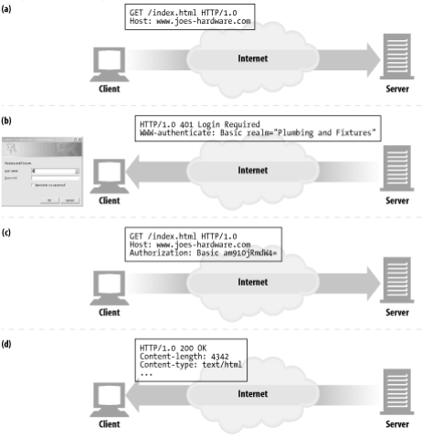
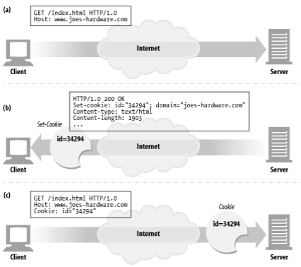
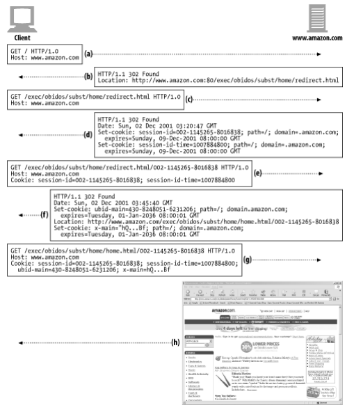

# 11장. 클라이언트 식별과 쿠키

> 서버가 통신하는 대상을 식별하는 데 사용하는 기술을 알아보자.
> 

## 개별 접촉

> HTTP는 익명으로 사용하며 상태가 없고, 요청과 응답으로 통신하는 프로토콜이다.
> 
- 서버는 클라이언트가 보낸 요청을 처리하고 나서 그 응답을 클라이언트로 전송한다.
- 웹 서버는 요청을 보낸 사용자를 식별하거나 방문자가 보낸 연속적인 요청을 추적하기 위해 약간의 정보를 이용할 수 있다.

## HTTP 헤더

**From 헤더**

- 사용자의 이메일 주소를 포함한다.
- 하지만 악의적으로 사용하는 문제가 있어서, From 헤더를 보내는 브라우저는 많지 않다.

**User-Agent 헤더**

- 사용자가 쓰고 있는 브라우저의 이름과 버전 정보, 어떤 경우에는 운영체제에 대한 정보까지 포함하여 서버에게 알려준다.

**Referer 헤더**

- 사용자가 현재 페이지로 유입하게 한 웹페이지의 URL을 가리킨다.
- 헤더 자체만으로 사용자를 식별할 수는 없지만, 사용자가 이전에 어떤 페이지를 방문했었는지는 알려준다.

## 클라이언트 IP 주소

> 클라이언트의 IP 주소는 보통 HTTP 헤더에 없지만, 웹 서버는 HTTP 요청을 보내는 반대쪽 TCP 커넥션의 IP 주소를 알아낼 수 있다.
> 

→ 안타깝게도 클라이언트 IP 주소로 사용자를 식별하는 방식은 다음과 같은 약점을 가진다.

- 클라이언트 IP 주소는 사용자가 아닌, 사용하는 컴퓨터를 가리킨다.
    - 여러 사용자가 같은 컴퓨터를 사용하면 식별할 수 없다.
- 많은 ISP는 사용자가 로그인하면 동적으로 IP 주소를 할당한다.
- 보안을 강화하고 부족한 주소들을 관리하려고 많은 사용자가 NAT 방화벽을 통해 인터넷을 사용한다.
- 보통 HTTP 프락시와 게이트웨이는 원 서버에 새로운 TCP 연결을 한다.
    - 웹 서버는 클라이언트의 IP 주소 대신 프락시 서버의 IP 주소를 본다.

## 사용자 로그인

> IP 주소로 사용자를 식별하려는 수동적인 방식보다, 웹 서버는 사용자 이름과 비밀번호로 인증(로그인)할 것을 요구해서 사용자에게 명시적으로 식별 요청을 할 수 있다.
> 
- HTTP는 `WWW-Authenticate` 와 `Authorization` 헤더를 사용하는 자체적인 체계를 가진다.

## Fat URL

> 사용자의 상태 정보를 포함하고 있는 URL을 Fat URL이라고 한다.
> 
- 웹 서버와 통신하는 독립적인 HTTP 트랜잭션을 하나의 ‘세션’ 혹은 ‘방문’으로 묶는 용도로 Fat URL을 사용할 수 있다.
- 사이트를 브라우징하는 사용자를 식별하는 데 사용할 수 있다.
- 하지만 여기에는 심각한 문제가 있다.
    - Ugly URL → 브라우저의 Fat URL은 새로운 사용자에게 혼란을 준다.
    - 공유하지 못하는 URL → 특정 사용자와 세션에 대한 상태 정보를 포함하기 때문에 공유하지 못한다.
    - 캐시를 사용할 수 없음 → URL이 달라지기 때문에 기존 캐시에 접근할 수 없다.
    - 서버 부하 가중 → Fat URL에 해당하는 HTML 페이지를 다시 그린다.
    - 이탈 → 사용자가 다른 곳에 가면 의도치 않게 Fat URL 세션에서 이탈하기 쉽다.
    - 세션 간 지속성의 부재 → 북마킹하지 않는 이상, 로그아웃하면 모든 정보를 잃는다.

## 쿠키

> 사용자를 식별하고 세션을 유지하는 방식 중에서 현재까지 가장 널리 사용하는 방식이다.
> 
- 쿠키는 캐시와 충돌할 수 있어서, 대부분의 캐시나 브라우저는 쿠키에 있는 내용물을 캐싱하지 않는다.

### 쿠키의 타입

**세션 쿠키(session cookie)**

- 사용자가 사이트를 탐색할 때, 관련한 설정과 선호 사항들을 저장하는 임시 쿠키
- 사용자가 브라우저를 닫으면 삭제된다.

**지속 쿠키(persistent cookie)**

- 세션 쿠키와 다르게 더 길게 삭제되지 않고 유지될 수 있다.
- 사용자가 주기적으로 방문하는 사이트에 대한 설정 정보나 로그인 이름을 유지하려고 사용한다.

→ 다른 점은 파기되는 시점뿐이다.

### 쿠키는 어떻게 동작하는가

> 쿠키는 서버가 사용자에게 “안녕, 내 이름은...”라고 적어서 붙이는 스티커와 같다. 사용자가 웹 사이트에 방문하면, 웹 사이트는 서버가 사용자에게 붙인 모든 스티커를 읽을 수 있다.
> 

- 서버는 사용자가 처음 방문하면 `Set-Cookie` 헤더를 통해 사용자를 식별하기 위한 쿠키를 할당해준다.

### 쿠키 상자: 클라이언트 측 상태

> 브라우저는 쿠키 정보를 저장할 책임이 있다. → HTTP State Management Mechanism
> 

### 사이트마다 각기 다른 쿠키들

> 브라우저는 수백 수천 개의 쿠키를 가지고 있을 수 있지만, 그렇다고 브라우저가 쿠키 전부를 모든 사이트에 보내지는 않는다.
> 
- 쿠키를 모두 전달하면 성능이 크게 저하된다.
- 서버에 특화된 값을 포함하기 때문에, 대부분 사이트에서는 인식하지 않는 무의미한 값이다.
- 모든 사이트에 쿠키 전체를 전달하는 것은 잠재적인 개인정보 문제를 일으킬 것이다.

→ 보통 브라우저는 쿠키를 생성한 서버에게만 쿠키에 담긴 정보를 전달한다.

***쿠키 Domain 속성***

서버는 쿠키를 생성할 때 `Set-Cookie` 응답 헤더에 Domain 속성을 기술해서 어떤 사이트가 그 쿠키를 읽을 수 있는지 제어할 수 있다.

***쿠키 Path 속성***

URL 경로의 앞부분을 가리키는 Path 속성을 기술해서 해당 경로에 속하는 페이지에만 쿠키를 전달한다.

### Version 0 쿠키 (넷스케이프 쿠키)

Set-Cookie 응답 헤더와 Cookie 요청 헤더와 쿠키를 조작하는 데 필요한 필드들을 정의하였다.

`Set-Cookie: name=value [; expires=date] [; path=path] [; domain=domain] [; secure]`

`Cookie: name1=value1 [; name2=value2] ...`

**Version 0 Set-Cookie 헤더**

- Set-Cookie 헤더는 쿠키의 이름과 값을 가져야 한다.

**Version 0 Cookie 헤더**

- 클라이언트가 서버에 요청을 보낼 때는, Domain, Path, Secure 필터들이 현재 요청하려고 하는 사이트에 들어맞으면서 아직 파기되지 않은 쿠키들을 함께 보낸다.
- 모든 쿠키는 Cookie 헤더에 한데 이어 붙여서 보낸다.

### 쿠키와 세션 추적

> 쿠키는 웹 사이트에 수차례 트랜잭션을 만들어내는 사용자를 추적하는 데 사용한다.
> 

- (a) → 브라우저가 Amazon.com의 루트 페이지를 처음 요청한다.
- (b) → 서버는 클라이언트를 전자상거래 소프트웨어 URL로 리다이렉트 시킨다.
- (c) → 클라이언트는 리다이렉트 URL로 요청을 보낸다.
- (d) → 서버는 응답에 두 개의 세션 쿠키를 기술하고 사용자를 다른 URL로 리다이렉트 시키며, 클라이언트는 다시 이 쿠키들을 첨부하여 요청을 보낸다.
    - 새로운 URL은 자체에 어떤 상태 정보를 가지고 있으므로 Fat URL이라고 할 수 있다.
- (e) → 클라이언트는 새로운 URL을 요청을 앞서 받은 두 개의 쿠키와 함께 보낸다.
- (f) → 서버는 home.html 페이지로 리다이렉트시키고 쿠키 두 개를 더 첨부한다.
- (g) → 클라이언트는 home.html 페이지를 가져오고 총 네 개의 쿠키를 전달한다.
- (h) → 서버는 콘텐츠를 보낸다.

### 쿠키와 캐싱

> 쿠키 트랜잭션과 관련된 문서를 캐싱하는 것은 주의해야 한다.
> 

**캐시되지 말아야 할 문서가 있다면 표시하라**

- 문서를 캐시하면 될지 안될지는 문서의 소유자가 가장 잘 안다.
- 명시적으로 `Cache-Control: no-cache=”Set-Cookie”`를 기술해야한다.

**Set-Cookie 헤더를 캐시 하는 것에 유의하라**

- 같은 Set-Cookie 헤더를 여러 사용자에게 보내게 되면, 사용자 추적에 실패할 것이기 때문이다.
- 캐시가 모든 요청마다 원 서버와 재검사시켜 클라이언트로 가는 응답에 Set-Cookie 헤더 값을 기술해서 이 문제를 개선할 수 있다.

**Cookie 헤더를 가지고 있는 요청을 주의하라**

- 요청이 Cookie 헤더와 함께 오면, 결과 콘텐츠가 개인정보를 담고 있을 수도 있다는 힌트다.

### 쿠키, 보안, 그리고 개인정보

> 쿠키를 사용하지 않도록 비활성화시킬 수 있고, 로그 분석 같은 다른 방법으로 대체하는 것도 가능하므로, 그 자체가 보안상으로 엄청나게 위험한 것은 아니다.
> 
- 개인정보를 다루거나 사용자를 추적하는 기술은 잘못된 의도로 사용될 수 있기 때문에 항상 조심하는 것이 좋다.
- 제공하는 개인정보를 누가 받는지 명확히 알고 사이트의 개인정보 정책에만 유의한다면, 쿠키에 관련한 위험성보다 세션 조작이나 트랜잭션상의 편리함이 더 크다.