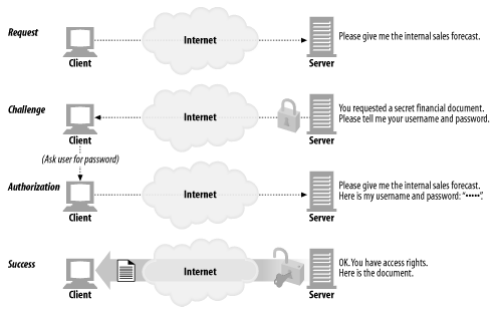
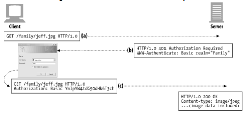
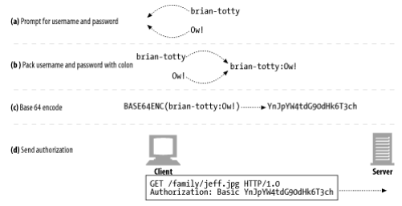

# 12장. 기본 인증

## 인증

> 당신이 누구인지 증명하는 것이다. 완벽한 인증이란 없지만, 여러 데이터가 당신이 누구인지 판단하는데 도움이 된다.
> 

### HTTP의 인증요구/응답 프레임워크

HTTP는 사용자 인증을 하는 데 사용하는 자체 인증요구/응답 프레임워크를 제공한다.

- 서버는 요청을 처리하는 대신 ‘인증 요구’로 응답할 수 있다.
- 사용자는 다시 요청을 보낼 때 인증 정보를 첨부해야 한다.

### 인증 프로토콜과 헤더

> HTTP는 필요에 따라 고쳐쓸 수 있는 제어 헤더를 통해, 다른 인증 프로토콜에 맞추어 확장할 수 있는 프레임워크를 제공한다.
> 

## 기본 인증

> 가장 잘 알려진 HTTP 인증 규약
> 

### Base-64 사용자 이름/비밀번호 인코딩

- HTTP 기본 인증은 사용자 이름과 비밀번호를 콜론으로 이어서 합치고, base-64 인코딩 메서드를 사용해 인코딩한다.
- 사용자 이름과 비밀번호 문자를 섞을 수 있기 때문에, 뜻하지 않게 이름과 비밀번호가 노출되는 문제를 예방할 수 있다.

### 프락시 인증

- 중개 프락시 서버를 통해 인증할 수도 있다.
- 프락시 서버에서 접근 정책을 중앙 관리할 수 있다.
- 웹 서버의 인증과 헤더와 상태 코드만 다르고 절차는 같다.

## 기본 인증의 보안 결함

1. 기본 인증은 사용자 이름과 비밀번호를 쉽게 디코딩할 수 있는 형식으로 네트워크에 전송한다.
    1. base-64로 인코딩된 애들은 쉽게 디코딩할 수 있다.
    2. 모든 HTTP 트랜잭션을 SSL 암호화 채널을 통해 보내거나, 보안이 더 강화된 다이제스트 인증 같은 프로토콜을 사용하는 것이 좋다.
2. 재전송 공격을 예방하기 위한 어떤 일도 하지 않는다.
3. 치명적이지 않은 애플리케이션에 사용된다 하더라도, 굉장히 위험하다.
    1. 저도 그런데... 같은 아이디 비밀번호를 여러 사이트에서 같이 사용합니다....
4. 메시지의 인증 헤더는 그대로지만, 그 외 다른 부분을 수정하여 트랜잭션의 본래 의도를 바꿔버리는 프락시나 중개자가 개입하는 경우, 정상 동작하지 않는다.
5. 가짜 서버의 위장에 취약하다.
    1. 진짜인 척 하면 사용자는 알아서 아이디와 비밀번호를 줄 것이다.

→ 호기심 많은 사용자가 우연이나 사고로 정보에 접근해서 보는 것을 예방하는 데는 도움이 된다. 하지만 위의 결함들을 생각한다면, SSL 같은 암호화된 데이터 전송과 함께 연계해서 사용할 수 있다.