# 14장. 보안 HTTP

## HTTP를 안전하게 만들기

> 웹은 안전한 방식의 HTTP를 필요로 한다.
> 
- 보다 중요한 트랜잭션을 위해서는, HTTP와 디지털 암호화 기술을 결합해야 한다.
- HTTP의 보안 버전은 효율적이고, 이식성이 좋아야 하고, 관리가 쉬워야 하며, 현실 세계의 변화에 대한 적응력이 좋아야 한다.
- 우리는 다음을 제공해 줄 수 있는 HTTP 보안 기술이 필요하다.
    - 서버 인증 → 클라이언트는 자신이 위조된 서버가 아닌 진짜와 이야기하고 있음을 알 수 있어야 한다.
    - 클라이언트 인증 → 서버는 자신이 가짜가 아닌 진짜 사용자와 이야기하고 있음을 알 수 있어야 한다.
    - 무결성 → 클라이언트와 서버는 그들의 데이터가 위조되는 것으로부터 안전해야 한다.
    - 암호화 → 클라이언트와 서버는 도청에 대한 걱정 없이 서로 대화할 수 있어야 한다.
    - 효율 → 저렴한 클라이언트나 서버도 이용할 수 있도록 알고리즘은 충분히 빨라야 한다.
    - 편재성(Ubiquity) → 프로토콜은 거의 모든 클라이언트와 서버에서 지원되어야 한다.
    - 관리상 확장성 → 누구든 어디서든 즉각적인 보안 통신을 할 수 있어야 한다.
    - 적응성 → 현재 알려진 최선의 보안 방법을 지원해야 한다.
    - 사회적 생존성 → 사회의 문화적, 정치적 요구를 만족시켜야 한다.

### HTTPS

> HTTPS는 HTTP를 안전하게 만드는 방식 중에서 가장 인기 있는 것이다.
> 
- HTTPS를 사용할 때, 모든 HTTP 요청과 응답 데이터는 네트워크로 보내지기 전에 암호화된다.
- Secure Sockets Layer (SSL), Transport Layer Security (TLS)를 이용하여 구현된다.

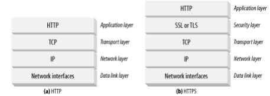

## 암호(cipher)

> 텍스트를 아무나 읽지 못하도록 인코딩하는 알고리즘
> 

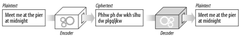

## 키(key)

> 암호의 동작을 변경하는 숫자로 된 매개변수
> 
- 누군가 암호 기계를 훔쳐도 이 값을 모른다면 디코더가 동작하지 않는다.

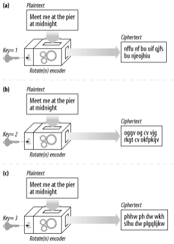

## 대칭키 암호법

> 인코딩과 디코딩에 같은 키를 사용하는 알고리즘
> 

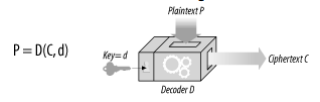

- DES, Triple-DES, RC2, RC4 등이 있다.
- 키가 알려지면 절대 안된다!
- 대칭키 암호의 단점 중 하나는 발송자와 수신자가 서로 대화하려면 둘 다 공유키를 가져야 한다는 것이다.

## 공개키 암호법 (비대칭키 암호법)

> 한 쌍의 호스트가 하나의 인코딩/디코딩 키를 사용하는 대신, 공개키 암호 방식은 두 개의 비대칭 키를 사용한다.
> 

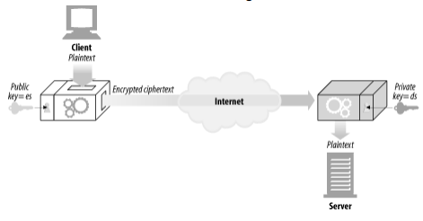

- 호스트만이 개인 디코딩 키를 알고 있다.

### RSA

- 공개키 (물론 누구나 얻을 수 있다)
- 가로채서 얻은 암호문의 일부 (네트워크를 스누핑해서 획득)
- 메시지와 그것을 암호화한 암호문 (인코더에 임의의 텍스트를 넣고 실행해서 획득)

## 디지털 서명

> 메시지가 위조 혹은 변조되지 않았음을 입증하는 체크섬
> 

### 서명은 암호 체크섬이다

- 서명은 메시지를 작성한 저자가 누군지 알려준다.
- 서명은 메시지 위조를 방지한다.

→ 보통 비대칭 공개키에 의해 생성된다. 개인 키는 오직 소유자만이 알고 있기 때문에, 저자의 개인 키는 일종의 ‘지문’처럼 사용된다.

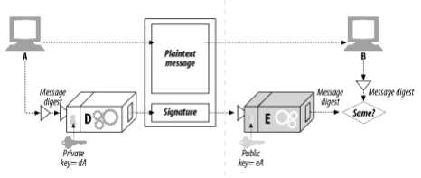

## 디지털 인증서

> 신뢰할 만한 조직에 의해 서명되고 검증된 신원 확인 정보
> 

### 인증서의 내부

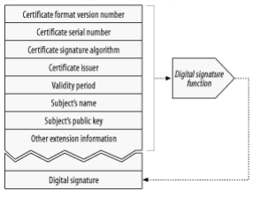

- 대상의 이름 (사람, 서버, 조직 등)
- 유효 기간
- 인증서 발급자 (누가 이 인증서를 보증하는가)
- 인증서 발급자의 디지털 서명
- 대상과 사용된 서명 알고리즘에 대한 서술적인 정보
- 대상의 공개키

→ 누구나 만들 수 있지만 누구나 인정받을 수 있지는 않다.

### 서버 인증을 위해 인증서 사용하기

> 사용자가 HTTPS를 통한 웹 트랜잭션을 할 때, 서버는 인증서를 가지고 있어야 한다.
> 

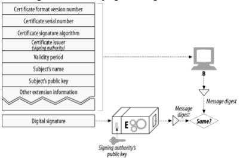

**서버 인증서**

- 웹 사이트의 이름과 호스트 명
- 웹 사이트의 공개키
- 서명 기관의 이름
- 서명 기관의 서명

## HTTPS의 세부사항

> HTTPS는 HTTP 프로토콜에 대칭, 비대칭 인증서 기반 암호 기법의 강력한 집합을 결합한 것이다.
> 

### HTTPS scheme

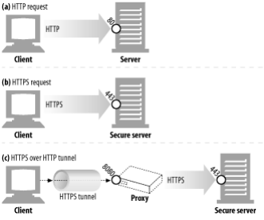

- http 스킴을 가진다면, 클라이언트는 서버에 80 포트값으로 연결하고, 평범한 http 명령을 전송한다.
- https 스킴을 가진다면, 클라이언트는 서버에 443 포트값으로 연결하고, 서버와 바이너리 포맷으로 된 몇몇 SSL 보안 매개변수를 교환하며 ‘handshake’를 하고, 암호화된 http 명령을 전송한다.

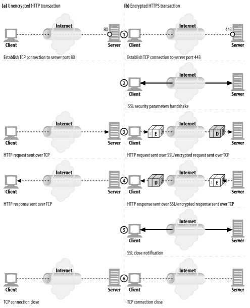

### SSL handshake

- 프로토콜 버전 번호 교환
- 양쪽이 알고 있는 암호 선택
- 양쪽의 신원을 인증
- 채널을 암호화하기 위한 임시 세션 키 생성

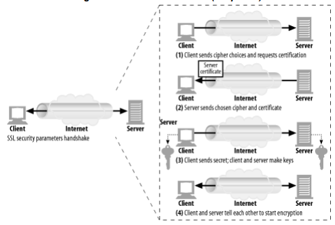

### 사이트 인증서 검사

> 최신 웹브라우저들은 대부분 인증서에 대해 간단한 기본적인 검사를 하고 그 결과를 더 철저한 검사를 할 수 있는 방법과 함께 사용자에게 알려준다.
> 
1. 날짜 검사 → 인증서가 만료되었는지 시작 및 종료일을 검사
2. 서명자 신뢰도 검사 → 신뢰성 있는 기관에서 서명되었는지 검사
3. 서명 검사 → 서명기관의 공캐키를 서명에 적용하여 그의 체크섬과 비교해본다.
4. 사이트 신원 검사 → 인증서의 도메인 이름이 대화 중인 서버의 도메인 이름과 비교해본다.

## 프락시를 통한 보안 트래픽 터널링

> 클라이언트는 종종 그들을 대신하여 웹 서버에 접근해주는 웹 프락시 서버를 이용한다.
> 

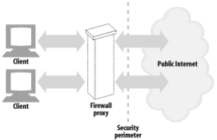

- 클라이언트가 서버로 보낼 데이터를 공개키로 암호화하기 시작했다면, 프락시는 더 이상 HTTP 헤더를 읽을 수 없다.
    - 그러면 프락시는 요청을 어디로 보내야 하는지 알 수 없게 된다.

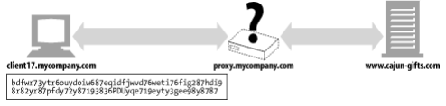

그래서 우리는 HTTP SSL 터널링 프로토콜을 사용한다.

- 클라이언트는 프락시에게 먼저 자신이 연결하고자 하는 안전한 호스트와 포트를 말해준다.
- 클라이언트는 이 내용을 프락시가 읽을 수 있도록 암호화하기 전 평문으로 말해준다.
- 그러면 CONNECT 메소드를 사용해서 평문으로 된 종단 정보를 전송한다.
    - CONNECT 메소드는 프락시에게 희망하는 호스트와 포트번호로 연결 해달라고 말해준다.
    - 완료되면, 클라이언트와 서버 사이에서 데이터가 직접 오갈 수 있는 터널을 만든다.
- 클라이언트는 프락시로부터 응답을 기다리고, 프락시는 요청을 평가하여 그것이 유효하고 사용자가 그러한 커넥션을 요청할 수 있도록 허가 받았는지 확인한다.
- 모든 것이 적법하다면, 프락시는 서버로 연결하고 응답을 클라이언트에게 보낸다.