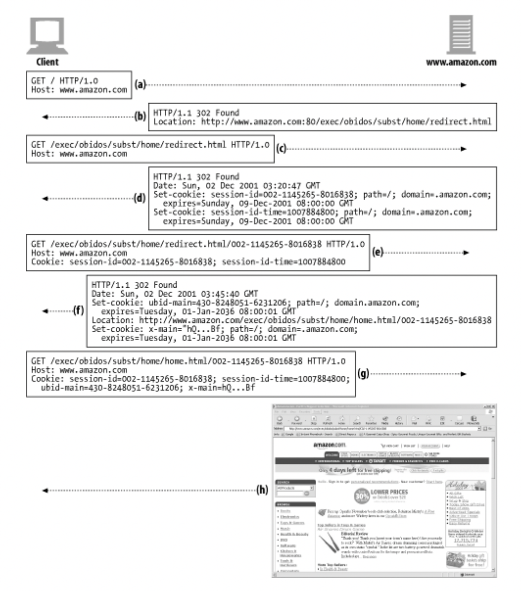

# Chap 11, 12, 14

---

# Chap.11 클라이언트 식별과 쿠키

HTTP는 **stateless** 프로토콜이다. 

- stateless란 연결 자체에 대한 정보를 가지지 않고, 매 요청이 일회성이며 독립적으로 처리되는 것을 의미한다.

HTTP가 사용자를 식별하는 기술들

- HTTP 헤더
- 클라이언트의 IP 주소
- 사용자 로그인 인증
- URL에 식별자를 포함하는 뚱뚱한(fat) URL
- 쿠키

## 11.2 HTTP 헤더

## 11.3 클라이언트 IP 주소

- 클라이언트 IP 주소로 사용자를 식별하기 어려운 이유
    - 여러 사람이 컴퓨터 한 대를 공유하는 경우
    - *많은 인터넷 서비스 공급자는 사용자가 로그인할 때마다 동적으로 IP 주소를 할당하기 때문*
    - NAT(Network Address Translation) 방화벽
        - 한정된 IP 주소를 관리하고 보안을 강화하기 위해 사용됨. 실제 IP 주소를 내부에서 사용하는 하나의 방화벽 IP 주소로 변환함.
    - 클라이언트 — 프락시 — 원 서버 형태인 경우
        - 원 서버는 프락시 서버의 IP 주소를 보기 때문에 클라이언트를 식별할 수 없음.
        - 일부 프락시는 클라이언트의 IP 주소를 보존하기 위해 Client-ip/X-Forwarded-For 확장 헤더를 추가하기도 한다.
    
    ## 11.4 사용자 로그인
    
    HTTP는 WWW-Authenticate와 Authorization 헤더를 *자체적으로 처리할 수 있음* → 한 번 로그인 하면 모든 요청마다 로그인 정보를 함께 보낸다. 한 세션이 진행되는 동안 유지됨.
    
    - 로그인이 필요한 서버에 로그인 하지 않은(인증 정보가 없는) 클라이언트가 요청을 하면 401 에러를 준다.
    
    
    
    *+) 401 에러와 403 에러의 차이점?*
    
    
    

## 11.5 뚱뚱한 URL

- 사용자의 상태 정보를 포함하고 있는 URL
- 뚱뚱한 URL의 문제점
    - 너무 복잡한 url은 사용자에게 혼란을 줄 수 있음
    - 특정 사용자와 세션에 대한 상태 정보를 포함하기 때문에 링크를 공유할 수 없음
    - 캐시를 사용할 수 없음
    - 서버 부하 가중
    - 사용자가 뚱뚱한 URL 세션에서 이탈하게 되면 유지 되어야 하는 상태들을 잃는다.
    - 세션 간 지속성의 부재

## 11.6 쿠키

### 11.6.1 쿠키의 타입

- 세션 쿠키
    - 브라우저를 닫으면 지워짐.
    - 유효기간(expires 나 max-age)이 없으면 세션 쿠키이다.
- 지속 쿠키
    - 디스크에 저장되기 때문에 브라우저를 닫아도 유지될 수 있음

### 11.6.2 쿠키는 어떻게 동작하는가

(a) 사용자가 웹 사이트에 처음 방문하면 웹 서버는 사용자에 대해 아무 정보가 없다.

(b) 사용자가 사이트를 다음에 방문할 때, 사용자를 식별하기 위해서 유일한 값을 쿠키에 할당한다.

- Set-Cookie나 Set-Cookie2와 같은 HTTP response 헤더에 기술되어 사용자에게 전달한다.

(c) 서버는 유일한 id 값을 쿠키에 담아서 데이터베이스에서 사용자의 정보를 찾는데 사용할 수 있음.

브라우저는 서버에서 온 Set-Cookie나 Set-Cookie2 헤더 담긴 내용을 브라우저 쿠키 데이터베이스에 저정하고, 사용자가 같은 사이트를 방문하면 서버가 할당 했던 쿠키 정보들을 요청 헤더에 담아서 서버에게 보낸다.

### 11.6.4 사이트마다 다른 쿠키들

브라우저는 많은 쿠키를 가지고 있지만, 모든 사이트에 전부 보내는 것이 아니다.

→ [naver.com](http://naver.com)에서 생성된 쿠키는 naver.com에만 보내고, [daum.net](http://daum.net)에는 보내지 않는다.

- 쿠키 Domain 속성 - 어떤 사이트가 그 쿠키를 읽을 수 있는지 제어할 수 있음.
    
    Set-cookie: user=”mary17”;domain=”[naver.com](http://naver.com)” 
    
    → user=”mary17”이라는 쿠키를 .naver.com 도메인을 가진 모든 사이트에 전달한다는 의미이다.
    
- 쿠키 Path 속성
    
    Set-cookie: pref=compact;domain=”gdksfjlw.com”;path=/autos/
    
    path를 포함하는 URL에만 pref=compact 쿠키 내용을 전달할 수 있음.
    

### 11.6.5 Version 0 쿠키

속성에는

- 이름=값 (required)
- Expires (optional)
- Domain (optional)
- Path (optional)
- Secure (optional)

이 있다.

Version 1 쿠키는 거의 사용 되지 않으며, 현재는 RFC 6265 쿠키가 사용 되고 있는 것 같다. [쿠키 버전에 대한 글](https://meetup.toast.com/posts/209) 

### 11.6.8 쿠키와 세션 추적

위 그림은 아마존에서 세션 쿠키를 이용해서 사용자를 추적하는 방식이다.

(a) 브라우저가 Amazon.com을 최초로 요청한다.

(b) 서버는 전자상거래 소프트웨어 URL로 리다이렉트

(c) 클라이언트는 리다이렉트 된 URL로 요청을 보낸다.

(d) 서버는 두 개의 세션 쿠키를 담아서 다른 URL로 리다이렉트 시키고, 클라이언트는 서버에게 받은 쿠키를 다시 담아서 리다이렉트 URL로 요청을 보낸다.

(e) 새로운 URL (상태 정보를 가지고 있는 뚱뚱한 URL)로 서버에서 받은 쿠키와 함께 요청을 보낸다.

(f) 서버는 home.html 페이지로 리다이렉트 시키고 쿠키 두 개를 담아서 응답을 보낸다.

(g) 클라이언트는 (d)와 (f)에서 받은 쿠키 총 4개와 함께 서버에 요청을 보낸다.

(h) 서버는 home.html 콘텐츠를 보낸다.

### 11.6.9 쿠키와 캐싱

- 쿠키와 관련해서 주의해야할 캐시를 다루는 기본 원칙
    - 캐시되지 말아야 할 문서가 있다면 표시
        
        Cache-Control: no-cache=”Set-Cookie”
        
    - Set-Cookie 헤더를 캐시 하는 것에 유의하기
        - 같은 Set-Cookie 헤더를 캐싱한 캐시를 여러 사용자가 접근하게 되면, 보안에 위험이 있고 사용자 추적에도 실패하게 된다.
        - 어떤 캐시는 응답을 저장하기 전에 Set-Cookie 헤더를 제거하는 경우도 있는데, 그 캐시 데이터를 받는 클라이언트는 Set-Cookie 정보가 없는 데이터를 받게 되어서 문제가 될 수 있다.
            
            → 캐시가 모든 요청마다 서버와 재검사 시키는 방법으로 해결할 수 있다.
            
    - Cookie 헤더를 가지고 있는 요청을 주의하기
        
        Cookie 헤더를 가지고 요청이 가면 응답에 개인 정보가 담겨있을 확률이 높음 
        
        → Cookie 헤더를 가진 요청에 대한 응답은 캐시하지 않도록 하거나, 캐시에서 매 요청마다 재검사를 하도록 하는 방법이 있다.
        

### 11.6.10 쿠키, 보안 그리고 개인정보

- 현재 웹 프로그래밍에서 쿠키는 편리하지만 보안 측면에서 취약하기 때문에 아직은 부정적인 여론이 남아있는 거 같다. 하지만 httpOnly Secure 속성들이 추가되면서, 문제점들을 보완할 수도 있기 때문에 무조건적으로 부정하는 것도 옳지 않다고 *개인적으로* 생각한다. [쿠키 보안에 관련된 글](https://nsinc.tistory.com/121)

# Chap.12 기본 인증

[그림 1] HTTP 인증 모델

요청 - 클라이언트가 인증 정보 없이 서버에게 요청한다.

인증 요구 - 서버는 사용자에게 인증 정보를 요구하는 401 에러와 함께 *WWW-Authenticate 헤더에 비밀번호가 있는 영역을 설명한다.* 

인증- 클라이언트는 인증 정보를 Authorization 헤더에 담아서 요청을 다시 보낸다.

성공 - 인증 정보가 맞으면 서버는 콘텐츠와 함께 200 응답 코드를 보낸다. Authentication-Info 헤더에 인증 세션에 관한 추가 정보를 기술하기도 한다.

**Authorization(권한 부여) vs Authentication(인증 = 로그인)*

### 12.1.3 보안 영역

위의 인증요구 단계에 비밀번호가 있는 영역을 보안 영역 그룹으로 설명할 수 있다.

웹 서버에는 보안 영역을 여러개 가질 수 있고, 클라이언트의 인증 정보에 따라서 권한을 다르게 부여한다.

이와 같은 401 에러 응답이 오면 사용자가 권한의 범위를 이해할 수 있다. 

## 12.2 기본 인증

[그림 1] HTTP 인증 모델을 자세히 살펴보자면, 

(a) 사용자가 자신의 가족사진을 요청한다.

(b) 서버가 WWW-Authenticate 헤더와 함께 가족사진을 접근할 때 필요한 비밀번호를 요구하는 401 Authorization Required 응답을 준다.

(c) 브라우저가 401 응답을 받아서 Family 보안 영역에 필요한 인증 정보(사용자 이름, 비밀번호) 를 요구하는 창을 띄운다. 사용자가 입력한 정보를 base-64 방식으로 인코딩하고, Authorization 헤더에 담아서 서버로 다시 요청한다.

(d) 서버가 받은 요청에 Authorization 헤더 정보를 디코딩하고, 문제가 없으면 HTTP 200 OK 메시지와 함께 요청한 콘텐츠를 보낸다.

## 12.3 기본 인증의 보안 결함

- 사용자 이름과 비밀번호를 쉽게 디코딩할 수 있는 형식으로 네트워크에 전송함.
- 재전송 공격 - 디코딩이 어렵다고 해도, 악의가 있는 제 3자가 인코딩 된 사용자 이름과 비밀번호를 캡쳐한 다음 원 서버에 보내서 인증에 성공하고 서버에 접근할 수 있음.
- 사용자가 사용하는 인증 정보들을 은행 사이트 같은 곳에 악용할 수 있음
- 인증 헤더를 건들지는 않지만, 다른 부분을 수정해서 트랜잭션의 본래 의도를 조작할 수 있음
- 가짜 서버 위장에 취약하다.

# Chap.14 보안 HTTP

### 14.1.1 HTTPS

HTTPS를 사용하면 모든 HTTP 요청과 응답 데이터는 네트워크로 보내지기 전에 암호화된다.

HTTPS는 HTTP 계층 하부에 암호 보안 계층(SSL, Secure Sockets Layer / TLS, Transport Layer Security)을 제공함으로써 동작한다.

## 14.2 디지털 암호학

- 대칭키 암호
    - 인코딩과 디코딩에 같은 키 사용
    - 발송자와 수신자만 아는 공유키(비밀키)를 가져야 한다. N개의 노드가 있고 각 노드가 N-1개의 상대 노드를 가진다면, N^2개의 비밀 키가 필요하기 때문에 키를 관리하기 어렵다는 단점이 있다.
- 비대칭키
    - 인코딩과 디코딩에 다른 키 사용
    - 공개키 암호법에 사용됨
- 공개키
    - 노드 A에게 인코딩 된 메시지를 보낼 때 사용하는 인코딩 키는 모두에게 공개 되어 있다
    - 하지만 노드 A의 인코딩 키로 암호화 된 메시지는 A만이 디코딩 할 수 있다. 디코딩 키는 A만 알고 있기 때문이다.
- 디지털 서명
- 디지털 인증서

## 14.7 HTTPS의 세부사항

- 만약 URL이 https 스킴을 가지고 있다면
    - 클라이언트는 443번 포트로 연결하고
    - 서버와 SSL 보안 매개변수를 협상하기 위해 SSL 핸드셰이크를 하고
    - 협의된 보안 매개변수들을 이용해서 HTTP 트랜잭션을 암호화한다.

### 14.7.3 보안 전송 셋업

(b) 그림을 보면, 

- 우선 클라이언트가 서버의 443번 포트로 연결해서 TCP 연결이 되고 나면
- 클라이언트와 서버는 암호법 매개변수와 교환 키를 협의하면서 SSL 계층을 초기화 해야한다.
- 이러한 과정의 서버와 클라이언트의 핸드셰이크(= SSL 핸드셰이크)가 완료되면 SSL 초기화가 완료되고
- 클라이언트는 요청 메시지가 TCP로 보내지기 전에 암호화 해서 보안 계층에 보낼 수 있다.

### 14.7.4 SSL 핸드셰이크

암호화된 HTTP 메시지를 보낼 때 필요한 정보들을 협의하기 위해서 서버와 클라이언트는 SSL 핸드셰이크를 하는데,

- 프로토콜 버전 번호 교환
- 양쪽이 알고 있는 암호 선택
- 양쪽의 신원을 인증
- 채널을 암호화하기 위한 임시 세션 키 생성

정보들을 합의하고 교환한다.

### 14.7.5 서버 인증서

SSL은 서버 인증서를 클라이언트로 나르고 다시 클라이언트 인증서를 서버로 전달하는 상호 인증을 지원한다.

클라이언트 인증서는 잘 사용 되지 않지만, HTTPS 트랜잭션은 항상 서버 인증서를 요구한다.

### 14.7.6 사이트 인증서 검사

SSL 자체는 사용자에게 웹 서버 인증서를 검증할 것을 요구하지 않지만, 브라우저들은 대부분 인증서에 대한 간단한 기본적인 검사를 하고, 더 엄격한 검사를 할 수 있는 방법을 사용자에게 알려준다.

넷스케이프에서 제안한 서버 인증서 검사를 위한 알고리즘 수행 단계

- 날짜 검사 - 인증서의 만료나 아직 활성화 되지 않은 인증서를 검사할 수 있다.
- 서명자 신뢰도 검사 - 모든 인증서는 서버를 보증하는 인증 기관(CA)에 의해 서명되어 있는데, 신뢰할 만한 서명 기관의 목록에 포함되는 CA이면 그 CA가 간접적으로 서명한 인증서를 받아들일 수 있다.
    
    ex) A(신뢰할만한 기관)  —- 서명 —> B —- 서명 —→ C (B는 신뢰할 만한 서명 기관의 목록에는 없지만 A의 서명을 받았으므로 C를 올바른 CA 경로에서 파생된 것으로 보고 받아들임.)
    
- 서명 검사
- 사이트 신원 검사

## 14.9 프락시를 통한 보안 트래픽 터널링

위와 같은 상황에서, 클라이언트가 서버로 보낼 데이터를 서버의 공개키로 암호화하기 시작하면, 프락시는 HTTP 헤더를 읽을 수 없다. (서버의 공개키로 암호화 된 메시지는 서버만 디코딩 할 수 있다.)

- HTTPS SSL 터널링 프로토콜
    - 클라이언트는 HTTP의 CONNECT 메서드를 통해 먼저 프락시에게 자신이 연결하고자 하는 안전한 호스트와 포트를 평문으로 말해준다.
    - 프락시는 클라이언트의 요청이 유효하고 사용자가 허가된 커넥션을 요청했는지 확인한다.
    - 프락시가 클라이언트의 요청이 유효하다고 판단하면, 목적지 서버로 연결한 후 성공하면 200 Connection Established 응답을 클라이언트에게 보낸다.
    - 클라이언트와 서버 사이에 데이터가 직접적으로 오갈 수 있는 터널을 만들어 진다.
