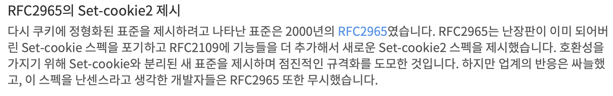

# 클라이언트 식별과 쿠키
- [클라이언트 식별과 쿠키](#클라이언트-식별과-쿠키)
  - [식별](#식별)
  - [HTTP 헤더](#http-헤더)
  - [클라이언트 IP 주소](#클라이언트-ip-주소)
    - [약점](#약점)
  - [사용자 로그인](#사용자-로그인)
  - [뚱뚱한 URL](#뚱뚱한-url)
    - [문제점](#문제점)
  - [쿠키](#쿠키)
    - [쿠키의 타입](#쿠키의-타입)
    - [쿠키의 동작 방식](#쿠키의-동작-방식)
      - [쿠키 Domain 속성](#쿠키-domain-속성)
      - [쿠키 Path 속성](#쿠키-path-속성)
      - [쿠키 구성요소](#쿠키-구성요소)
        - [Version 0](#version-0)
        - [Version 1](#version-1)
    - [쿠키와 세션 추적](#쿠키와-세션-추적)
    - [쿠키와 캐싱](#쿠키와-캐싱)
      - [규칙](#규칙)
    - [쿠키, 보안, 개인정보](#쿠키-보안-개인정보)

## 식별
- HTTP는 익명으로 사용하며 상태 없이 요청과 응답으로 통신
- 서버가 클라이언트를 식별할 수 있어야한다.
## HTTP 헤더
- 일반적인 HTTP 헤더
  - From: 사용자의 이메일 주소
  - User-Agent: 사용자의 브라우저
  - Referer: 사용자가 현재 링크를 타고온 페이지
  - Authorization: 사용자의 이름과 비밀번호
  - Client-ip: 클라이언트의 ip
  - X-Forwared-for: 클라이언트의 ip
  - Cookie: 서버가 생성한 ID 라벨

## 클라이언트 IP 주소
- 클라이언트의 ip 주소는 보통 http 헤더에 없다.
- 하지만 웹 서버는 http 요청을 보내는 쪽의 tcp 커넥션의 ip 주소를 알아낼 수 있다.
### 약점
- 클라이언트 ip는 사용자가 아닌 사용자의 컴퓨터를 가리킴. 공용 컴퓨터에서 사용자 구분 불가
- 인터넷 서비스 제곳자(ISP)는 동적으로 ip 주소를 할당
- 사용자가 네트워크 주소 변환(Network Address Translation, NAT) 방화벽을 통해 인터넷 사용. -> 실제 ip 주소를 방화벽 뒤로 숨기고 클라이언트의 실제 ip 주소를 방화벽 ip 주소로 변환
- 프록시의 ip 주소를 얻을 수 있다.

## 사용자 로그인
- IP 주소를 사용하는 것 보다 사용자 이름과 비밀번호로 로그인 하는 것이 유용하다.
- WWW-Authenticate와 Authorization 헤더를 사용해 웹 사이트에 사용자의 이름을 전달할 수 있다.
- 서버로의 모든 요청에 로그인 정보를 함께 보낸다. 

## 뚱뚱한 URL
- 사용자의 상태 정보를 URL에 포함시킨다.
- 웹 서버와 통신하는 HTTP 트랜잭션을 하나의 세션으로 묶는 용도로 사용
- 웹 사이트 방문시 고유 id 생성후 url에 추가
- 서버는 클라이언트를 "뚱뚱한 url"로 리다이렉트
### 문제점
- 못생긴 url
- 공유하지 못하는 url
- 캐시를 사용할 수 없음
- 서버 부하 증가
- 이탈
- 세션 간 지속성 부재

## 쿠키
- 사용자를 식별하기 위해 사용
- 쿠키는 캐시와 충돌 가능성 때문에 쿠키 내용물을 캐싱하지 않음

### 쿠키의 타입
- 세션 쿠키(Session Cookie): 사용자가 사이트를 탐색할 때 관련 설정과 선호사항 저장
- 지속 쿠키(Persistent Cookie):: 디스크에 저장되어 브라우저를 닫거나 컴퓨터를 재시작해도 남아있다. 설정 정보나 로그인 이름을 유지하기위해 사용
- 쿠키는 Discard 또는 Expires, Max-Age가 없으면 세션 쿠키

### 쿠키의 동작 방식
- 쿠키는 서버에게 클라이언트가 누군지 알려준다.
- 최초에 서버가 클라이언트에 쿠키를 전달하고 브라워는 해당 쿠키를 저장한다.
- 브라우저가 쿠키를 저장하는 기능을 `HTTP 상태 관리 체계(HTTP Status Management Mechanism)`이라고 한다.

#### 쿠키 Domain 속성
- 서버는 쿠키를 생성할 때 Set-Cookie 응답 헤더에 domain 속성 적용할 수 있다.
  - 어떤 사이트가 해당 쿠키를 읽을 수 있는지 제어한다.

#### 쿠키 Path 속성
- 웹 사이트의 일부 경로에서만 쿠키를 사용하게 지정해 줄 수 있다.

#### 쿠키 구성요소
- 쿠키는 `version 0`과 `version 1`이 있다.
- 
> [Coookie 참고](https://meetup.toast.com/posts/209)

##### Version 0
```
Set-Cookie: name=value [; expires=date] [; path=path] [; domain=domain] [; secure]
Cookie: name1=value1 [; name2=value2]...
```
- Verion 0 Set-Cookie Header
  - 이름=값: 핅수 속성으로 쿠키에 저장된 데이터의 이름과 값을 의미
  - Expires: 쿠키의 생명주기를 의미하고 값이 있다면 지속 쿠키를 의미한다.
  - Domain: 쿠키에 접근 가능한 도메인 의미
  - Path: 서버의 특정 경로에서만 사용 가능
  - Secure: HTTP가 SSL 보안 연결을 사용핼 때만 쿠키 전송

##### Version 1

```
set-cookie      = "Set-Cookie2:" cookies
cookies         = 1#cookie
cookie          = Name "=" VALUE *(";" set-cookie-av)
NAME            = attr
VALUE           = value
set-cookie-av   = "Comment" "=" value
                | "CommentURL" "=" <"> http+URL <">
                | "Discard"
                | "Domain" "=" value
                | "Max-Age" "=" value
                | "Path" "=" value
                | "Port" [ "=" <"> portlist <"> ]
                | "Secure"
                |"Version" "=" 1*DIGIT
portlist        = 1#portnum
portnum         = 1*DIGIT

cookie          = "Cookie:" cookie-version 1*((";"|",") cookie-value)
cookie-value    = NAME "=" VALUE [";" path] [";" domain] [";" port]
cookie-version  = "$Version" "=" value
NAME            = attr
VALUE           = value
path            = "$Path" "=" value
domain          = "$Domain" "=" value
prot            = "$Port" [ "=" <"> value <"> ]

cookie2         = "Cookie2:" cookie-version                
```

### 쿠키와 세션 추적
- 사용자가 서버로부터 받아서 전송하는 쿠리를 통해서 세션을 추적할 수 있다.

### 쿠키와 캐싱
- 쿠키를 캐싱하게 되면 이전 사용자의 쿠키가 다른 사용자에게 할당될 수 있다.
#### 규칙
- 캐시되지 말아야할 문서가 있다면 표시해라
  - Cache-Control: no-cache="Set-Cookie"를 사용
- Set-Cookie 헤더를 캐시하는 것에 유의해라
- Cookie 헤더를 가지고 있는 요청을 주의해라
  - 보수적인 서버는 Cookie 헤더가 포함된 요청응 캐싱하지 않는다.

### 쿠키, 보안, 개인정보
- 쿠키를 통해서 개인정보가 노출될 수 있음을 주의해야한다.
