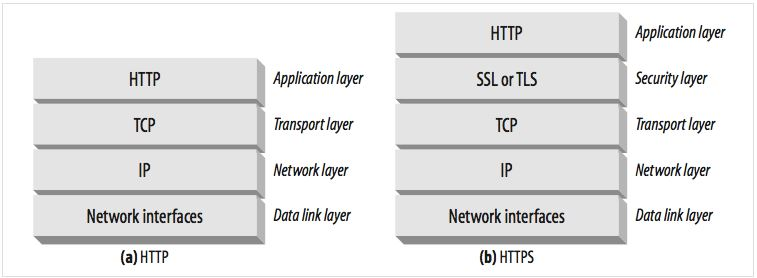

# 보안 HTTP
- [보안 HTTP](#보안-http)
  - [안전한 HTTP 만들기](#안전한-http-만들기)
  - [HTTPS](#https)
  - [디지털 암호학](#디지털-암호학)
  - [대칭키 암호법](#대칭키-암호법)
  - [공개키 암호법](#공개키-암호법)
    - [RSA](#rsa)
    - [혼성 암호 체계와 세션 키](#혼성-암호-체계와-세션-키)
  - [디지털 서명](#디지털-서명)
    - [서명은 암호 체크섬](#서명은-암호-체크섬)
  - [디지털 인증서](#디지털-인증서)
    - [인증서 내부](#인증서-내부)
    - [X.509 v3 인증서](#x509-v3-인증서)
    - [서버 인증을 위해 인증서 사용하기](#서버-인증을-위해-인증서-사용하기)
  - [HTTPS 세부사항](#https-세부사항)
    - [개요](#개요)
    - [HTTPS 스킴](#https-스킴)
    - [보안 전송 셋업](#보안-전송-셋업)
    - [SSL 핸드쉐이크](#ssl-핸드쉐이크)
    - [서버 인증서](#서버-인증서)
    - [사이트 인증서 검사](#사이트-인증서-검사)
    - [가상 호스팅과 인증서](#가상-호스팅과-인증서)
  - [진짜 HTTPS 클라이언트](#진짜-https-클라이언트)
    - [OpenSSL](#openssl)
    - [간단한 HTTPS 클라이언트](#간단한-https-클라이언트)
  - [프록시를 통한 보안 트래픽 터널링](#프록시를-통한-보안-트래픽-터널링)
## 안전한 HTTP 만들기
- 서버 인증: 진짜 서버인지 확인시켜줘야함
- 클라이언트 인증: 진짜 클라이언트인지 인증해야함
- 무결성: 데이터 위조 방지
- 암호화: 도청 방지
- 효율: 빨리 주고 받아야한다.
- 편재성(Ubiquity): 범용성, 모든 클라이언트와 서버에서 사용 가능
- 관리상 확장성: 보안 통신을 바로 적용할 수 있어야한다. 
- 적응성: 제일 보안성이 높아야한다.
- 사회적 생존성: 사회의 문화적, 정치적 요구를 만족해야한다.

## HTTPS
- 모든 요청은 네트워크로 보내지기 전에 암호화된다.
- HTTPS는 HTTP 하부에 전송 레벨 암호 보안 계층을 제공하여 동작
- 안전 소켓 계층(Secure Sockets Layer, SSL) 또는 전송 계층 보안(Transport Layer Security, TLS)를 이용해서 구현
- 인코딩 및 디코딩은 SSL 라이브러리에서 작동

## 디지털 암호학
- 암호화: 텍스트를 아무나 읽지 못하도록 인코딩
- 키: 암호의 동작을 변경하는 매개변수
- 대칭키 암호 체계: 인코딩과 디코딩에 같은 키 사용
- 비대칭키 암호 체계: 인코딩과 디코딩에 다른 키 사용
- 공개키 암호법: 비밀 메시지를 전달하는 컴퓨터를 쉽게 생성 가능
- 디지털 서명: 메시지 위변조 체크
- 디지털 인증서: 신뢰 가능한 조직에 서명되고 검증된 신원 확인 정보

## 대칭키 암호법
- 인코딩과 디코딩 할 때 키가 같다
- DES, Triple-DES, RC2, RC4 등이 있다.

- 키 길이와 열거 공격(Enumeration Attack)
  - 모든 키 값을 대입해본다.
- 공유키 발급하기
  - 대칭키 암호는 통신하려면 둘 다 공유키를 가져야한다.
  - 서로 비밀키를 발급하여야 하기 때문에 N개의 노드가 서로서로 통신하기 위해서는 N^2의 키를 관리해야한다.

## 공개키 암호법
- 두개의 비대칭 키를 사용
- 인코딩키는 모두에게 공개되어 있고 디코딩 키는 비밀이다.

### RSA
- 해커가 공개키, 암호문 일부, 본문과 암호문을 알고있어도 키를 알 수 없어야한다.
- RSA는 뚫을 수 없다.

### 혼성 암호 체계와 세션 키
- 비대칭 공개키 암호 방식은 누구나 공개키만 알면 공개 서버에 안전하게 메시지를 보낼 수 있다. 
- 공개키 암호화는 느리다. 
- 실제로는 대칭과 비대칭을 섞은 것을 쓴다. 
- 안전 채널을 형성할 때는 공개키 사용 안전 채널로 대칭키 교환

## 디지털 서명
- 암호화 및 해독 가능
- 누가 메시지를 작성했는지 알수 있음
- 위변조 방지

### 서명은 암호 체크섬
- 저자를 알 수 있다. 저자만 체크섬 계산 가능
- 위변조 방지
- 디지털 서명은 보통 비대칭 공개키에 의해 생성
- 개인키는 소유자 만이 알고 있기 때문에 `지문`처럼 사용
  

## 디지털 인증서
- 신뢰할 수 있는 기관을 통해서 인증서 발급

### 인증서 내부
- 대상의 이름
- 유효기간
- 인증서 발급자
- 인증서 발급자의 디지털 서명

### X.509 v3 인증서
- 인증서에 표준은 없지만 대부분 X.509를 사용

### 서버 인증을 위해 인증서 사용하기
- 서버 인증서
  - 웹 사이트의 이름과 호스트명
    - 웹 사이트의 공개키
    - 서명 기관의 이름
    - 서명 기관의 서명

## HTTPS 세부사항
### 개요

- SSL or TLS 계층을 통해서 암호화

### HTTPS 스킴 
- https: 를 사용

### 보안 전송 셋업
- 클라이언트는 웹 서버의 443 포트로 연결
- 암호법 매개변수와 교환키 협상
- SSL 계층 초기화
- 클라이언트는 요청 메시지를 보안 계층으로 전송 가능
- TCP로 전송하기 전에 암호화

### SSL 핸드쉐이크
- 프로토콜 버전 번호 교환
- 양쪽이 알고 있는 암호 선택
- 양쪽의 신원 인증
- 채널 암호화를 위한 임시 세션키 생성

### 서버 인증서
- SSL은 서버 인증서를 클라이언트로 전송
- 클라이언트 인증서를 서버로 전송
- 하지만 대부분 개인 클라이언트는 인증서가 없다.
- 대부분 서버에서만 인증서 관리

### 사이트 인증서 검사
1. 날짜 검사
2. 서명자 신뢰도 검사
   - 인증서는 CA(Cerificate Authority)에 의해 서명되어 있다.
   - 인증기관 검사
3. 서명 검사
4. 사이트 신원 검사

### 가상 호스팅과 인증서
- 가상 호스트(하나의서버에 여러 호스트명 사용)로 운영
- 사용자가 인증서의 이름과 가상 호스트명이 정확히 같지 않다면 경고 발생
- 해당 문제를 피하기위해서 보안 트랜잭션을 인증서와같은 곳으로 리다이랙트 시킴

## 진짜 HTTPS 클라이언트
### OpenSSL 
- SSL과 TLS의 가장 인기있는 오픈 소스 구현

### 간단한 HTTPS 클라이언트
1. SSL 라이브러리 초기화
2. 서버의 호스트명의 IP 주소로 변환
3. 서버의 443 포트로 TCP 커넥션 형성
4. TCP 커넥션을 통해 SSL 핸드쉐이크
5. 핸드쉐이크 완료, SSL을 통해 HTTP 요청 전송
6. SSL 스택에서 HTTP 응답 읽기
7. 커넥션 닫기 
   
## 프록시를 통한 보안 트래픽 터널링
- 클라이언트가 서버로 보낼 데이터를 암호화 했기 때문에 프록시는 HTTP 헤더를 읽을 수 엇ㅂ다
- HTTPS와 프록시가 잘 동작하기 위해서 클라이언트가 프록시에게 어디와 접속하는지 알려준다. 
- HTTPS SSL 터널링 프로토콜을 사용하여 연결 가능
  - 프록시에게 연결하고자하는 호스트와 포트를알려줌
  - 클라이언트는 프록시가 읽을 수 있도록 암호화 전에 평문으로 알려줌
  - CONNECT라는 확장 메소드를 사용해서 평문으로된 종단 정보 전달
  - 프록시는 터널을 생성해줌