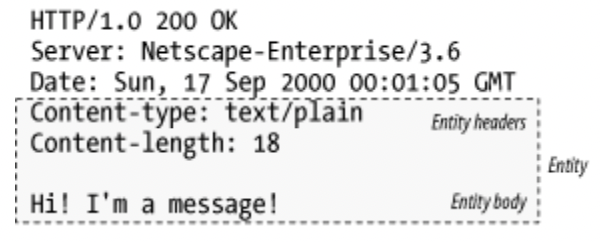
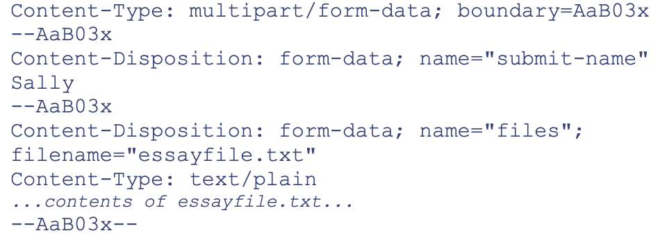
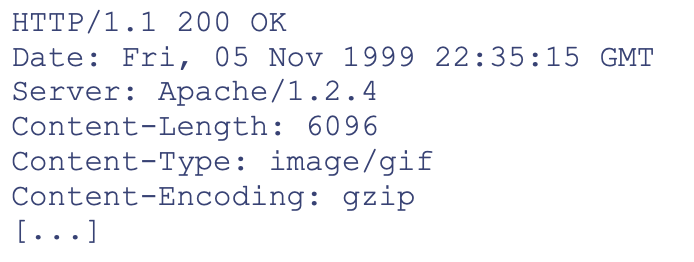
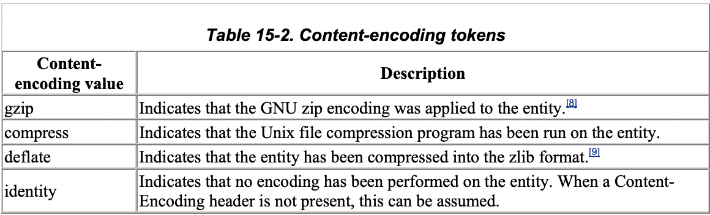
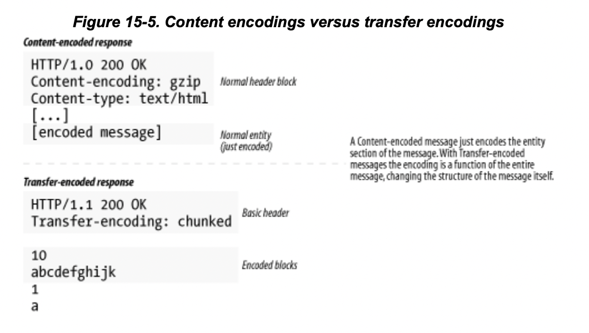
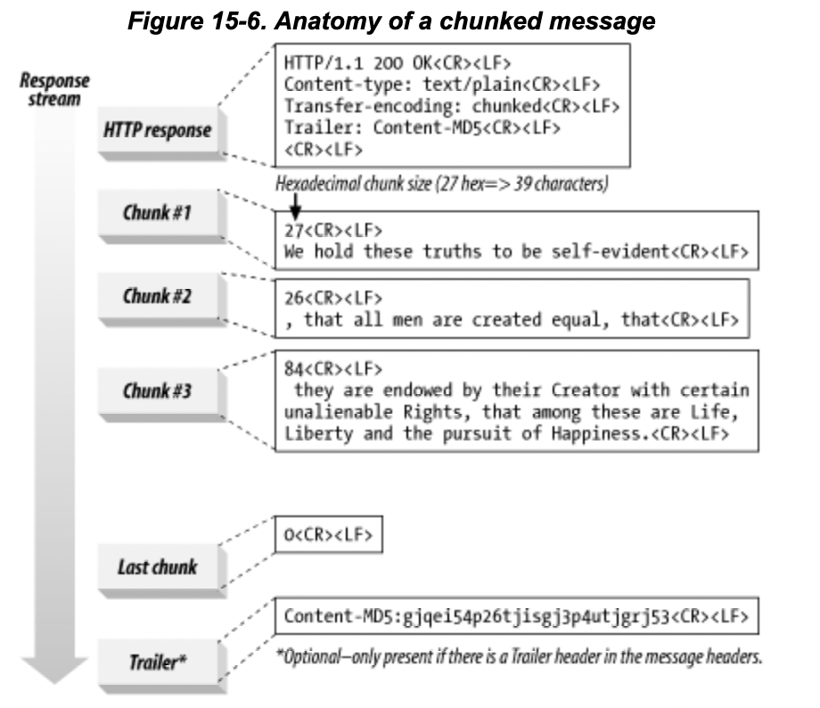
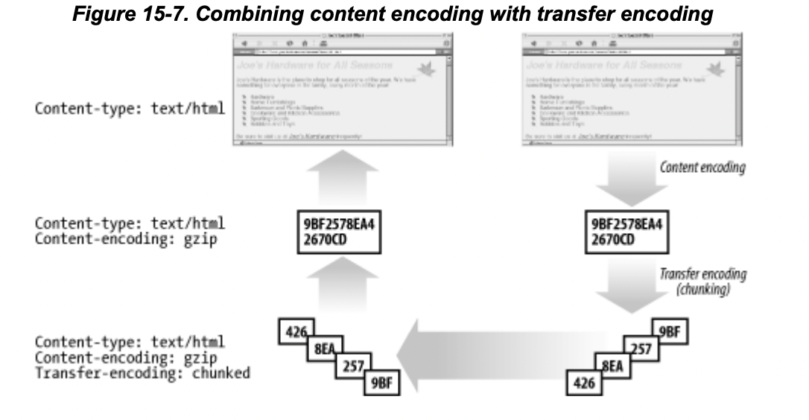
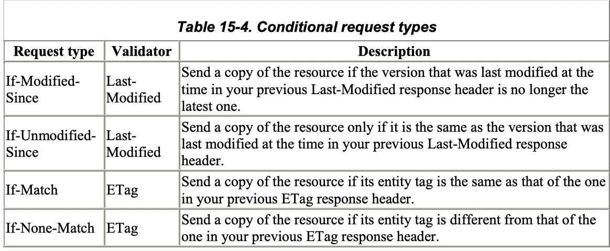
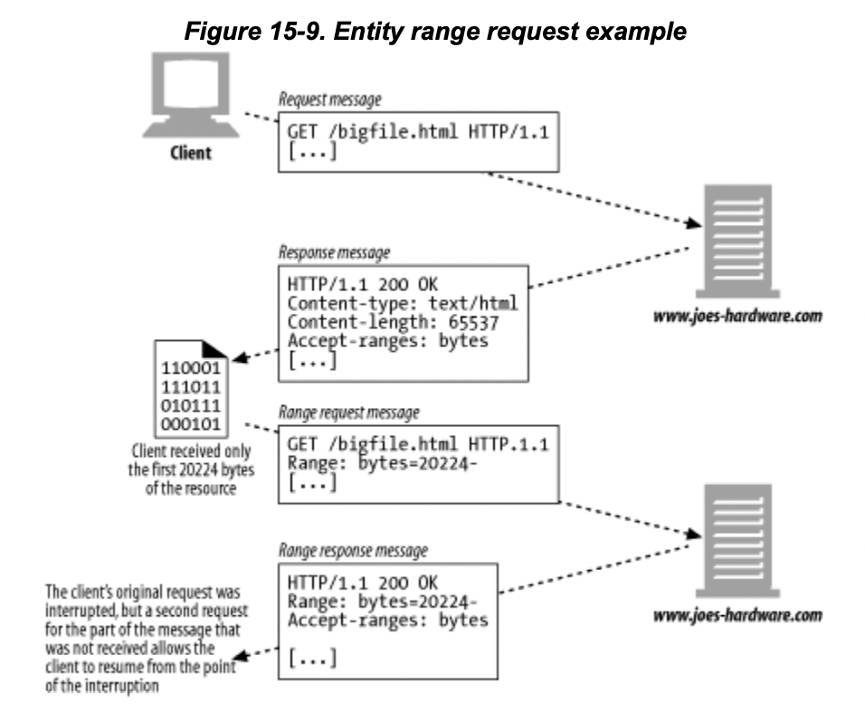
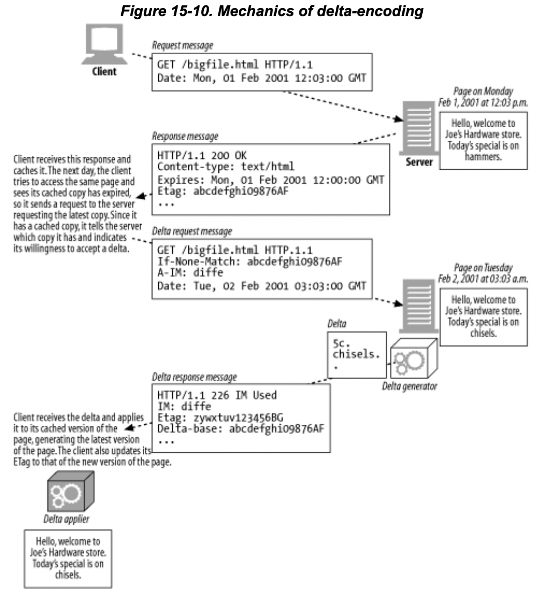

# Chap15

# Chap 15. 엔터티와 인코딩

15장에서 다루는 내용

- HTTP 데이터를 담는 **컨테이너인 HTTP 메시지 엔터티의 포맷과 동작방식**
- HTTP가 **엔터티 본문의 크기를 서술**하는 방법, 크기 측정을 위해 HTTP가 요구하는 것
- 클라이언트가 콘텐츠를 잘 처리할 수 있도록 제공되는 **엔터티 헤더**들
- 공간을 적게 차지하고 보안을 강화하기 위해 콘텐츠 데이터 포맷을 변형할 때 사용하는 **콘텐츠 인코딩**
- 특정 종류의 콘텐츠의 개선을 위해 HTTP가 데이터를 실어 나르는 방식을 수정하는 **전송 인코딩.** 중에서도 길이를 알 수 없는 콘텐츠를 안전하게 전송하기 위해 데이터를 여러 조각으로 쪼개 전달하는 **청크 인코딩**
- 콘텐츠가 **최신 버전을 가져올 수 있도록 도와주는 태그, 라벨, 시간, 체크섬** 등
- 콘텐츠의 버전 번호처럼 동작하는 **검사기**와 객체를 최신으로 유지하기 위해 설계된 **HTTP 헤더**
- 중단되었던 다운로드를 중단된 지점부터 재개하고자 할 때 유용한 **범위 요청**
- 클라이언트가 봤던 적 있는 웹페이지를 다시 볼 때, 변경 있는 부분만 요청할 수 있게 해주는 **HTTP 델타 인코딩 확장**
- 엔턴티 콘텐츠가 프락시를 지나는 과정에서 변경된 곳이 있는지 확인할 수 있는 **엔터티 본문의 체크섬**

## 15.1 메시지는 컨테이너, 엔터티는 화물

HTTP 엔터티 헤더는 HTTP 메시지의 내용물을 설명한다.

- Content-Type: 객체의 종류
- Content-Length
- Content-Language
- Content-Encoding
- Content-Location
- Content-Range : 엔터티가 부분 엔터티라면, 전체에서 어느 부분에서 해당하는지 정의함
- Content-MD5 : 엔터티 본문의 콘텐츠에 대한 체크섬
- Last-Modified
- Expires
- ETag: 인스턴스에 대한 고유한 검사기
- Cahce-Control

### 15.1.1 엔터티 본문

- 엔터티 본문은 가공되지 않은 데이터만을 담고 있고, 다른 정보들은 모두 헤더에 담겨 있다.
- Content-Type은 데이터를 어떻게 해석해야 하는지를 말해주고, Content-Encoding 헤더는 데이터가 압축되었거나 어떤 방식으로 인코딩 되었는지를 설명해줌.

## 15.2 Content-Length: 엔터티의 길이

- 메시지의 엔터티 본문의 크기를 바이트 단위로 나타냄
- 압축이나 인코딩 되었다면, 인코딩 된 후의 크기로 나타냄
- 메시지를 청크 인코딩으로 전송되지 않는 이상, 필수적으로 있어야 하는 값임

### 15.2.1 잘림 검출

- 예전에는 커넥션이 닫히면 메시지가 끝났다고 인지 했지만, Content-Length가 없다면 커넥션이 정상적으로 닫힌건지 서버에 충돌이 발생하여 비정상적으로 닫혔는지 알 수 없기 때문에 Content-Length가 있어야 함
- 캐싱 프락시 서버에 잘린 메시지가 캐싱 되면 안되기 때문에 Content-Length 헤더를 갖고 있지 않은 HTTP 본문은 보통 캐시하지 않는다.

### 15.2.3 Content-Length와 지속 커넥션

- 지속 커넥션*(4장에서 다룬)*에 Contnet-Length는 필수적이다. 왜냐하면 클라이언트는 원래 커넥션이 닫히면 메시지가 끝났다고 인지하는데, 지속 커넥션에서는 메시지가 언제 끝나고 다음 시작이 언제인지 판단할 수 없기 때문이다.
- 지속 커넥션에서 Content-Length 헤더가 없어도 되는 상황이 있다 → *청크 인코딩을 사용할 경우, 엔터티 본문 앞에 자신의 크기를 담아서 보낸다.*

### 15.2.5 엔터티 본문 길이 판별을 위한 규칙

나열된 순서대로 규칙을 적용하여 엔터티 본문의 길이를 판단해야 한다.

1. 본문을 갖는 것이 허용되지 않는 특정 타입의 HTTP 메시지에서는, Content-Length 헤더는 무시된다.
    
    ex) HEAD 응답 
    
2. Transfer-Encoding 헤더를 포함하고 있다면, 커넥션이 닫혀서 먼저 끝나지 않는 이상 엔터니는 ‘0바이트 청크'라 불리는 특별한 패턴으로 끝나야 한다.
3. 메시지가 엔터티 본문을 허용하고, Content-Lenght 헤더가 있다면 본문의 길이를 담게 된다. 만약 Transfer-Encoding 헤더 필드도 가지고 있는 메시지라면 반드시 Content-Length 헤더를 무시해야 한다. 왜냐하면 전송 인코딩은 엔터티 본문을 표현하고 전송하는 방식을 바꾸기 때문에 전송된 바이트 크기도 변경될 수 있기 때문이다.
4. 메시지가 ‘multipart/byteranges’ 미디어 타입을 사용하고 Content-Length로 길이가 정해지지 않았다면, 멀티파트 메시지의 각 부분은 스스로의 크기를 정의할 것이다. 멀티파트 유형은 자신의 크기를 스스로 결정할 수 있는 유일한 엔터티 본문 유형이다. 따라서 수신자가 이를 해석할 수 있다는 사실을 송신자가 알기 전까지는 절대 보내지 말아야 한다.
5. 위의 4가지 규칙에 어디에도 해당되지 않는다면, 엔터티는 커넥션이 닫힐 때 끝난다.
6. HTTP/1.0 애플리케이션과의 호환을 위해 엔터티 본문을 가지고 있는 HTTP/1.1 요청은 반드시 유효한 Content-Length를 가지고 있어야 한다. HTTP/1.1 명세에서는 요청에 본문은 있지만 Content-Length가 없는 경우, 메시지의 길이를 판별할 수 없다면 401 코드를 응답하고, 유효한 Content-Length를 요구하고 싶다면 411 Length Required 응답을 보내라고 조언한다고 한다.

## 15.3 엔터티 요약

- HTTP는 불완전한 트랜스코딩 프락시나 버그 많은 중개자 프락시를 비롯한 여러가지 이유로 메시지의 일부분이 전송 중에 변형되는 일이 일어난다.
- 이처럼 의도하지 않은 변경을 감지하기 위해, 최초 엔터티가 생성될 때 송신자가 데이터에 대해 생성하는 체크섬으로 기본적인 검사를 할 수 있다. *하지만 메시지 본문과 요약 헤더 모두를 교체하는 악의적인 공격에는 면역력이 없다고 한다.*
- Content-MD5 헤더 - 메시지 무결성을 검사하기 위한 헤더 (*자주 쓰이지 않음)*
- Want-Digest

## 15.4 미디어 타입과 차셋(Charset)

- Content-Type
    
    text/html, image/git, multipart/byterange … 등등
    
    인코딩을 거친 경우에도 인코딩 전의 원본 엔터티 본문의 미디어 타입을 명시한다.
    

### 15.4.2 멀티파트 미디어 타입

- 폼을 채워서 제출할 때와 문서의 일부분을 실어 나르는 범위 응답을 할 때 사용한다.
- 연결되어 있는 메시지(하나의 큰 복합 메시지)를 여러 개로 나누어 보낸다. 각 구성요소는 자신에 대해 서술하는 헤더를 포함한다.

### 15.4.3 멀티파트 폼 제출

- 가변 길이 텍스트 필드와 업로드 될 객체는 각각 멀티파트 본문을 구성하는 하나의 파트가 되어 보내진다.
- 멀티파트 본문은 여러 다른 종류와 길이의 값으로 채워진 폼을 허용한다. 텍스트와 이미지 파일을 함께 보낼 수 있는 것이다.
- multipart/form-data나 multipart.mixed 헤더에 멀티파트 본문을 함께 보낸다. boundary 옵션이 있는데 이는 보문의 서로 다른 부분을 구분하기 위한 구분자로 쓴다.
    
    
    

## 15.5 콘텐츠 인코딩

### 15.5.1 콘텐츠 인코딩 과정

1. 웹 서버가 원본 Content-Type과 Content-Length 헤더를 수반한 원본 응답 메시지를 생성함.
2. 콘텐츠 인코딩 서버(원 서버 또는 다운스트림 프락시)가 인코딩 된 메시지를 생성함. 인코딩 된 메시지는 Content-Type은 같지만 Content-Length는 다르다. Content-Encoding 헤더를 인코딩된 메시지에 추가하여 수신하는 쪽에서 디코딩 할 수 있도록 한다.
3. 수신 측 프로그램은 디코딩 하고 원본을 얻는다.
    
    

Content-Type 헤더는 엔터티의 원래 포맷을 기술하고, 이는 디코딩된 엔터티를 보여주기 위해 필요한 정보다. Content-Length은 인코딩된 본문의 길이를 나타낸다.

### 15.5.2 콘텐츠 인코딩 유형

### 15.5.3 Accept-Encoding 헤더

- 서버가 인코딩 할 때, 클라이언트가 디코딩 할 수 없는 방법으로 해서는 안된다. 따라서 클라이언트는 자신이 해독할 수 있는 인코딩 목록을 Accept-Encoding 헤더를 통해 전달한다.
- 클라이언트는 각 인코딩에 Q(quality) 값을 매개변수를 더해 선호도를 나타낼 수도 있다. Q의 범위는 0.0 ~ 1.0이다.

## 15.6 전송 인코딩과 청크 인코딩

- 콘텐츠 인코딩은 메시지의 엔터티 부분만 인코딩 하며, 콘텐츠 포맷과 연관되어 있다. → 텍스트는 gzip으로 압축하지만 JPEG 파일은 그렇게 하지 않는다.
- 전송 인코딩 또한 엔터티 본문에 적용되는 변환이지만, 전체 메시지에 대해 적용되어 메시지 자체의 구조를 바꾼다. 데이터가 네트워크를 통해 전송되는 방법을 바꾸기 위해 전송 인코딩을 적용하기 때문에, 콘텐츠의 포맷과는 독립적이다.

### 15.6.1 안전한 전송

- HTTP에서 전송된 메시지의 본문이 문제를 일으키는 이유 2가지
    - 알 수 없는 크기
        
        콘텐츠를 먼저 생성하지 않고서는 메시지 본문의 최종 크기를 판단할 수 없다. 몇몇 게이트웨이 애플리케이션과 콘텐츠 인코더는 그 사이즈를 알기 전에 데이터의 전송을 시작하려고 한다. HTTP는 Contnet-Length를 요구하기 때문에, 몇몇 서버는 데이터의 끝을 알리는 특별한 종결 꼬리말을 포함시켜 전송 인코딩으로 데이터를 보내려고 시도한다.
        
    - 보안
        
        공용 전송 네트워크로 메시지 콘텐츠를 보내기 전에 전송 인코딩을 사용해 알아보지 못하게 하는 방법도 있다. 하지만 이미 SSL과 같은 유명한 전송 계층 보안 방식이 있기 때문에 보안을 목적으로 전송 인코딩을 쓰는 것은 흔하지 않다.
        

### 15.6.2 Trasfer-Encoding 헤더

- Tranfer-Encoding - 서버
    
    어떤 인코딩이 메시지에 적용되었는지 수신자에게 알려준다.
    
- TE  - 클라이언트
    
    어떤 확장된 전송 인코딩을 사용할 수 있는지 서버에게 알려주기 위해 요청 헤더에 사용함
    

### 15.6.3 청크 인코딩

- 청크 인코딩은 메시지를 일정 크기의 청크 여러개로 쪼갠다.
- 본문이 동적으로 생성됨에 따라, 서버는 그 중 일부를 버퍼에 담은 뒤 그 하나의 청크를 그것의 크기와 함께 보낼 수 있기 때문에 청크 인코딩을 사용하면 메시지를 보내기 전에 전체 크기를 알 필요가 없다.
- 전송 인코딩의 한 형태이며 따라서 본문이 아닌 메시지 자체의 속성이다.
- 멀티파트 인코딩 vs 청크 인코딩
    - 두 가지 모두 연결된 데이터를 분리해서 보낸다는 특징이 있지만, 멀티파트 인코딩은 엔터티 본문에 대한 속성이고, 청크 인코딩은 전송 인코딩의 한 형태이고 보문이 아닌 메시지의 속성인 점에 차이가 있다.
- 청크와 지속 커넥션

HTTP 응답 헤더에 청크 인코딩을 사용했다는 내용이 담겨져있으면, 청크의 스트림이 오게 된다. 각 청크는 길이 값과 각 청크에 대한 데이터를 담고 있다. 길이 값은 16진수 형식이며 청크 데이터와 CRLF로 분리된다.

마지막 청크는 본문의 끝을 의미하기 위해 길이가 0바이트인 특별한 패턴으로 보내야 한다.

- 클라이언트도 청크 인코딩 된 데이터를 서버로 전송할 수 있다. 서버는 응답에 TE 헤더를 포함시켜 보내지 않기 때문에 서버가 청크 인코딩을 받아들여줄지 모르고 이에 대해 대비해야 한다.
- 청크 인코딩 된 메시지의 트레일러
    - 트레일러 - 청크 인코딩 된 메시지 다음에 오게 될 헤더들을 나열하는 트레일러 헤더
        
        Transfer-Encoding, Trailer, Content-Length를 제외한 모든 HTTP 헤더는 트레일러로 보낼 수 있다
        
    
    청크 메시지에 트레일러를 추가할 수 있는 조건
    
    - 클라이언트의 TE 헤더가 트레일러를 받아들일 수 있음을 나타내는 경우
    - 트레일러가 응답을 만든 서버에 의해 추가되었고, 트레일러의 콘텐츠는 클라이언트가 이해하고 사용할 필요가 없는 선택적인 메타데이터라서 클라이언트가 무시하고 버려도 되는 경우

### 15.6.4 콘텐츠와 전송 인코딩의 조합

콘텐츠 인코딩과 전송 인코딩은 동시에 사용될 수 있다.

위 그림은 html 파일이 gzip으로 인코딩 된 후, 청크 데이터를 전송 인코딩을 사용해서 전송하고 있다.

### 15.6.5 전송 인코딩 규칙

- 전송 인코딩의 집합은 반드시 ‘chunked’를 포함해야 한다. 유일한 예외는 메시지가 커넥션의 종료로 끝나는 경우이다.
- 청크 전송 인코딩이 사용되었다면, 마지막 전송 인코딩(0바이트인 청크 데이터)가 있어야 한다.
- 청크 전송 인코딩은 반드시 메시지 본문에 한 번 이상 적용되어야 한다.

## 15.7 시간에 따라 바뀌는 인스턴스

- 같은 URL은 시간에 따라 다른 버전의 객체를 가르킬 수 있다.
- 인스턴스 조작 - HTTP가 어떤 특정한 종류의 요청이나 응답을 다루는 방법을 정의한 것
    - 범위 요청
    - 델타 인코딩

## 15.8 검사기와 신선도

- 각 조건부 요청(If- 로 시작하는 조건부 헤더에 의해 구현됨)은 특정 검사기 위에서 동작한다.
- ETag - 특별한 키워드이거나 엔터티와 관련된 버전 식별 태그이다.
- Last-Modified 검사기는 정확도가 최대 1초에 불과하기 때문에 약한 검사기로 간주 된다.
- ETag는 강한 검사기로 간주되는데, 서버는 ETag 헤더에 매 변경마다 구분되는 값을 넣어두기 때문이다.
- ETag 위에서 검사하면서도 태그 앞에 W/ 를 붙여서 약한 검사를 할 수도 있다.

## 15.9 범위 요청

- HTTP는 클라이언트가 문서의 일부분이나 특정 범위만 요청할 수 있도록 해준다.
    
     ex) 중단된 다운로드를 중단된 시점에서부터 다운 받도록 하는 요청
    
    
    

## 15.10 델타 인코딩

- 일부분만 변경된 페이지를 전체를 다 받기 보다는 변경된 부분만 받고자 할 때 사용하는 인코딩
- 델타 인코딩 - 객체 전체가 아닌 변경된 부분에 대해서만 통신하여 전송량을 최적화하는 HTTP 프로토콜의 확장이다.
- 델타 인코딩은 일종의 인스턴스 조작의 일종인데, 왜냐하면 어떤 객체의 특정 인스턴스들에 대한 클라이언트와 서버 사이의 정보 교환에 의존하기 때문이다.
    
    
    
1. 클라이언트는 캐시된 사본이 만료되었음을 알게 되어 서버에게 최신 사본을 요청하는데, 자신은 사본을 이미 가지고 있으며 델타를 받아들이겠다는 의미를 가진 델타 요청을 서버에게 보낸다.  
2. 서버는 델타를 계산해서 클라이언트에게 보내주고, 응답 메시지에 델타를 보내고 있음을 알려주며 페이지의 최신 버전에 대한 새로운 식별자 (ETag)를 설정해야 한다.

1번 과정에서 클아이언트는 자신이 가지고 있는 버전에 대한 ETag를 If-None-Match 헤더에 담아 서버가 가지고 있는 최신 버전과 비교할 수 있도록 한다. (=”니가 갖고 있는 최신 버전의 페이지가 이것과 같은 ETag를 가지고 있지 않다면, 최신 버전의 페이지를 보내달라") 

여기에 A-IM(Accept-Instance-Manipulation) 헤더를 붙여서 자신이 페이지에 대한 델타를 받아들이겠다는 의사를 전달한다. (=”그런데 나는 인스턴스 조작의 몇몇 형태를 받아들일 수 있으므로, 만약 그 중 하나를 사용하겠다면 굳이 문서 전체를 보내지 않아도 된다.”) 클라이언트는 델타를 이용해 최신 버전의 문서를 생성하는 방법에 대해 자신이 알고 있는 알고리즘을 A-IM 헤더에 명시한다. 

서버는 델타를 계산하기 위해 사용된 알고리즘을 응답의 IM 헤더에 명시하고 새로운 ETag 헤더(최신 사본에 대한)와 델타를 계산할 때 기반이 된 문서의 ETag(=클라이언트의 If-None-Match 요청에 들어있던 ETag)를 Delta-Base 헤더에 담아 응답한다.

- 델타 인코딩은 전송 시간을 줄일 수 있지만 구현하기가 까다로울 수 있다. 문서를 제공하는데 걸리는 시간이 줄어드는 대신, 서버는 문서의 과거 사본을 모두 유지하기 위해 디스크 공간을 더 늘려야 한다.