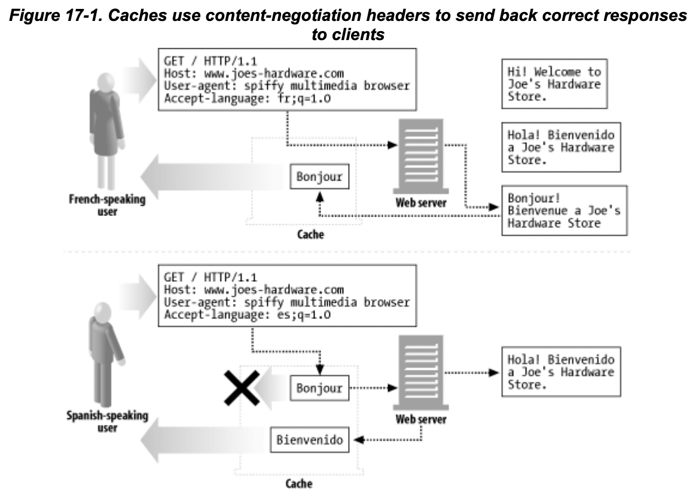

# Chap16-17

# Chap 16. 국제화

## 16.1 국제적인 콘텐츠를 다루기 위해 필요한 HTTP 자원

- 서버는 클라이언트에게 문서가 어떤 언어로 되어있는지 Content-Type charset 매개변수와 Content-Language 헤더를 통해 알려줌.
- 클라이언트는 서버에게 이해할 수 있고 선호하는 언어를 Accept-Charset과 Accept-Language 헤더를 보냄

## 16.2 Charset과 HTTP

### 16.2.1 charset은 글자를 비트로 변환하는 인코딩이다.

### 16.3.2 charset은 형편없는 이름이다.

- charset 값은 데이터 비트를 고유한 문자의 코드로 매핑하는 알고리즘이기 때문에 ‘문자 인코딩'의 의미가 더 적절하다.

## 16.4 언어 태그와 HTTP

- Content-Language 엔터티 헤드 필드 - 엔터티가 어떤 언어 사용자를 대상으로 하고 있는지 서술함
- Accept-Language 헤더 - 클라이언트가 이해할 수 있고 선호하는 언어를 헤더에 담아 보낼 수 있음.

## 16.5 국제화된 URI

### 16.5.2 URI에 사용될 수 있는 문자들

# Chap 17. 내용 협상과 트랜스코딩

- 하나의 콘텐츠를 여러 언어로 제공하기 위해서 하나의 URL이 여러 리소스에 대응해야할 필요가 있다.
- 클라이언트와 서버가 사용자에게 적절한 콘텐츠를 제공하기 위한 내용 협상(content-negotiation) 방법을 제공한다. 이 때 제공하는 서로 다른 콘텐츠의 버전을 variant라고 한다.

## 내용 협상 기법(클라이언트 주도/서버 주도/투명한 중개자)

## 17.2 클라이언트 주도

- 클라이언트가 요청을 보내면 서버가 클라이언트에게 선택지를 주고, 클라이언트가 선택한다.
- 장점 - 서버 입장에서 구현이 가장 쉽고, 클라이언트는 최선의 선택을 할 수 있다.
- 단점 - 최소 두 번의 요청이 필요하기 때문에 대기시간이 증가한다. 또한 하나의 주 URL에 요청을 하면 여러 개의 URL이 오기 때문에 공유를 해야 하거나 한다면 사용자가 혼돈할 수 있다.
- 서버가 클라이언트에게 선택지를 주는 두가지 방법
    - 여러 가지 버전에 대한 링크와 설명이 담긴 HTML 페이지를 돌려준다
    - 300 Multiple Choices 응답을 보낸다. → 링크와 함께 페이지를 보여주거나, 사용자가 결정할 수 있도록 대화창을 띄울 것이다.

## 17.3 서버 주도

- 서버가 클라이언트의 요청 헤더를 검증해서 어떤 버전을 제공할지 결정
    - 클라이언트의 Accept 관련 헤더들을 보고 그에 맞는 응답 헤더를 준비한다.
    - 내용 협상 헤더 이외에 User-Agent 와 같은 헤더를 보고 판단할 수도 있다.
- 장점 - 클라이언트 주도 협상보다 빠르다. 서버가 가장 적절한 선택을 할 수 있도록 q값 매커니즘을 제공 받고, 서버는 Vary 헤더를 통해 클라이언트의 요청이 어떻게 평가되었는지 제공할 수 있다.
- 단점 - 헤더에 맞는 올바른 콘텐츠가 없으면 서버가 추측한 결과를 사용해야 한다.
- 캐시는 반드시 캐시된 문서의 올바른 최선의 버전을 제공해야 하기 때문에, HTTP는 서버가 응답에 넣어 보낼 수 있는 Vary 헤더를 정의한다. Vary 헤더는 캐시에게 클라이언트의 요청 헤더에서 어떤 헤더를 참고하여 응답을 냈는지에 대한 정보를 담는다.

### 17.3.4 아파치의 내용 협상

- type-map
    
    .var 확장자를 가지는 파일이다. 모든 variant와 그들 각각에 대응하는 내용 협상 헤더들을 나열한다.
    
    type-map 파일을 자동으로 생성해주는 MultiView 지시어를 켜야한다.
    

## 17.4 투명 협상

- 투명한 중간 장치(프락시 캐시)가 서버를 대신하여 클라이언트와 협상
- 웹 서버가 협상할 필요가 없고, 클라이언트 주도 협상보다 빠르다.
- 투명 협상에 대한 정형화된 명세가 없다.
- 프락시는 클라이언트의 기대를 알고 있으며, 서버는 올바른 콘텐츠를 제공하기 위해 어떤 요청 헤더를 검사해야 하는지를 Vary 헤더를 통해 프락시에게 말해주어 서버와 클라이언트를 중개할 수 있다.
- 캐시 프락시는 단일한 URL을 통해 접근할 수 있는 문서의 여러 다른 사본을 저장할 수 있다.
- 하나의 서버에 국한 되지 않고 여러 서버의 콘텐츠를 트랜스코딩할 수 있기 때문에 캐시 프락시를 트랜스코딩에 훌륭한 장소이다.

### 17.4.1 캐시와 alternate

- 캐시는 캐시된 응답을 보낼 때 서버가 클라이언트의 요청 헤더에 최적의 응답을 하기 위한 담았던 엔터티 헤더와 같은 헤더를 사용해야 한다.
    
    
    

위 그림처럼 같은 URL에 대해 요청하지만 클라이언트가 원하는 언어가 다른 경우 캐시는 캐시된 사본이 아닌 클라이언트의 요구에 맞는 새로운 사본을 서버에서 가져와서 둘 다 저장하고 있어야 한다. 이 다른 버전은 variant나 alertnate로 불린다.

### 17.4.2 Vary 헤더

- 서버가 클라이언트의 요청 헤더에서 어떤 값을 참고하여 적절한 콘텐츠를 제공했는지에 대한 정보를 Vary 헤더에 담아야 한다.
    
    ex) 클라이언트 요청 헤더 중 User-Agent 값을 참고하여 콘텐츠를 선택했다면, Vary: User-Agent 헤더와 함께 응답 해야함.
    
    
    
- 캐시는 클라이언트에게 제공하기 전에, 캐시된 응답 안에 서버가 보낸 Vary 헤더가 들어있는지 확인해야하고, Vary 헤더가 존재한다면 헤더가 명시하고 있는 값은 새 요청의 헤더와 값이 맞아야 한다.

## 17.5 트랜스코딩

- 서버가 클라이언트의 요구에 맞는 문서를 아예 갖고 있지 않다면 , 서버는 기존의 문서를 클라이언트가 사용할 수 있는 무언가로 변환해서 응답할 수 있다. 이 옵션을 트랜스 코딩이라고 한다.

트랜스코딩에는 3가지 종류가 있다.

- 포맷 변환
    
    클라이언트가 볼 수 있도록 한 포맷에서 다른 포맷으로 변환하는 것이다. 예를 들면 WAP 환경에서 동작하는 오래된 모바일 기기가 데스크톱 클라이언트에서 보기 위해 만들어진 문서에 접근하려고 한다면 HTML을 WML로 변환해서 줄 수 있다.
    
- 정보 합성
    
    각 절의 제목에 기반한 문서의 개요 생성이나 페이지에서 광고 및 로고 제거해 정보의 요점을 추출하는 것이다.
    
- 콘텐츠 주입
    
    ex) 자동 광고 생성이나 사용자 추적 시스템에 사용된다.
    

### 17.5.4 트랜스코딩 vs 정적으로 미리 생성해놓기

트랜스코딩의 대안으로 웹 서버에서 웹페이지의 여러 가지 대안(HTML 문서와 WML 문서, 고해상도 이미지와 저해상도 이미지 … )를 미리 만들어 놓을 수 있다.

하지만 페이지가 조금만 수정 되어도 모든 버전을 다 수정해야하고, 모든 버전을 저장하기 위해 더 많은 공간이 필요하기 때문에 적절하지 않다. 

동적으로 필요할 때마다 변환하는 것은 대기시간이 증가하기 때문에 이 방법도 적절하지 않지만, 변환하는 작업을 더 싼 프락시나 캐시에 있는 외부 에이전트에 의해 수행하게 하면 웹 서버의 부담을 덜 수 있다.