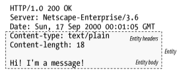

# 15장. 엔터티와 인코딩

HTTP는 다음을 보장한다.

- 객체는 올바르게 식별되므로, 브라우저나 다른 클라이언트는 콘텐츠를 바르게 처리할 수 있다.
- 객체는 올바르게 압축이 풀릴 것이다.
- 객체는 항상 최신이다.
- 사용자의 요구를 만족할 것이다.
- 네트워크 사이를 빠르고 효율적으로 이동할 것이다.
- 조작되지 않고 온전하게 도착할 것이다.

→ 이 모든 것을 가능하게 하기 위해, HTTP는 콘텐츠를 나르기 위한 잘 라벨링된 엔터티를 사용한다.

## 메시지는 컨테이너, 엔터티는 화물

- HTTP 엔터티 헤더의 주요 필드
    - `Content-Type`: 엔터티에 의해 전달된 객체의 종류
    - `Content-Length`: 전달되는 메시지의 길이나 크기
    - `Content-Language`: 전달되는 객체와 가장 잘 대응되는 자연어
    - `Content-Encoding`: 객체 데이터에 대해 행해진 변형
    - `Content-Location`: 요청 시점을 기준으로, 객체의 또 다른 위치
    - `Content-Range`: 만약 이 엔터티가 부분 엔터티라면, 이 헤더는 이 엔터티가 전체에서 어느 부분에 해당하는지 정의한다.
    - `Content-MD5`: 엔터티 본문의 컨텐츠에 대한 체크섬
    - `Last-Modified`: 서버에서 이 콘텐츠가 생성 혹은 수정된 날
    - `Expires`: 이 엔터티가 더 이상 신선하지 않은 것으로 간주되기 시작하는 날짜와 시각
    - `Allow`: 이 리소스에 대해 어떤 요청 메서드가 허용되는지
    - `ETag`: 이 인스턴스에 대한 고유한 검사기
    - `Cache-Control`: 어떻게 이 문서가 캐시될 수 있는지에 대한 지시자

### 엔터티 본문

> 가공되지 않은 데이터만을 담고 있으며, 다른 정보들은 모두 헤더에 담겨 있다.
> 

## Content-Length: 엔터티의 길이

> 메시지의 엔터티 본문의 크기를 바이트 단위로 나타낸다.
> 
- 메시지를 청크 인코딩으로 전송하지 않는 이상, 필수적으로 있어야 한다.
- 서버 충돌로 인해 메시지가 잘렸는지 감지하고자 할 때 필요하다.
- 지속 커넥션을 공유하는 메시지를 올바르게 분할하고자 할 때 필요하다.

### 잘림 검출

- 메시지 잘림은 캐싱 프락시 서버에서 특히 취약하다.
    - 캐시가 인식하지 못했다면, 결함있는 컨텐츠를 저장하고 계속 제공할 것이다.
- 그래서 보통은 `Content-Length` 헤더가 없는 본문은 캐싱하지 않는다.

### 잘못된 Content-Length

> 잘못된 값을 가지고 있으면, 아예 없는 것만 못하다. 😥
> 

### Content-Length와 지속 커넥션(Persistent Connection)

> HTTP 애플리케이션은 `Content-Length` 헤더 없이는 어디까지가 엔터티 본문이고, 어디부터가 다음 메시지인지 알 수 없을 것이다.
> 

### 컨텐츠 인코딩

> HTTP는 보안을 강화하거나 압축을 통해 공간을 절약할 수 있도록, 엔터티 본문을 인코딩할 수 있게 해준다.
> 
- `Content-Length` 헤더는 인코딩된 본문의 길이를 바이트 단위로 정의한다.

### 엔터티 본문 길이 판별을 위한 규칙

***엔터티 본문의 길이와 끝나는 위치를 바르게 판별하는 상황별 규칙들이며, 순서대로 적용되어야 한다.***

1. 본문을 갖는 것이 허용되지 않는 특정 타입의 HTTP 메시지에서는, 본문 계산을 위한 `Content-Length` 헤더가 무시된다.
2. 메시지가 `Transfer-Encoding` 헤더를 포함하고 있다면, 메시지가 커넥션이 닫혀서 먼저 끝나지 않는 이상 엔터티는 ‘0바이트 청크’라 불리는 특별한 패턴으로 끝나야 한다.
3. 메시지가 `Content-Length` 헤더를 갖는다면, `Tranfer-Encoding` 헤더가 존재하지 않는 이상 `Content-Length` 값은 본문의 길이를 담게 된다.
4. 메시지가 `‘multipart/byteranges’` 미디어 타입을 사용하고 엔터티 길이가 별도로 정의되지 않았다면, 멀티파트 메시지의 각 부분은 각자가 스스로의 크기를 정의할 것이다.
5. 위의 어떤 규칙에도 해당되지 않는다면, 엔터티는 커넥션이 닫힐 때 끝난다.
6. HTTP/1.0 애플리케이션과의 호환을 위해, 엔터티 본문을 갖고 있는 HTTP/1.1 요청은 반드시 유효한 `Content-Length` 헤더도 갖고 있어야 한다.

## 엔터티 요약

- 최초 엔터티가 생성될 때 송신자는 데이터에 대한 체크섬을 생성할 수 있다.
- 수신자는 모든 의도하지 않은 엔터티의 변경을 잡아내기 위해 그 체크섬으로 기본적인 검사를 할 수 있다.

## 미디어 타입과 Charset

> 지금까지 `Content-Length` 필드에 대해 다루었다면 이제는 `Content-Type` 필드에 대해 다루어보자.
> 
- `Content-Type` 헤더 필드는 엔터티 본문의 MIME 타입을 기술한다.
- `Content-Type` 헤더가 원본 엔터티 본문의 미디어 타입을 명시한다는 것은 중요하다.

### 텍스트 매체를 위한 문자 인코딩

- ‘charset’ 매개 변수를 통해 엔터티의 비트 집합을 텍스트 파일의 글자들로 변환한다.
- `Content-Type: text/html; charset=iso-8859-4`

### 멀티파트 미디어 타입

- HTTP는 멀티파트 본문도 지원한다.
- 하지만 일반적으로는 폼을 채워서 제출할 때와, 문서의 일부분을 실어 나르는 범위 응답을 할 때의 두 가지 경우에만 사용된다.

### 멀티파트 폼 제출

> HTTP 폼을 채워서 제출하면, 가변 길이 텍스트 필드와 업로드 될 객체는 각각이 멀티파트 본문을 구성하는 하나의 파트가 되어 보내진다.
> 

→ 멀티파트 본문은 여러 다른 종류와 길이의 값으로 채워진 폼을 허용한다.

### 멀티파트 범위 응답

- 범위 요청에 대한 HTTP 응답 또한 멀티파트가 될 수도 있다.
- `Content-Type: multipart/byteranges` 헤더 및 각각 다른 범위를 담고 있는 멀티파트 본문이 함께 온다.

## 컨텐츠 인코딩

> 데이터 전송 시간을 줄이기 위해 큰 문서를 전송하기 전 압축을 진행할 수 있다.
> 

### 콘텐츠 인코딩 과정

1. 웹 서버가 원본 Content-Type과 Content-Length 헤더를 수반한 원본 응답 메시지를 생성
2. 컨텐츠 인코딩 서버가 인코딩된 메시지를 생성
    1. Content-Type은 같지만, Content-Length는 다르다. (인코딩을 했으니 당연 😅)
3. 수신 측 프로그램은 인코딩된 메시지를 받아서 디코딩하고 원본을 얻는다.

### 컨텐츠 인코딩 유형

> HTTP는 몇 가지 표준 컨텐츠 인코딩 유형을 정의하고 확장 인코딩으로 인코딩을 추가하는 것도 허용한다.
> 

→ 인코딩은 각 컨텐츠 인코딩 알고리즘에 고유한 토큰을 할당하는 IANA를 통해 표준화된다.

### Accept-Encoding 헤더

클라이언트가 해독할 수 없는 방법으로 서버가 컨텐츠를 인코딩하는 것을 원하지 않기 때문에, 클라이언트는 자신이 지원하는 인코딩의 목록을 `Accept-Encoding` 요청 헤더를 통해 전달한다.

## 전송 인코딩과 청크 인코딩

> 전송 인코딩 또한 엔터티 본문에 적용되는 가역적 변환이지만, 그들은 구조적인 이유 때문에 적용되는 것이며, 컨텐츠의 포맷과는 독립적이다.
> 

### 안전한 전송

HTTP에서 전송된 메시지의 본문이 문제를 일으킬 수 있는 이유 중 두가지를 소개한다.

**알 수 없는 크기**

- 몇몇 게이트웨이 애플리케이션과 컨텐츠 인코더는 컨텐츠를 먼저 생성하지 않고서는 메시지 본문의 최종 크기를 판단할 수 없다.
- 그런데 이 서버들은 흔히 그 사이즈를 알기전에 데이터의 전송을 시작하려고 한다.
- 그래서 몇몇 서버들은 데이터의 끝을 알리는 특별한 종결 꼬리말을 포함시켜 전송 인코딩으로 데이터를 보내려 시도한다.

**보안**

- 공용 전송 네트워크로 메시지 컨텐츠를 보내기 전에 전송 인코딩을 사용해 알아보기 어렵게 뒤섞어버린다.
- 근데 이미 SSL과 같은 유명한 전송 계층 보안 방식이 있기 때문에 전송 인코딩 보안은 흔하지 않다.

### Transfer-Encoding 헤더

> 전송 인코딩을 제어하고 서술하기 위해 정의된 헤더는 단 두 개뿐이다.
> 

**Transfer-Encoding**

- 안전한 전송을 위해 어떤 인코딩이 메시지에 적용되었는지 수신자에게 알려준다.

**TE**

- 어떤 확장된 전송 인코딩을 사용할 수 있는지 서버에게 알려주기 위해 요청 헤더에 사용한다.

### 청크 인코딩

- 청크 인코딩은 메시지를 일정 크기의 청크 여럿으로 쪼갠다.
- 서버는 각 청크를 순차적으로 보낸다.
- 청크 인코딩을 이용하면 메시지를 보내기 전에 전체 크기를 알 필요가 없어진다.

> 전송 인코딩의 한 형태이며, 따라서 본문이 아닌 메시지의 속성임에 주목해야 한다.
> 

**청크와 지속 커넥션**

클라이언트와 서버 사이의 커넥션이 지속적이지 않다면, 클라이언트는 자신이 읽고 있는 본문의 크기를 알 필요가 없다.

클라이언트는 서버가 커넥션을 닫을 때까지를 본문으로 간주하고 읽을 것이다.

- 동적으로 본문이 생성된다.
- 서버는 그중 일부를 버퍼에 담은 뒤 그 한 덩어리를 그의 크기와 함게 보낼 수 있다.
- 본문을 모두 보낼때까지 이 단계를 반복한다.

**청크 인코딩된 메시지의 트레일러**

다음 중 하나 이상의 조건을 만족하면 청크 메시지에 트레일러를 추가할 수 있다.

- 클라이언트의 TE 헤더가 트레일러를 받아들일 수 있음을 나타내고 있는 경우
- 트레일러가 응답을 만든 서버에 의해 추가되었으며, 그 트레일러의 컨텐츠는 클라이언트가 이해하고 사용할 필요가 없는 선택적인 메타데이터이므로 클라이언트가 무시하고 버려도 되는 경우

→ 트레일러에는 본문의 컨텐츠가 먼저 생성되어야 한다거나 하는 등의 이유로 메시지 시작 시점에서는 그 값을 알 수 없는 추가적인 헤더 필드를 담을 수 있다.

### 컨텐츠와 전송 인코딩의 조합

> 컨텐츠 인코딩과 전송 인코딩은 동시에 사용될 수 있다.
> 

### 전송 인코딩 규칙

- 전송 인코딩의 집합은 반드시 `chunked`를 포함해야 한다.
    - 유일한 예외는 메시지가 커넥션의 종료로 끝나는 경우뿐이다.
- 청크 전송 인코딩이 사용되었다면, 메시지 본문에 적용된 마지막 전송 인코딩이 존재해야 한다.
- 청크 전송 인코딩은 반드시 메시지 본문에 한 번 이상 적용되어야 한다.

## 시간에 따라 바뀌는 인스턴스

> 웹 객체는 정적이지 않다. 같은 URL은 시간에 따라 다른 버전의 객체를 가리킬 수 있다.
> 

## 검사기와 신선도

> 시간에 따라 다른 버전의 객체를 가리키면, 얼마나 캐시에 저장해야 할까?
> 

→ 조건부 요청을 통해 클라이언트가 서버에게 자신이 갖고 있는 버전을 말해주고, 검사기를 사용해 자신의 사본 버전이 더 이상 유효하지 않을 때만 사본을 보내달라고 요청하는 것이다.

### 신선도

> 서버는 클라이언트에게 얼마나 오랫동안 컨텐츠를 캐시하고 그것이 신선하다고 가정할 수 있는지에 대한 정보를 준다.
> 

### 조건부 요청과 검사기

> HTTP는 클라이언트에게 리소스가 바뀐 경우에만 사본을 요청하는 조건부 요청이라 불리는 특별한 요청을 할 수 있는 방법을 제공한다.
> 
- 약한 검사기
    - 리소스의 인스턴스를 고유하게 식별하지 못하는 경우도 있다.
    - 리소스 컨텐츠의 크기는 같아도 내용이 다를 때, 바이트의 개수를 세는 방식으로 동작하면 약하게만 감지할 수 있다.
    - 최종 변경 시각을 통해 검사하면, 정확도가 최대 1초이기 때문에 약하다.
- 강한 검사기
    - 언제나 리소스의 인스턴스를 고유하게 식별한다.
    - 리소스 컨텐츠의 크기는 같아도 내용이 다를 때, 체크섬을 검사하면 강한 검사기이다.
    - ETag 헤더를 통해 매 변경마다 구분되는 값을 넣어두면 강하게 검사할 수 있다.

## 범위 요청

> HTTP는 더 나아가서, 클라이언트가 문서의 일부분이나 특정 범위만 요청할 수 있도록 해준다.
> 

1. 요청 메시지
2. 응답 메시지
    1. 클라이언트는 처음 20224 바이트만을 받았다.
3. 범위 요청 메시지
4. 범위 응답 메시지
    1. 클라이언트의 원래 요청이 방해 받았지만, 받지 못한 메시지 일부분에 대한 두 번째 요청은 클라이언트가 방해 받은 지점부터 다시 받을 수 있도록 해준다.

## 델타 인코딩

> 객체 전체가 아닌 변경된 부분에 대해서만 통신하여 전송량을 최적화하는, HTTP 프로토콜의 확장이다.
> 

일종의 인스턴스 조작

- 어떤 객체의 특정 인스턴스들에 대한 클라이언트와 서버 사이의 정보 교환에 의존하기 때문

1. 요청 메시지
2. 응답 메시지
3. 델타 요청 메시지
    1. 클라이언트는 자신이 사본을 갖고 있으니, 델타를 받아들이겠다는 의사를 밝힌다.
4. 델타 생성기
5. 델타 응답 메시지
6. 델타 적용기
    1. 클라이언트는 델타를 받고 캐시된 버전에 적용하여 최신 버전을 생성한다.
    2. 또한 ETag를 페이지의 새 버전에 대한 것으로 갱신한다.

→ 전송 시간을 줄일 수는 있지만 구현하기가 까다로울 수 있다.