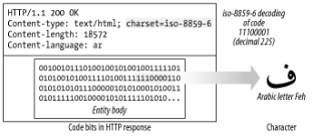
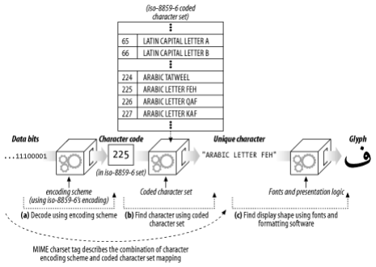
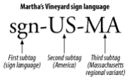
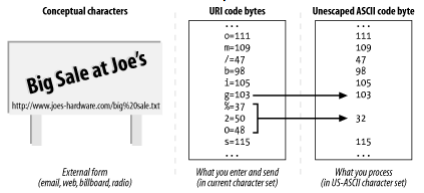

# 16장. 국제화

## 국제적인 컨텐츠를 다루기 위해 필요한 HTTP 지원

> HTTP 메시지는 어떤 언어로 된 컨텐츠든, 이미지, 동영상 혹은 그 외 다른 종류의 미디어처럼 실어 나를 수 있다.
> 
- 서버는 클라이언트에게 `HTTP Content-Type charset` 매개변수와 `Content-Language` 헤더를 통해 알려준다.
- 클라이언트는 서버에게 사용자가 어떤 언어를 볼 수 있는지 `Accept-Charset` 과 `Accept-Language` 헤더를 통해 알려준다.

## 문자집합과 HTTP

### Charset은 글자를 비트로 변환하는 인코딩이다.



> HTTP Charset 값은 어떻게 엔터티 컨텐츠 비트들을 특정 문자 체계의 글자들로 바꾸는지 말해준다.
> 

### 문자집합과 인코딩은 어떻게 동작하는가



1. (a) → 문서를 이루는 비트들은, 특정 코딩된 문자집합의 특정 문자로 식별될 수 있는 문자 코드로 변환된다.
2. (b) → 문자 코드는 코딩된 문자집합의 특정 요소를 선택하기 위해 사용된다.
3. (c) → 글꼴과 소프트웨어를 사용하여 화면이 보여줄 모양을 찾는다.

### 잘못된 Charset은 잘못된 글자를 낳는다.

→ 당연한 소리다. charset 이 잘못되면 그냥 다른 나라 언어가 튀어나올 수 있다.

### 표준화된 MIME Charset 값

> 특정 문자 인코딩과 특정 코딩된 문자집합의 결합을 MIME charset 이라고 부른다.
> 

### Content-Type charset 헤더와 META 태그

```
Content-Type: text/html; charset=iso-2022-jp
```

- 웹 서버는 클라이언트에게 MIME charset 태그를 charset 매개변수와 함께 Content-Type 헤더에 담아 보낸다.

### Accept-Charset 헤더

- HTTP 클라이언트는 서버에게 정확히 어떤 문자 체계를 그들이 지원하는지 Accept-Charset 요청 헤더를 통해 알려준다.

```
Accept-Charset: iso-8859-1, utf-8
```

## 다중언어 문자 인코딩에 대한 지침

### 문자집합 용어

- 문자
- 글리프 → 하나의 글자를 표현하기 위한, 획의 패턴이나 다른 것과 구분되는 유일한 시각적 형태.
- 코딩된 문자 → 우리가 글자를 다룰 수 있도록 각 글자에 할당된 유일한 숫자.
- 코드 공간 → 문자 코드 값으로 사용하려고 계획해 둔 정수의 범위
- 코드 너비 → 각 문자 코드의 비트 개수
- 사용 가능 문자집합
- 코딩된 문자집합
- 문자 인코딩 구조

### Charset은 형편없는 이름이다.

> 이미 문자 인코딩 구조와 코딩된 문자집합에 대한 출판된 표준이 존재하기 때문이다.
> 

## 언어 태그와 HTTP

> 언어 태그는 언어에 이름을 붙이기 위한 짧고 표준화된 문자열이다.
> 

### Content-Language 헤더

> 엔터티가 어떤 언어 사용자를 대상으로 하고 있는지 서술한다.
> 
- 텍스트 문서만을 위한 것이 아니라, 오디오 클립, 동영상 그리고 애플리케이션도 특정 언어 사용자를 대상으로 할 수 있다.

### Accept-Language 헤더

> 클라이언트는 자신이 이해할 수 있는 콘텐츠를 요청하기 위해 `Accept-Language`와 `Accept-Charset`을 사용할 수 있다.
> 

### 언어 태그



- 일반적인 언어의 종류
- 특정 국가의 언어
- 방언
- 지방어
- 그 외 다른 언어의 변형이 아닌 표준 언어
- 비표준 언어

## 국제화된 URI

### 이스케이핑과 역이스케이핑(unescaping)



- URI escape
    - 예약된 문자나 다른 지원하지 않는 글자들을 안전하게 URI에 삽입할 수 있는 방법
- URI unescape
    - 데이터가 필요할 때만 URI를 unescaping 해야한다.
    - 두 번 하면 절대 안된다.