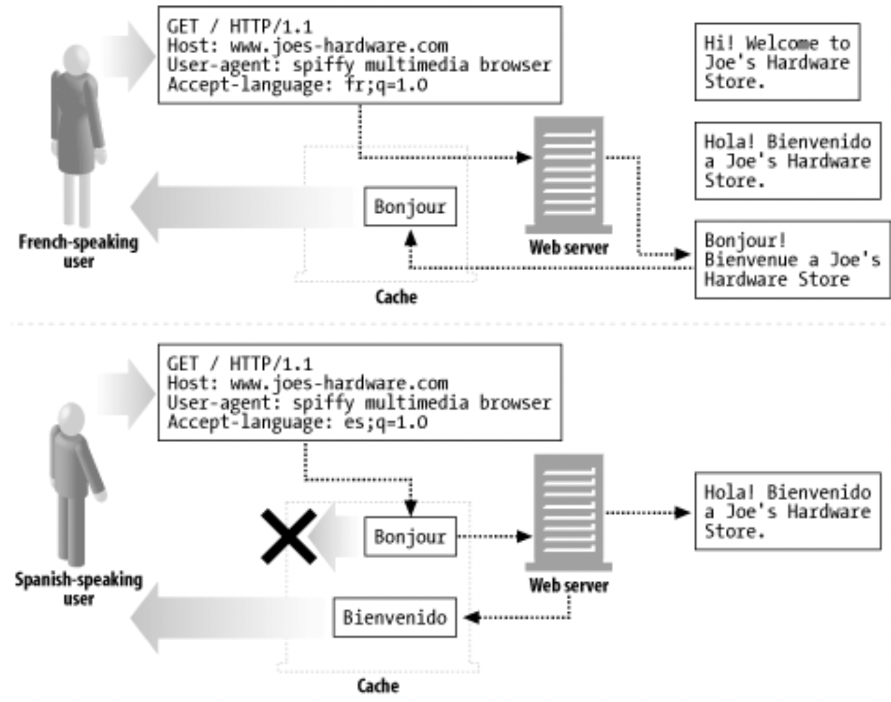
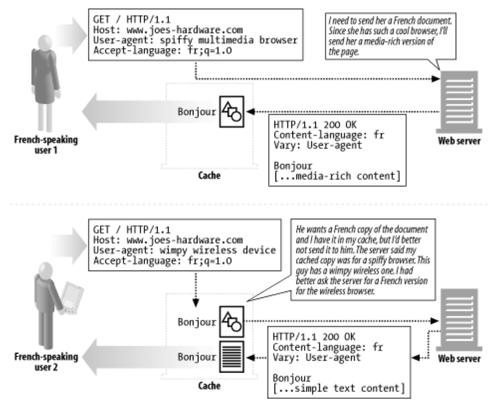

# 17장. 내용 협상과 트랜스코딩

## 내용 협상 기법

서버에 있는 페이지들 중 어떤 것이 클라이언트에게 맞는지 판단하는 세 가지 다른 방법이 있다.

- 클라이언트에게 선택지를 준다. = 클라이언트 주도 협상
- 서버가 자동으로 판단한다. = 서버 주도 협상
- 중개자에게 선택하도록 부탁한다. = 투명한 협상

## 클라이언트 주도 협상

> 서버가 가능한 페이지의 목록을 주어 클라이언트가 선택하게 한다.
> 
- 서버 입장에서는 가장 구현하기 쉽고 최선의 사본이 선택될 것이다.
- 하지만 각 페이지에 두 번의 요청이 필요하다.
    - 한 번은 목록을 얻고, 두 번째는 선택한 사본을 받아와야 한다.

## 서버 주도 협상

> 서버가 어떤 페이지를 응답할 것인지 결정하게 한다.
> 
- 클라이언트가 자신이 선호하는 것에 대한 정보를 요청할 때 헤더에 담아준다.

### 내용 협상 헤더

> 클라이언트와 서버가 선호 정보를 서로 교환하고 문서들의 여러 버전 중 하나를 선택하는 것을 도와, 클라이언트의 선호에 가장 잘 맞는 문서를 제공해 주기 위한 목적으로 사용된다.
> 

→ HTTP는 상태가 없는 프로토콜이기 때문에, 클라이언트는 자신의 선호 정보를 반드시 매 요청마다 보내야한다.

### 내용 협상 헤더의 품질값

> HTTP 프로토콜은 클라이언트가 각 선호의 카테고리마다 여러 선택 가능한 항목을 선호도와 함께 나열할 수 있도록 품질값을 정의하였다.
> 

## 투명 협상

> 클라이언트 입장에서 협상하는 중개자 프락시를 둠으로써 클라이언트와의 메시지 교환을 최소화하는 동시에 서버 주도 협상으로 인한 부하를 서버에서 제거한다.
> 
- 프락시는 클라이언트의 기대가 무엇인지 알고있고, 클라이언트 입장에서 협상을 수행할 능력이 있는 것으로 전제된다.
- 서버는 어떤 요청 헤더를 검사해야 하는지 프락시에게 반드시 말해줄 수 있어야 한다.
- 캐시는 서버의 입장에서 클라이언트와 협상할 수 있다.
- 캐시는 또한 컨텐츠를 트랜스코딩하기에 훌륭한 장소다.
    - 범용 트랜스코더는 특정 서버에 국한되지 않고 어떤 서버의 컨텐츠든 트랜스코딩할 수 있기 때문이다.

### 캐시와 alternate

> 캐시는 올바른 응답을 클라이언트에게 돌려주기 위해 내용 협상 헤더를 사용한다.
> 
- 내용 협상은 배리언트 중에서 클라이언트의 요청에 가장 잘 맞는 것을 선택하는 과정으로 이해할 수 있다.
- 캐시는 각 배리언트마다 알맞은 문서 버전을 저장해야 한다.

> 서버가 특정 요청 헤더에 따라 다르게 응답한다면, 캐시된 응답을 돌려보내기 전에 캐시는 반드시 일반적인 내용 협상 헤더들뿐 아니라 이들 요청 헤더들도 맞춰보아야 한다.
> 

## 트랜스코딩

### 포맷 변환

> 데이터를 클라이언트가 볼 수 있도록 한 포맷에서 다른 포맷으로 변환하는 것이다.
> 

### 정보 합성

> 문서에서 정보의 요점을 추출하는 것 → 트랜스코딩 과정에서 유용할 수 있다.
> 

### 컨텐츠 주입

> 웹 문서의 양을 줄이는 것이 아니라 오히려 늘리는 다른 종류의 변환
> 

## 다음 단계

- HTTP의 내용 협상은 성능 제약을 초래한다.
- HTTP는 내용 협상이 필요한 유일한 프로토콜이 아니다.

> `Accept`나 `Content` 관련 헤더들에서 멈추지 않을 것이다….
>