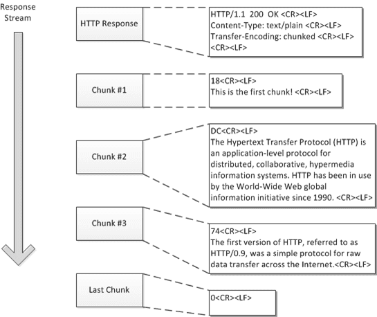

# 엔터티와 인코딩
## 목차
- [엔터티와 인코딩](#엔터티와-인코딩)
  - [목차](#목차)
  - [인코딩](#인코딩)
  - [메시지와 엔터티](#메시지와-엔터티)
    - [엔터티 헤더 필드](#엔터티-헤더-필드)
    - [엔터티 본문](#엔터티-본문)
  - [Content-Length](#content-length)
    - [잘림 검출](#잘림-검출)
    - [잘못된 Content-Length](#잘못된-content-length)
    - [Content-Length와 지속 커넥션(Persistence Connection)](#content-length와-지속-커넥션persistence-connection)
    - [콘텐츠 인코딩](#콘텐츠-인코딩)
    - [엔터티 본문 길이 판별을 위한 규칭](#엔터티-본문-길이-판별을-위한-규칭)
  - [미디어 타입과 Charset](#미디어-타입과-charset)
    - [텍스트 매체를 위한 문자 인코딩](#텍스트-매체를-위한-문자-인코딩)
    - [멀티파트 미디어 타입](#멀티파트-미디어-타입)
    - [멀티파트 폼 제출](#멀티파트-폼-제출)
    - [멀티파트 범위 응답](#멀티파트-범위-응답)
  - [콘텐츠 인코딩](#콘텐츠-인코딩-1)
    - [콘텐츠 인코딩 과정](#콘텐츠-인코딩-과정)
    - [콘텐츠 인코딩 유형](#콘텐츠-인코딩-유형)
    - [Accept-Encoding 헤더](#accept-encoding-헤더)
  - [전송 인코딩과 청크 인코딩](#전송-인코딩과-청크-인코딩)
    - [안전한 전송](#안전한-전송)
    - [Transfer-Encoding 헤더](#transfer-encoding-헤더)
    - [청크 인코딩](#청크-인코딩)
      - [청크와 지속 커넥션](#청크와-지속-커넥션)
      - [청크 인코딩된 메시지의 트레일러](#청크-인코딩된-메시지의-트레일러)
    - [콘텐츠와 전송 인코딩의 조합](#콘텐츠와-전송-인코딩의-조합)
    - [청크 인코딩 전송 규칙](#청크-인코딩-전송-규칙)
  - [시간에 따라 바뀌는 인스턴스](#시간에-따라-바뀌는-인스턴스)
  - [검사기와 신선도](#검사기와-신선도)
    - [신선도](#신선도)
    - [검사기](#검사기)
  - [범위 요청](#범위-요청)
  - [델타 인코딩](#델타-인코딩)

## 인코딩
HTTP는 라벨링된 에터티를 사용해서 메시지를 송신
- Content-Type과 Content-Lenguage를 통해서 객체 식별
- Content-Length와 Content-Encoding을 통해서 압축 해제
- 언터티 검사기와 캐시 만료를 제어하여 최신의 객체 유지
- 범위 요청, 델타 인코딩 등을 사용해서 빠른 전송
- 전송 인코딩 헤더와 Content-MD5 체크섬을 사용해서 조작 방지

## 메시지와 엔터티
> 메시지는 컨테이너고 엔터티는 그 컨테이너에 실려가는 화물이다.

### 엔터티 헤더 필드
- Content-Type: 엔터티에 의해 전달된 객체의 종류
- Content-Length: 전달되는 메시지의 길이
- Content-Language: 객체와 가장 잘 대응되는 자연어
- Content-Encoding: 인코딩 종류
- Content-Location: 요청 시점을 기준으로, 객체의 또 다른 위치
- Content-Rage: 부분 엔터티일 때, 전체 엔터티에서 어느 부분에 해당하는지 정의
- Content-MD5: 엔터니 본문의 콘텐츠에 대한 체크섬
- Last-Modified: 서버에서 콘텐츠가 생성 또는 수정된 날
- Expires: 엔터티 만료날짜
- Allow: 허용되는 메소드
- ETag: 인틋턴스에 대한 고유 검사기
- Cache-Control: 캐시 타입

### 엔터티 본문
- 가공되지 않은 데이터만 가지고 있다.
- Content-Encoding 헤더가 있으면 인코딩 되어 있는 상태
- 엔터티 본문은 헤더 필드의 끝을 의미하는 CRLF 다음부터 시작한다.

## Content-Length
- 메시지의 엔터티 본문의 크기를 바이트 단위로 나타낸다.
- 메시지를 청크 인코딩하지 않은 이상 `필수적`으로 있어야한다.
- 외부 요소로 인해서 메시지가 잘렸는지 감지할 때와 지속 커넥션을 공유하는 메시지들을 올바르게 분할 할 때 필요

### 잘림 검출
- Content-Length를 통해서 커넥션이 정상적으로 닫힌 것인지 구분할 수 있다.
- 메시지 잘림은 캐싱 프록시 서버에서 취약하다.
  - 캐시가 잘린 메시지를 캐싱하면 해당 메시지를 다른 클라이언트에도 전달한다. 
  - 명시적으로 길이가 없으면 캐시하지 않는다.

### 잘못된 Content-Length
- 잘못된 값을 가지고 있으면 검증하기 어렵다.
- 알려진 버그들을 탐지하고 교정 시도
- HTTP/1.1은 잘못된 길이를 받으면 사용자에게 알려준다.

### Content-Length와 지속 커넥션(Persistence Connection)
- Content-Length는 지속 커넥션에 `필수`로 사용된다.
- 커넥션이 지속적이기 때문에 커넥션이 닫힌 위치를 통해서 메시지의 끝을 알 순 없다.
- 청크 인코딩에서는 청크들이 특정한 크기를 갖기 때문에 길이 정보가 없다.

### 콘텐츠 인코딩
- HTTP는 보안과 압축을 위해서 인코딩을 사용한다.
- 본문이 인코딩되어 있다면 Content-Length는 인코딩된 본문의 길이를 의미한다.

### 엔터티 본문 길이 판별을 위한 규칭
1. 본문을 가지지 않는 HTTP 메시지는 Content-Length 무시 
2. 메시지가 Transfer-Encoding 헤더를 포함하고 있다면 커넥션이 닫혀서 끝나지 않는 이상 `0 바이트 청크`라 불리는 특별한 패턴으로 끝난다.
3. Content-Length && !Transfer-Encoding -> 본문의 길이를 의미
   1. Content-Length && Transfer-Encoding -> Content-Length 무시
4. `multipart/byeranges` 미디어 타입을 사용하고 엔터티의 길이가 정의되지 않는 경우
   - 멀티파트 메시지의 각 부분은 각자가 스스로의 크기를 정의
   - 자신의 크기를 스스로 결정할 수 있는 유일한 유형
5. 위의 규칙에 해당되지 않으면 언터티는 커넥션이 닫힐 때 끝난다.
   - 서버만 커넥션을 닫을 수 있다.
6. HTTP/1.0과 호환을 위해 엔터니 본문을 갖고 있는 HTTP/1.1 요청은 반드시 유효안 Content-Length 헤더도 갖고 잇어야한다.

## 미디어 타입과 Charset
- Content-Type은 엔터니 본문의 MIME 타입을 기술
- MIME 타입은 데이터의 기저형식의 표준화된 이름이다.
  - HTML, word, MPEG

### 텍스트 매체를 위한 문자 인코딩
- Content-Type 헤더는 내용 유형을 자세히 저장하기 위한 선택적인 매게변수 지원 
- `charset`이 대표적인 예시이다.

### 멀티파트 미디어 타입
- 폼을 채워서 재출할때 또는 무서의 일부분을 실어 나르는 범위 응답을 할 때만 사용

### 멀티파트 폼 제출
- HTTP 폼을 제출하면 가변길이 텍스트 필드와 업로드 될 객체는 각각 멀티파트 본문을 구성하는 하나의 파드로 전송
- 멀티파트 본문은 여러 다른 종류 길이와 값으로 채워진 폼 허용
- `Content-Type: multipart/form-data` 또는 `multipart/mixed` 헤더에 멀티파트 본문 함께 전송

### 멀티파트 범위 응답
- 범위 요청에 대한 HTTP 응답 또한 멀티 파트가 될 수 있다.
- `Content-Type: multipart/byteranges` 헤더 및 각 다름 범위를 담고 있는 멀티 파트 본문이 함께 온다.

## 콘텐츠 인코딩
### 콘텐츠 인코딩 과정
1. 웹서버가 원본 Content-Type과 Content-Length 헤더를 수반한 원본 응답 메시지를 생성한다.
2. 콘텐츠 인코딩 서버가 인코딩된 메시지를 생성
3. 수신 측 프로그램은 인코딩된 메시지를 받아서 디코딩하고 원본을 얻는다.
   
### 콘텐츠 인코딩 유형
- gzip: 엔터니에 GNU zip 인코딩 적용
- compress: 엔터티에 대해 유닉스 파일 압출 프로그램, compress가 실행되었음을 의미
- deflate: 엔터니가 zlib 포맷으로 압축
- identity: 엔터티가 어떤 인코딩도 수행되지 않음

### Accept-Encoding 헤더
- 클라이언트는 자신이 지원하는 인코딩 목록을 Accept-Encoding 요청 헤더를 통해 전달한다.
- 요청에 Accept-Encoding 헤더가 없다면 서버는 클라이언트가 모든 인코딩을 받아들인다고 가정한다.

## 전송 인코딩과 청크 인코딩
### 안전한 전송
- HTTP에서 전송된 메시지의 본문이 문제를 일으키는 경우
  - 알 수 없는 크기
    - 어떤 서버는 콘텐츠를 먼저 생성하지 않고 메시지 본문의 최종 크기를 판단할 수 없다.
    - 이 서버들은 사이즈를 알기전에 데이터의 전송을 시작하려고 한다.
    - HTTP는 헤더에서 길이를 요구하기 때문에 몇몇 서버는 데이터의 끝을 알리는 종결 꼬리말을 포함 시켜 전송 인코딩으로 데이터를 보내려 시도한다.
  - 보안 
    - 공용 전송 네트워크로 메시지 콘텐츠를 보내기 전에 전송 인코딩을 사용해 알아보기 어렵게 뒤섞어 버리는 방법도 있다.
    - SSL과 같은 유명한 전송 계층 보안 방식이 있기 때문에 전송 인코딩 보안은 흔하지 않다.

### Transfer-Encoding 헤더
- 전송 인코딩을 제어하고 서술하기 위해 정의된 헤더는 2가지가 있다.
  - Transfer-Encoding
    - 안전한 전송을 위해 어떤 인코딩이 메시지에 적용되었는지 표시
  - TE
    - 확장된 전송 인코딩을 사용할 수 있는지 서버에 알려주기 위해 요청 헤더에서 사용

### 청크 인코딩
- 메시지를 일정 크기의 청크로 쪼개서 전송
- 서버는 각 청크를 순차적으로 전송
- 본문이 동적으로 생성되고 서버는 일부를 버퍼에 담은 뒤 청크를 크기와 함께 전송

#### 청크와 지속 커넥션
- 서버는 크기가 0인 청크로 본문이 끝낫음을 알린다.
- 청크의 길이는 바이트 단위로 ㅊㄱ정
- 클라이언트는 청크된 인코딩을 서버로 전송해서 청크 인코딩을 수신할 수 있다고 알려준다.



#### 청크 인코딩된 메시지의 트레일러
- 트레일러는 마지막 청크 다음에 위치한다.
- 다음 중 하나 이상의 조건을 만족하면 청크 메시지에 트레일러를 추가할 수 있다. 
  - 클라이언트의 TE 헤더가 트레일러를 받아들일 수 있을을 나타내고 있는 경우
  - 트레일러가 응답을 만든 서버에 의해 추가되었으며, 그 트레일러의 콘텐츠는 클라이언트가 이해하고 사용할 필요가 없는 선택적인 메타데이터이므로 클라이언트가 무시하고 버려도 되는 경우
- 트레일러에는 메시지 시작 시점에서는 값을 알 수 없는 추가적인 헤더 필드를 담을 수 있다.

### 콘텐츠와 전송 인코딩의 조합
- 콘텐츠 인코딩과 전송 인코딩은 동시에 사용될 수 있다.
- 콘텐츠를 인코딩한 뒤 청크로 인코딩한다.
- 해석은 반대로

### 청크 인코딩 전송 규칙
- 전송 인코딩의 집합은 반드사 `chunked`를 포함, 커넥션의 종료로 끝나는 경우 제외
- 메시지 본문에 적용된 마지막 전송 인코딩이 존재
- 메시지 본문에 한번 이상 적용되어야한다.

## 시간에 따라 바뀌는 인스턴스
- 같은 URL은 시간에 따라 다른 버전의 객체를 가리킬 수 있다. 
- `인스턴스 조작(instance manipulation)`: HTTP는 특정한 종류의요청이나 응답을 다루는 방법들을 정의 
  - 범위 요청
  - 델타 인코딩

## 검사기와 신선도
- 클라이언트는 사본을 얼마나 오래 캐싱해야할까
### 신선도
- 서버는 Expires나 Cache-Control 헤더를 통해서 언제까지 신선한지 알려준다.
- Expires는 정확한 날자를 표기 -> 시계를 동기화해야한다
- Cache-Control은 문서의 최대 수명을 초단위로 표기
### 검사기
- 캐싱한 데이터가 신선하지 않다면 최신본으로 교체하거나 파기해야한다.
- 만약 서버에도 캐싱된 데이터와 같은 문서가 있다면 네트워크를 낭비하게된다.
- 리소스가바뀐경우에만 사본을 요청하는 조건부 요청이있다. 
```
GET /announce.html HTTP/1.0
If-Modified-Since: Sat, 29 Jun 2002, 14:30:00 GMT
```
- `If-Modified-Since` 헤더를 사용해서 변경된 경우에만 문서를 가져온다.
- HTTP 검사기는 약한 검사기와 강한 검사기로 분류된다.
  - 약한 검사기: 리소스의 인스턴스를 고유 식별하지 않는 경우도 있다.
    - 바이트를 검사하여 체크하는 경우
  - 강한 검사기: 리소스의 인스턴스를 고유 식별한다. 

## 범위 요청
- 클라이언트가 문서의 일부분이나 특정 범위만 요청할 수 있다. 
- 다운로드하다가 시래한엔터티를 일부 혹은 범위로 요청하여 중단된 시점에서 재개할 수 있다.
```
GET /bigfile.html HTTP/1.1
HOST: www.google.com
Range: bytes=4000- 
User-Agent: Mozilla/4.61 [en] (WinNT; I)
```
-> 4000바이트 이후 요청
- 서버는 클라이언트에게 자신이 범위 요청을 처리할 수 있는 지를 `Accept-Range`헤더를 사용해서 알려 줄 수있다. 

## 델타 인코딩
- 객체 전체가 아닌 변경된 부분에 대해서만 통신하여 전송량을 최적화하는 HTTP 프로토콜의 확장이다.
- 객체의 특정 인스턴스들에 대한 클라이언트와 서버 사이의 정보 교환에 의존하기 때문에 인스턴스 조작이라고 할 수 있다.
- `어떤 버전을 가지고 있는지`와 `델타를 적용하는 알고리즘`을 서버에 알려주어야한다.
- 서버는 클라이언트가 갖고 있는 버전을 가지고 있는지와 최신 버전과 클라이언트의 버전 사이의 델타를 계산할 것인치 체크 -> 달라고 다 주는건 아닌가보다
- 서버가 클라이언트에 델타를 보낸다고알려주고 델타 전송
- 깃과 비슷한 느낌?
