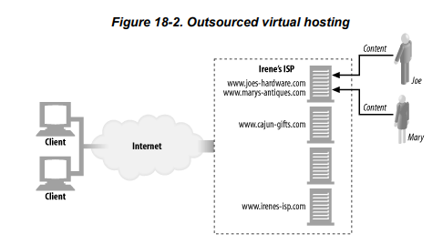
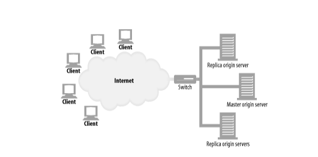

# Chap18

---

# Chap 18. 웹 호스팅

콘텐츠 리소스를 저장, 중개, 관리하는 일을 통틀어 웹 호스팅이라고 한다.

## 18.2 가상 호스팅

- 가상 호스팅(공유 호스팅)이란 한 서버에 여러 개의 사이트를 호스팅하는 서비스이다.
    
    → 하지만 이것이 PC 한 대에 웹 사이트 1000개를 구축한다는 것은 아니다. 서버 팜이라는 복제된 서버들의 집합을 이용하여 부하를 분산할 수 있다.
    
- 각 웹 사이트는 다른 서버에서 호스팅하는 것처럼 보이겠지만, 사실은 물리적으로 같은 서버에서 호스팅 되는 것이다.

### 18.2.1 호스트 정보가 없는 가상 서버 요청

- HTTP/1.0에는 공용 웹 서버가 호스팅하고 있는 가상 웹 사이트에 누가 접근하고 있는지 식별하는 Host 헤더가 없다
- HTTP/1.0 요청은 요청 메시지에 URL의 경로 컴포넌트만 전송한다.
    
    ex) [http://www.joes-hardware.com/index.html](http://www.joes-hardware.com/index.html) 을 요청하면 HTTP/1.0은 호스트 명에 대한 명시 없이 GET /index.html 이라는 요청을 한다.
    

### 18.2.2 가상 호스팅 동작하게 하기

HTTP/1.0이 호스트 명을 식별하지 못하지만 가상 호스팅을 가능하게 하는 4가지 방법이 있다.

- URL 경로를 통한 가상 호스팅
    
    서버가 어떤 사이트를 요청하는 것인지 알 수 있게 URL에 특별한 경로 컴포넌트를 추가한다.
    
    ex) [http://www.joes-hardware.com/joe/index.htm](http://www.joes-hardware.com/index.html) → HTTP 요청은 GET /joe/index.html이 되어 joe의 홈페이지에 대한 요청인 것을 알 수 있다.
    
- 포트번호를 통한 가상 호스팅
    
    80번 포트 대신에 죠는 82, 메리는 83번 포트를 사용해서 구별할 수 있다.
    
- IP 주소를 통한 가상 호스팅
    
    각 가상 웹 사이트에 유일한 IP 주소를 한 개 이상 부여한다. 모든 가상 서버의 IP 주소는 같은 공용 서버에 연결되어 있다. 서버는 HTTP 커넥션의 목적지 IP 주소를 보고 클라이언트가 어떤 웹 사이트에 연결하려고 하는지 알 수 있다. 
    
    - [http://www.joes-hardware.com/index.html](http://www.joes-hardware.com/index.html)을 요청한다.
    - [http://www.joes-hardware.com/index.html](http://www.joes-hardware.com/index.html)에 대한 IP 주소를 알아낸다.
    - 알아낸 IP 주소에 있는 웹 서버에 TCP 커넥션을 맺는다.
    - GET /index.html HTTP/1.0 요청을 보낸다.
    - 알아낸 IP 주소가 어떤 웹 사이트인지 판단하고, 그 사이트에 맞는 페이지를 반환한다.
- Host 헤더를 통한 가상 호스팅
    - IP 주소는 제한적이기 때문에, 가상 사이트들이 같은 IP를 사용하더라도 각 사이트가 어디에 속해있는지 알 수 있어야 한다.
    - HTTP/1.0+에서 Host 헤더가 추가되었고, HTTP/1.1에서는 Host 헤더를 무조건 기술해야 한다.

### 18.2.3 HTTP/1.1 Host 헤더

- 대부분의 HTTP 클라이언트가 HTTP/1.1과 호환되지 않더라도 Host 헤더는 구현해야 한다.
- Host 헤더 해석하기
    
    가상 호스팅을 지원하지 않는 원 서버는 요청 받는 호스트에 따라서 리소스가 달라지지 않기 때문에 Host 헤더 값을 무시할 것이다. 
    
    하지만 호스트를 기준으로 리소스를 구분하는 모든 웹 서버는 HTTP/1.1을 통해 오는 리소스를 결정하기 위해서 아래 규칙을 따라야 한다.
    
    - HTTP 요청 메시지에 전체 URL이 기술되어 있으면 Host 헤더는 무시하고 URL을 사용
    - URL이 기술되어 있지 않고 Host 헤더가 있으면, 호스트 명과 포트를 Host 헤더에서 가져옴
    - 두가지 모두 없다면 클라이언트에 400 응답을 반환함

## 18.3 안정적인 웹 사이트 만들기

### 18.3.1 미러링 된 서버 팜

서버 팜은 서로 대신할 수 있고 식별할 수 있게 설정된 웹 서버들의 집합이다.

아래 그림에서 스위치 옆 서버들의 집합이 서버 팜이다. 

원본 콘텐츠를 가지고 있는 서버를 마스터 원 서버라 하고, 마스터 원 서버로부터 콘텐츠를 받아 복제한 서버를 복제 원 서버라 한다. 

서버 팜에 배포하는 간단한 방법 하나는, 네트워크 스위치를 사용해서 서버에 분산 요청을 보내는 것이다. 서버에 호스팅 되고 있는 각 웹 사이트의 IP 주소는 스위치의 IP 주소가 된다.

### 18.3.3 CDN의 대리 캐시

- 대리 캐시는 복제 원 서버를 대신해 사용될 수 있다.
- 대리 서버 vs 미러링 된 서버(=복제 원 서버)
    
    대리 서버는 원 서버의 전체 콘텐츠를 복사하지 않고, 클라이언트가 요청하는 콘텐츠만 수요에 따라 저장한다.