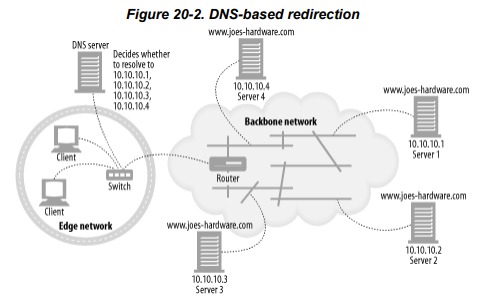
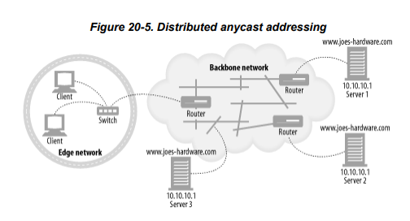

# Chap20

---

# Chap 20. 리다이렉션과 부하균형

HTTP 애플리케이션은 언제나 신뢰할 수 있는 **HTTP 트랜잭션 / 지연 최소화 / 네트워크 대역폭 절약** 이 세가지를 원하기 때문에 리다이렉션은 현대 웹에서는 피할 수 없는 현실이다.

- 웹 콘텐츠는 여러 장소에 배포된다
    - 한 곳에서 실패하면 다른 곳을 이용할 수 있어서 신뢰성이 개선됨
    - 클라이언트가 가까운 리소스에 접근할 수 있게되어서 응답시간도 줄여줌
    - 목적지 서버가 분산되므로 네트워크 혼잡도 줄어든다.
    
    → 리다이렉션이란 최적의 분산된 콘텐츠를 찾는 것을 도와주는 기법의 집합
    

## 20.3 리다이렉션 프로토콜의 개요

리다이렉션의 목표는 HTTP 메시지를 가용한 웹 서버로 가급적 빨리 보내는 것이다.

HTTP 메시지가 인터넷을 통해 나아가는 방향은 그 메시지가 오고, 거쳐가고, 향하는 **HTTP 애플리케이션과 라우팅 장치**에 영향을 받는다.

- 브라우저 설정, DNS, TCP/IP 라우팅, 그리고 HTTP는 모두 메시지를 리다이렉트하는 메커니즘을 제공한다. → 브라우저 설정과 같은 방법은 프락시로 향하는 리다이렉트 트래픽에 대해서만 사용할 수 있다. 반면 나머지 리다이렉션들은 트래픽을 보내려는 곳이 어느 서버냐에 상관없이 사용될 수 있다.

## 20.4 일반적인 리다이렉션 방법

서버와 프락시 양쪽에서 공통으로 쓰이는 여러 가지 리다이렉션 방법들

### 20.4.1 HTTP 리다이렉션

- 요청을 처리하는 서버(리다이렉팅 서버)는 가용한 것들 중 부하가 가장 적은 콘텐츠 서버를 찾아서 브라우저의 요청을 그 서버로 리다이렉트 한다.
- 다른 형태의 리다이렉션에 비해 HTTP 리다이렉션이 갖는 장점은 리다이렉트를 하는 서버가 클라이언트의 아이피 주소를 안다는 것이다. 이렇게 하면 좀 더 클라이언트의 정보에 근거해 서버를 선택할 수 있다.
- HTTP 리다이렉션의 단점
    - 어떤 서버로 리다이렉트할지 결정하려면 원 서버에 부하가 갈 수 있다. (페이지 자체를 제공할 때 필요한 것과 거의 같은 양의 정보를 제공해야할 수도 있음)
    - 페이지 접근마다 두 번의 왕복(요청 → 리다이렉션 응답 → 리다이렉션 주소로 요청 → 응답)이 필요하기 때문에 사용자가 오래 기다린다
    - 리다이렉트 서버가 고장하면 사이트도 고장난다
    
    → HTTP 리다이렉션은 보통 몇몇 다른 리다이렉션 기법과 함께 사용됨
    

### 20.4.2 DNS 리다이렉션

- 클라이언트가 어떤 하드웨어 웹 사이트에 접근하려고 할 때마다, 도메인 이름 www.joes-hardware.com은 반드시 아이피 주소로 분석되어야 한다.
- DNS 분석자는 클라이언트의 운영체제일 수도, 클라이언트의 네트워크에 있는 DNS 서버 혹은 더 원격에 있는 DNS 서버일 수도 있다.
- DNS는 하나의 도메인에 여러 아이피 주소가 결부되는 것을 허용하고, 분석자는 여러개의 아이피 중 어떤 것을 반환할지 여러 알고리즘(라운드 로빈, 여러 서버의 로드를 검사하는 방법 등)을 통해 결정할 수 있다.

### 20.4.3 임의 캐스트 어드레싱

- 여러 지리적으로 흩어진 웹 서버들은 정확히 같은 아이피 주소를 갖고 클라이언트의 요청을 클라이언트에서 가장 가까운 서버로 보내주기 위해 백본 라우터의 최단거리 라우팅 능열게 의지한다.
- 각 웹 서버에게 자신을 인접한 백본 라우터를 향하는 라우터라고 광고하는 것이다.
- 백본 라우터가 임의 캐스트 주소를 목적지로 하는 패킷을 받았을 때 그 아이피 주소를 받아들일 수 있는 가장 가까운 라우터를 찾는다.
    - 아래 그림에서 LA 서버는 10.10.10.1을 LA 라우터에 광고하고, NY 서버는 같은 주소를 NY 라우터에 광고한다. 라우터는 10.10.10.1을 향한 클라이언트의 요청을 자동으로 그 주소를 광고한 가장 가까운 서버로 라우팅 한다. 아래 그림에서는 서버 3번으로 라우팅 될 것이다.

## 20.5 프락시 리다이렉션 방법

지금까지는 일반적인 리다이렉션 방법에 대해 얘기했다면, 콘텐츠에 접근할 때 프락시를 통할 필요가 있는 경우를 생각해보자.

웹브라우저와 같은 클라이언트들이 어떻게 프락시로 가는 길을 알 수 있을까?

- 명시적인 브라우저 설정을 통해
- 동적인 자동 설정을 통해
- 자연스러운 가로채기를 통해

### 20.5.1 명시적인 브라우저 설정

대부분의 브라우저에는 프락시 서버에 접촉하기 위해 프락시 이름, 아이피 주소, 포트번호를 설정할 수 있는 풀다운 메뉴가 존재한다.

명시적인 브라우저 설정에는 두 가지 중요한 단점이 있다.

- 프락시가 응답하지 않더라도 원 서버와 접촉하지 않는다. → 만약 프락시가 다운되었거나 브라우저가 잘못 설정되었다면 사용자는 접속 문제를 겪는다
- 네트워크 아키텍처를 변경했을 떄 그 변경사항을 모든 최종사용자에게 전파하는 것이 어렵다 → 만약 서비스 제공자가 더 많은 프락시를 추가하길 원하거나 몇 개를 서비스에서 제거하길 원한다면, 브라우저 사용자들은 그들의 프락시 설정을 변경해야만 한다.

### 20.5.2 프락시 자동 설정

명시적인 브라우저 설정의 단점을 보완하기 위해, 프락시 서버에 접촉하기 위해 브라우저가 동적으로 자신을 설정할 수 있게 하는 방법이다. PAC(Proxy Auto-configuration) 프로토콜이라고 한다.

- 브라우저들이 URL별로 접촉해야 할 프락시를 저장한 PAC 파일이라 불리는 특별한 파일을 찾도록 한다. → 브라우저는 반드시 PAC 파일을 얻기 위해 지정된 서버에 접촉하도록 설정되어야 한다.
- 지정된 서버에 접촉해야하는 문제를 해결하기 위해 웹 프락시 자동발견 프로토콜(Web Proxy Autodiscovery Protocol, WPAD)를 사용할 수 있다.

## 20.6 캐시 리다이렉션 방법

### 20.6.1 WCCP 리다이렉트

웹 라우터들이 웹 트래픽을 프락시 캐시로 리다이렉트 할 수 있도록 하기 위해서 캐시 조직 프로토콜(WCCP)이 개발 되었다. WCCP는 라우터들과 캐시들 사이의 대화를 관리하여 라우터가 캐시를 검사하고 특정 종류의 트래픽을 특정캐시로 보낼 수 있게 해준다.

- WCCP 리다이렉션 동작
    - WCCP를 사용할 수 있는 라우터와, 다른 캐시와 의사소통할 수 있는 캐시가 포함되어 있는 네트워크가 필요하다.
    - 라우터들의 집합과 그들의 대상이 되는 캐시들이 WCCP 서비스 그룹을 구성한다. 서비스 그룹의 설정은 어떤 트래픽이 어디로 어떻게 보내지는지, 서비스 그룹에서 부하가 캐시들 사이에서 어떻게 분산되어야 하는지 명시한다.
    - 만약 서비스 그룹이 HTTP 트래픽을 리다이렉션 하도록 설정되어 있다면, 서비스 그룹의 라우터는 HTTP 요청을 서비스 그룹의 캐시로 보낸다.
    - HTTP 요청이 서비스 그룹의 라우터에 도착했을 때, 라우터는 그 요청을 처리기 위해 서비스 그룹의 캐시 중 하나를 선택한다.
    - 라우터는 요청 패킷을, 캐시의 아이피 주소와 함께 캡슐화하거나 아이피 맥 포워딩을 하여 캐시로 보낸다.
    - 만약 캐시가 요청을 처리할 수 없다면, 패킷은 평범하게 포워딩되기 위해 라우터로 돌아온다.
    - 서비스 그룹의 구성원들은 지속적으로 다른 구성원들의 가용성을 확인하기 위해 하트비트 메시지(자신이 정상 동작하고 있음을 알려주는 메시지)를 교환한다.

---

프락시는 결과적으로 클라이언트의 요청을 다른 프락시로 리다이렉트할 수 있다.예를 들어, 요청 받은 콘텐츠를 갖고 있지 않은 프락시 캐시는 클라이언트를 다른 캐시로 리다이렉트할 것이다. 

피어 프락시 캐시 리다이렉션을 위해 사용되는 프로토콜 **인터넷 캐시 프로토콜, 캐시 배열 라우팅 프로토콜, 헤이퍼텍스트 캐싱 프로토콜**에 대해 살펴볼 것이다. 

## 20.7 인터넷 캐시 프로토콜

- 인터넷 캐시 프로토콜(ICP)는 캐시들이 형제 캐시에서 일어난 캐시 적중을 찾아볼 수 있도록 해준다.
- 한 차례 이상의 ICP 질의를 통해 HTTP 요청 메시지의 최종 목적지를 결정할 수 있다는 점에서 볼 때 이 프로토콜은 리다이렉션 프로토콜이다.

## 20.8 캐시 배열 라우팅 프로토콜

- 사용자의 증가에 따라, 대량의 트래픽은 프락시 서버 자체에 과도한 부하를 줄 수 있다.
    
    → 부하를 분산하기 위해 사용하는 프락시 서버를 여러 대로 늘리는 것이다.
    
- 캐시 배열 라우팅 프로토콜(CARP)은 프락시 서버의 배열이 클라이언트의 시점에서는 마치 하나의 논리적인 캐시처럼 보이도록 관리해주는 프로토콜이다.
- ICP와 CARP의 차이점
    - ICP 프로토콜로 서로 연결된 프락시 서버들 각각은 콘텐츠의 쓸데없는 복제본도 갖고 있는, 프락시 서버들 전체에 걸친 웹 객체에 대한 중복된 엔트리가 허용되는 독립적인 캐시이다.
    - 반면 CARP를 이용해서 독자적으로 동작하는 서버들의 무리는, 각 구성요소 서버가 전체 캐시된 문서의 일부만 갖고있는 하나의 큰 서버처럼 동작한다. 웹 객체의 URL에 해시 함수를 적용함으로써, CARP는 웹 객체를 특정 프락시 서버에 매핑한다. 하나의 웹 객체는 하나의 프락시 서버에만 속하기 때문에, 프락시 서버 각각을 폴링하지 않고도 한 번의 검색으로 위치를 알 수 있다.
- CARP의 장점과 단점
    - CARP에서 프락시 서버 분석이 경정론적이라는 것은 질의를 모든 이웃에게 보낼 필요는 없다는 뜻이고, 이는 캐시가 주고받아야 하는 메시지가 더 적음을 의미함.
    - 하지만 프락시 서버 중 하나가 사용할 수 없게되면, 이 사실을 반영하기 위해 해시 함수가 수정되어야 하고, 프락시 서버 전체에 퍼져 있는 콘텐츠들도 다시 배치하지 않을 수 없다는 단점이 있다.

## 20.9 하이퍼텍스트 캐싱 프로토콜

하이퍼텍스트 캐싱 프로토콜(Hyper Text Caching Protocol, HTCP)은 형제 캐시들이 URP과 모든 요청 및 응답 헤더를 사용하여 서로에게 문서의 존재 여부에 대한 질의를 할 수 있도록 해줌으로써 적중이 아님에도 적중으로 처리될 확률을 줄인다. 

또한 HTCP는 형제 캐시들이 서로의 캐시 안에 있는 선택된 문서의 추가 및 삭제를 모니터링하고 요청할 수 있게, 서로의 캐시된 문서에 대한 캐싱 정책을 변경할 수 있게 해준다.