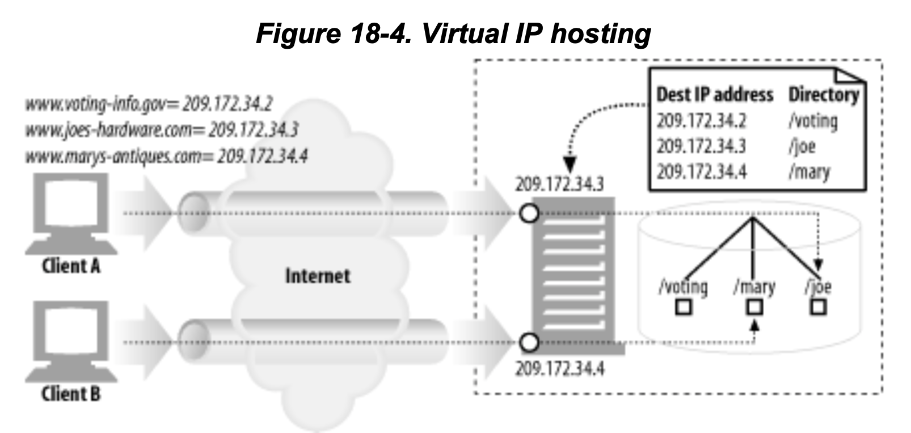
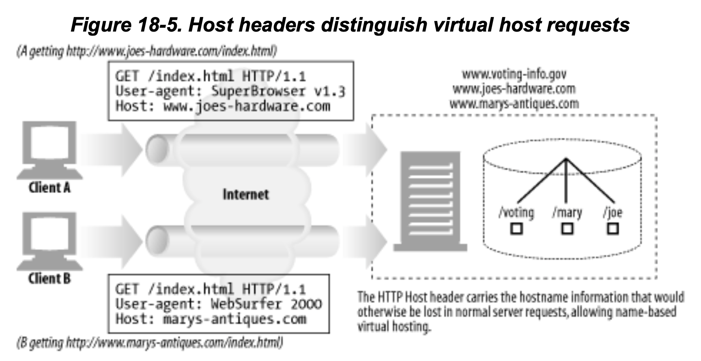
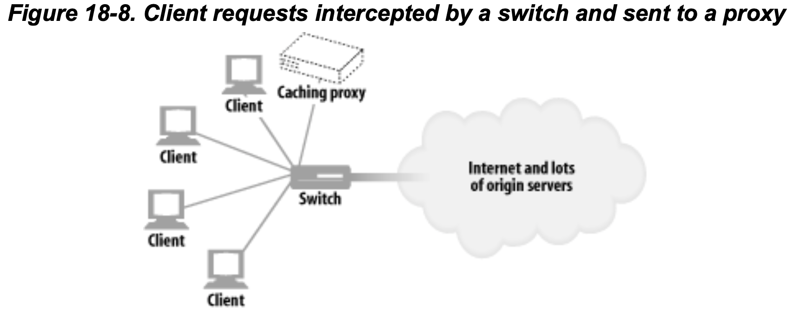

# 웹 호스팅
- [웹 호스팅](#웹-호스팅)
  - [가상 서비스](#가상-서비스)
    - [호스팅 정보가 없는 가상 서버 요청](#호스팅-정보가-없는-가상-서버-요청)
    - [가상 호스팅 동작하게하기](#가상-호스팅-동작하게하기)
      - [신(?)기술 4가지](#신기술-4가지)
      - [URL 경로를 통한 가상 호스팅](#url-경로를-통한-가상-호스팅)
      - [포트 번호를 통한 가상 호스팅](#포트-번호를-통한-가상-호스팅)
      - [IP 주소를 통한 가상 호스팅](#ip-주소를-통한-가상-호스팅)
        - [절차](#절차)
      - [Host 헤더를 통한 가상 호스팅](#host-헤더를-통한-가상-호스팅)
      - [HTTP/1.1 Host 헤더](#http11-host-헤더)
        - [문법과 사용 방법](#문법과-사용-방법)
        - [Host 헤더의 누락](#host-헤더의-누락)
        - [Host 헤더 해석](#host-헤더-해석)
        - [Host 헤더와 프록시](#host-헤더와-프록시)
  - [안정적인 웹 사이트 만들기](#안정적인-웹-사이트-만들기)
    - [미러링된 서버 팜](#미러링된-서버-팜)
    - [콘텐츠 분산 네트워크(CDN)](#콘텐츠-분산-네트워크cdn)
    - [CDN의 대리 캐시(리버스 프록시)](#cdn의-대리-캐시리버스-프록시)
    - [CDN의 프록시 캐시](#cdn의-프록시-캐시)
## 가상 서비스
- 대부분의 웹 호스팅은 컴퓨터 한대를 여러 고객이 공유하는 형태로 저렴하게 제공한다. 
- 물리적으로는 같은 서버에 있지만 다른 서버에 호스팅되는 것 처럼 보인다.
- PC 한대에 여러 서버가 구축된 것이 아닌 서버 팜(복제 서버 더미)을 두고 부하를 분산시킨다.
  
### 호스팅 정보가 없는 가상 서버 요청
- HTTP/1.0 명세는 공용 웹 서버가 호스팅하고 있는 가상 웹 사이트에 누가 접근하는 하는지 식별하는 기능을 제공하지 않는다.
  - HTTP/1.0 요청은 호스트 명에 대한 별다른 언급없이 "GET /index.html"와 같은 형식으로 요청한다.
  - 서버가 여러 개의 서비스를 가상 호스팅하고 있으면 사용자가 어떤 서비스에 접근하는지 구분할 수 없다. 

### 가상 호스팅 동작하게하기
- HTTP/1.1 서버는 요청에 있는 URL을 처리할 수 있다.
#### 신(?)기술 4가지
- URL 경로를 통한 가상 호스팅: URL에 경로 컴포넌트를 추가하여 서버가 어떤 서비스로의 요청인지를 구분할 수 있다.
- 포트번호를 통한 가상 호스팅: 각 서비스에 다른 포트번호를 할당하여 포트로 구분
- IP 주소를 통한 가상 호스팅: 각 서비스에 별도의 IP 주소를 할당하고 모든 IP 주소를 장비 하나에 연결한다. 
- Host 헤더를 통한 가상 호스팅: HTTP/1.0 개선 버전과 HTTP/1.1의 공식 버전은 서비스의 이름을 알려주는 Host 요청 헤더를 통해서 서비스를 구분한다.

#### URL 경로를 통한 가상 호스팅
- 공용 서버의 가상 사이트에 서로 다른 URL 경로 할당 -> 구분 가능
- 예시
  - 죠의 컴퓨터 가게: http://www.joes-hardware.com/joe/index.html
  - 메리의 골동품 가게: http://www.marys-antiques.com/mary/index.html
- 서버로 전달되는 요청은 호스트명 정보가 없이 전달되도 구분 가능해진다
  - "GET /joe/index.html"
  - "GET /mary/index.html"
- 별로 좋은 해결책은 아니다.
- 불빌요한 접두어가 필요해지고 사용자가 가상호스팅을 유추할 수 있다.

#### 포트 번호를 통한 가상 호스팅
- 각 서비스에 다른 포트번호를 부여하여 구분한다.
- 사용자는 URL에 비표준 포트를 쓰지 않고서도 리소스를 찾을 수 있어야하는데 불가능하다.

#### IP 주소를 통한 가상 호스팅

- 가상 IP 를 할당하여 구분한다.
- 각 서비스에 고유한 가상 IP를 부여하여 서버는 HTTP 커넥션의 목적지를 IP 주소를 보고 찾는다.
##### 절차
1. 클라이언트A는 http://www.joes-hardware.com/index.html 요청
2. 클라이언트A는 www.joes-hardware.com의 IP 주소를 요청하여 209.172.34.3를 획득
3. 클라이언트A는 209.172.34.3에 있는 공용 웹 서버에 TCP 커넥션을 형성
4. 클라이언트A는 "GET /index.html HTTP/1.0" 요청
5. 웹 서버가 실제 목적지 IP 주소(209.172.34.3)를 joe 서비스라고 기록
6. /joe 하위 디렉터리에 요청을 처리하고 /joe/index.html 페이지 반환

- 규모가 큰 경우에는 관리하기 어렵다.
- 컴퓨터 시스템에 연결할 수 있는 장비의 IP의 갯수에는 제한이 있다.
- IP주소는 희소상품이다.
- 서버의 용량을 늘리기위해 서버를 복제하면 복제한 만큼 주소가 더 필요하다


#### Host 헤더를 통한 가상 호스팅


- 가상 사이트들이 같은 IP를 사용하더라도 각 사이트가 어디에 속해 있는지 알 수 있어야함
- 브라우저 대부분이 URL의 경로 컴포턴트만 전달하기 때문에 호스트명을 전달할 수 있어야한다.
- HTTP를 확장하여 Host 헤더를 사용하여 전달한다.
- HTTP/1.0+에서 처음 소개되고 HTTP/1.1 명세를 따르기 위해서는 반드시 기술해야한다. 

#### HTTP/1.1 Host 헤더
- Host 헤더는 RFC 2068에 정의되어있는 HTTP/1.1 요청 헤더
- 대부분의 클라이언트가 HTTP/1.1과 호환되지 않더라도 Host 헤더는 구현

##### 문법과 사용 방법
```
Host = "Host" ":":"호스트[":"포트]
```
- Host 헤더에 포트가 적혀있지 않으면 해당 스킴의 기본 포트를 사용
- URL에 IP 주소가 있으면 호스트 헤더를 같은 주소를 포함
- URL에 호스트명이 있으면, 호스트 헤더는 같은 호스트 명 포함
- URL에 호스트명이 있으면 호스트 헤더는 URL의 호스트명이 가리키는 IP 주소를 포함하면 안된다.
  - 여러 개의 가상 사이트를 한개의 IP 주소에 연결 경우 문제가 생김
- 클라이언트가 특정 프록시 서버를 사용해야하는 경우
  - 호스트 헤더에 프록시가 아닌 원 서버의 호스트명과 포트를 기술
- 웹 클라이언트는 모든 요청에 Host 헤더 기술
- 웹 프록시는 요청 전달 전에 메시지에 Host 헤더 추가
- HTTP/1.1의 경우 Host 헤더가 없으면 400 응답

##### Host 헤더의 누락
- Host 헤더가 없는 경우 기본 웹페이지로 보내거나 브라우저를 업데이트하라고 한다.
  
##### Host 헤더 해석
- 원 서버가 가상 호스팅을 지원하지 않는 경우 Host 헤더 값 무시
- 지원하는 경우
  - HTTP 요청 메시지에 전체 URL이 기술된 경우  
    - Host 헤더값 무시하고 URL사용
  - URL에 호스트명이 없고 Host 헤더가 있는 경우
    - 호스트명과 포트를 Host 헤더에서 가져옴
  - 호스트를 결정할 수 없는 경우 400 Bad Request
  
##### Host 헤더와 프록시
- 프록시를 사용하게 설정한 브라우저중에 부정확한 Host 헤더를 보내는 경우가 있음

## 안정적인 웹 사이트 만들기
### 미러링된 서버 팜
- 서버 팜은 서로를 대신할 수 있다.
  - 서버에 문제가 생긴 경우 다른 곳으로 전달 가능
- 미러링된 서버는 계층적인 관계를 가짐
- 네트워크 스위치를 사용해서 요청을 분산시킨다.
- 클라이언트의 요청으 특적 서버로 가능 방법
  - HTTP 리다이렉션
    - URL은 마스터 서버(원래 서버)의 ip를 가리키고 마스터 서버는 요청을 받는 즉시 복제 서버로 리다이렉트
  - DNS 리다이렉션
    - URL은 복제서버 + 원서버의 수만큼 ip 주소를 가리킬수 있고 DNS 서버는 클라이언트에게 전송할 ip 주소를 선택할 수 있다.

### 콘텐츠 분산 네트워크(CDN)
> 특정 콘텐츠로의 요청을 분산시키는 네트워크, 노드는 서버, 대리서버, 프록시가 될 수 있다.

### CDN의 대리 캐시(리버스 프록시)
- 대리 캐시는 복제 원 서버를 대신해서 샤용될 수 있다.
- 대리서버와 미러링 서버의 차이점
  - 대리서버는 원서버의 전체 콘텐츠를 복사하지 않음, 클라이언트가 요청하는 콘텐츠만 저장
    원서버가 대리서버를 업데이트하는 것이 아닌 대리 서버가 요청해서 가지고 있는다
  - 요청하는 방식은 대리 서버의 알고리즘따라 다름
- CDN이 대리 서버보다 캐시를 계층하화기 어려워서 대리서버 사용?

### CDN의 프록시 캐시

- 대리 서버와 다르게 프록시 캐시는 모든 웹 서버 요청을 받을 수 있다.
- 대리 서버를 사용하면 프록시 캐시의 콘텐츠는 요청이 있는 경우에만 저장하고 정확히 복제한다는 보장 없음
- 요청을 많이 받는 콘텐츠를 미리 로딩할 수도 있다.
- 요청이 있을 때만 저장하는 프록시 캐시는 스위치 혹은 라우터가 웹 트래픽을 가로채는 경우도 있다.

