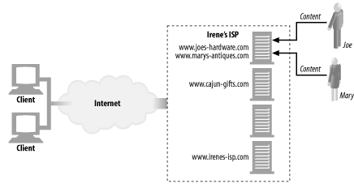
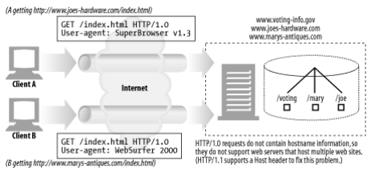
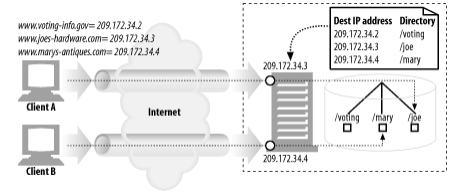
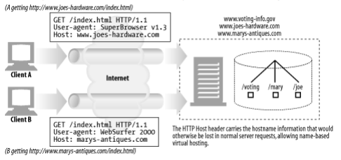
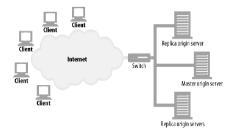
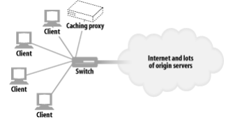

# 18장. 웹 호스팅

> 컨텐츠 리소스를 저장, 중개, 관리하는 일을 통틀어 웹 호스팅이라 한다.
> 

## 가상 호스팅

> 컴퓨터 한 대를 여러 고객이 공유하게 해서 저렴한 웹 호스팅 서비스를 제공
> 



### 호스트 정보가 없는 가상 서버 요청

> HTTP/1.0 명세는 공용 웹 서버가 호스팅하고 있는 가상 웹 사이트에 누가 접근하고 있는지 식별하는 기능을 제공하지 않는다.
> 



→ 서버가 여러 개의 사이트를 가상 호스팅하고 있으면, 사용자가 어떤 가상 웹 사이트로 접근하려고 하는 것인지 아는 데 필요한 정보가 충분하지 않다.

### 가상 호스팅 동작하게 하기

> HTTP 설계자들이 공유 서버인 가상 호스팅을 고려하지 않은 것이 패착….
> 
- 모든 HTTP 요청 메시지에 경로 컴포넌트만 보내는 것이 아니라, 완전한 URL도 포함해 보내게 해서 간단히 해결한다.
- HTTP/1.1을 지원하는 서버는 HTTP 요청 메시지에 있는 전체 URL을 처리할 수 있어야 한다.

**URL 경로를 통한 가상 호스팅 (좋지 않은 방법)**

- 서버가 어떤 사이트를 요청하는 것인지 알 수 있게 URL에 특별한 경로 컴포넌트를 추가한다.
- 공용 서버에 있는 각 가상 사이트에 서로 다른 URL 경로를 할당해서 각각을 강제로 구분할 수 있다.

**포트번호를 통한 가상 호스팅 (좋지 않은 방법)**

- 각 사이트에 다른 포트번호를 할당하여, 분리된 웹 서버의 인스턴스가 요청을 처리한다.
- 사용자는 URL에 비표준 포트를 쓰지 않고서도 리소스를 찾기를 원하기 때문에 문제가 발생한다.

**IP 주소를 통한 가상 호스팅 (널리 쓰이는 방식)**



- 각 가상 사이트에 별도의 IP 주소를 할당하고 모든 IP 주소를 장비 하나에 연결하고, 웹 서버는 IP 주소로 사이트 이름을 식별한다.
- 모든 가상 서버의 IP 주소는 같은 공용 서버에 연결되어 있다.
    - 서버는 HTTP 커넥션의 목적지 IP 주소를 보고 클라이언트가 어떤 웹 사이트에 연결하려고 하는지 알 수 있다.
- IP 주소가 부족할 수 있다.

**Host 헤더를 통한 가상 호스팅**



- 사이트 이름을 알려주는 Host 요청 헤더를 정의하고, 웹 서버는 Host 헤더로 가상 사이트를 식별할 수 있다.

### HTTP/1.1 Host 헤더

**문법과 사용 방법**

> Host 헤더에는 원본 URL에 있는 요청 리소스에 대한 인터넷 호스트와 포트번호를 기술한다.
> 

```
Host = "Host" ":" host [ ":" port ]
```

- Host 헤더에 포트가 기술되어 있지 않으면, 해당 scheme의 기본 포트를 사용한다.
- URL에 IP 주소가 있으면, Host 헤더는 같은 주소를 포함해야 한다.
- URL에 호스트 명이 기술되어 있으면, Host 헤더는 같은 호스트 명을 포함해야 한다.
- URL에 호스트 명이 기술되어 있으면, Host 헤더는 URL의 호스트 명이 가리키는 IP 주소를 포함해서는 안 된다.
    - 여러 개의 가상 사이트를 한 개의 IP 주소에 연결한 가상 호스트 서버에서 문제가 될 수 있기 때문이다.
- 클라이언트가 특정 프락시 서버를 사용한다면, Host 헤더에 프락시 서버가 아닌 원 서버의 호스트 명과 포트를 기술해야 한다.
- 웹 클라이언트는 모든 요청 메시지에 Host 헤더를 기술해야 한다.
- 웹 프락시는 요청을 전달하기 전에 요청 메시지에 Host 헤더를 추가해야 한다.
- HTTP/1.1 웹 서버는 Host 헤더 필드가 없는 HTTP/1.1 요청 메시지를 받으면 400 상태 코드로 응답해야 한다.

**Host 헤더의 누락**

- 서버는 사용자를 기본 웹페이지로 보내거나 브라우저를 업그레이드하라고 제안하는 에러 페이지를 반환할 수 있다.

**Host 헤더 해석하기**

1. HTTP 요청 메시지에 전체 URL이 기술되어 있으면, Host 헤더에 있는 값은 무시하고 URL을 사용한다.
2. HTTP 요청 메시지에 있는 URL에 호스트 명이 기술되어 있지 않고, 요청에 Host 헤더가 있으면, 호스트 명과 포트를 Host 헤더에서 가져온다.
3. 1, 2단계에서 호스트를 결정할 수 없으면, 400 Bad Request 응답을 반환한다.

**Host 헤더와 프락시**

- 실수로 원 서버의 이름이 아닌 프락시의 이름을 Host 헤더에 담아서 전송할 때

## 안정적인 웹 사이트 만들기

아래는 웹 사이트에 장애가 생기는 몇 가지 상황이다.

- 서버 다운
- 트래픽 폭증
- 네트워크 장애나 손실

### 미러링된 서버 팜

> 서버 팜은 서로 대신할 수 있고 식별할 수 있게 설정된 웹 서버들의 집합이다.
> 
- 서버 팜의 서버에 있는 컨텐츠들은 한 곳에 문제가 생기면 다른 한 곳에서 대신 전달할 수 있도록 미러링할 수 있다.



→ 미러링된 서버는 보통 계층적인 관계에 있다. 그래서 `master origin server` 는 `replica origin server` 에 컨텐츠를 보낼 책임을 가진다.

### 컨텐츠 분산 네트워크 (CDN)

> 특정 컨텐츠의 분산을 목적으로 하는 단순한 네트워크이다.
> 

### CDN의 대리 캐시

- 앞에서의 replica origin server 를 대신해서 사용될 수 있다.
- 보통 수요에 따라서 동작한다.
    - 원 서버의 전체 컨텐츠를 복사하지는 않는다.
    - 클라이언트가 요청하는 컨텐츠만 저장한다.
- 캐시에 컨텐츠가 분산되는 방식은 그들이 받는 요청에 따라 달라진다.
- 원 서버는 그들의 컨텐츠를 업데이트해줄 의무는 없다.

### CDN의 프락시 캐시

- 전통적인 프락시 캐시는 어떤 웹 서버 요청이든지 다 받을 수 있다.
- 요청이 있을 때만 저장하는 프락시 캐시는 조금 다른 방식으로 동작한다.
    - 스위치 혹은 라우터가 중간에서 웹 트래픽을 가로채 처리하기도 한다.

