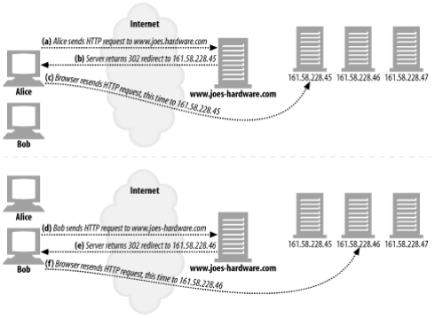
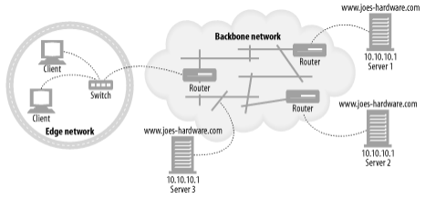

# 20장. 리다이렉션과 부하 균형

> 리다이렉션은 보통 메시지가 프락시, 캐시, 서버 팜의 특정 웹 서버 중 어디에서 끝나는지 판별하기 위해 사용한다.
> 

## 왜 리다이렉트인가?

- 신뢰할 수 있는 HTTP 트랜잭션의 수행
- 지연 최소화
- 네트워크 대역폭 절약

→ 하지만 부하 균형의 과제가 포함된다.

## 리다이렉트 할 곳

> 서버로의 리다이렉트란, 휘발유를 찾는 모든 운전기사를 가장 가까운 주유소로 보내주는 것과 같다.
> 
- 서버, 프락시, 캐시, 게이트웨이가 모두 공통적으로 서버의 특성을 갖고 있기 때문에, 많은 리다이렉션 기법이 그들 모두에서 동작한다.

## 리다이렉션 프로토콜의 개요

> 리다이렉션의 목표는 HTTP 메시지를 가용한 웹 서버로 가급적 빨리 보내는 것이다.
> 
- 브라우저 설정, DNS, TCP/IP 라우팅, 그리고 HTTP는 모두 메시지를 리다이렉트하는 메커니즘을 제공한다.

## 일반적인 리다이렉션 방법

> 이제 다룰 방법들은 트래픽을 다른 서버나 프락시를 통해 벡터 트래픽으로 리다이렉트하기 위해 사용될 수 있다.
> 

### HTTP 리다이렉션

> 웹 서버들은 다른 곳에 요청을 보내보라고 말해주는 짧은 리다이렉트 메시지를 클라이언트에게 돌려줄 수 있다.
> 

**장점**

- 리다이렉트를 하는 서버가 클라이언트의 아이피 주소를 알고있다.
- 서버로 향하는 요청의 방향을 변경할 수 있다.

**단점**

- 어떤 서버로 리다이렉트할지 결정하려면 원 서버는 상당히 많은 처리를 해야한다.
- 페이지에 접근할 때마다 두 번의 왕복이 필요하기 때문에, 사용자가 더 오래 기다리게 된다.
- 만약 리다이렉트 서버가 고장나면, 사이트도 고장난다.

### DNS 리다이렉션

DNS 분석자는 클라이언트의 운영체제일 수도 있고, 클라이언트의 네트워크에 있는 DNS 서버이거나 혹은 더 원격에 있는 DNS 서버일 수도 있다.

- DNS는 하나의 도메인에 여러 아이피 주소가 결부되는 것을 허용한다.
- DNS 분석자는 여러 아이피 주소를 반환하도록 설정되거나 프로그래밍 될 수 있다.

***DNS 라운드 로빈***

> 가장 흔한 동시에 가장 단순한 리다이렉션 기법이다.
> 
- 웹 서버 팜 전체에 대한 부하의 균형을 유지하기 위해 DNS 호스트 명 분석 기능을 사용한다.
- 서버에 대한 클라이언트의 상대적인 위치나 서버의 현재 스트레스를 고려하지 않는다.

***다중 주소와 라운드 로빈 주소 순환***

> 대부분의 DNS 서버는 룩업이 끝날때마다 주소를 순환시킨다.
> 

***부하 균형을 위한 DNS 라운드 로빈***

> 대부분의 DNS 클라이언트는 그냥 첫 번째 주소를 사용하기 때문에, DNS 순환은 서버들 간의 부하 균형을 유지해준다.
> 

***DNS 캐싱의 효과***

> 호스트 하나에 대해 한 번의 DNS 룩업을 수행한 뒤, 그 주소를 몇 번이고 다시 사용한다.
> 

***다른 DNS 기반 리다이렉션 알고리즘***

- 부하 균형 알고리즘
    - 몇몇 DNS 서버는 웹 서버의 로드를 추적하고 가장 로드가 적은 웹 서버를 목록의 가장 위에 놓는다.
- 근접 라우팅 알고리즘
    - 웹 서버들의 팜이 지리적으로 분산되어 있는 경우, DNS 서버는 사용자를 근처의 웹 서버로 보내는 시도를 할 수 있다.
- 결함 마스킹 알고리즘
    - DNS 서버는 네트워크의 건강 상태를 모니터링하고 요청을 정전이나 기타 장애를 피해서 라우팅할 수 있다.

### 임의 캐스트 어드레싱

- 웹 서버는 라우터 통신 프로토콜을 이용해 자신과 인접한 백본 라우터와 대화한다.
- 백본 라우터가 임의 캐스트 주소를 목적지로 하는 패킷을 받는다.
- 그 아이피 주소를 받아들일 수 있는 가장 가까운 라우터를 찾는다.
- 그 서버는 자신이 그 주소를 위한 라우터라고 광고한 상태일 것이기 때문에, 그 백본 라우터는 그 서버에게 그 패킷을 보낸다.

### 아이피 맥 포워딩

> 레이어-2 장비에서 특정 MAC 주소의 패킷을 받아서 나가는 특정 MAC 주소로 포워딩한다.
> 
- MAC 주소 포워딩은 점 대 점으로만 가능하기 때문에, 서버나 프락시는 스위치와 한 홉 거리에 위치해야 한다.

### 아이피 주소 포워딩

> 스위치나 다른 레이어 4를 이해하는 장비는 들어오는 패킷에 대해 TCP/IP 어드레싱을 검증하고 패킷을 목적지 맥 주소가 아니라 목적지 아이피 주소의 변경에 따라 라우팅한다.
> 
- 목적지 서버가 한 홉 거리에 있을 필요가 없다.
- 하지만 라우팅 대칭성이라는 문제가 있다.
    - 목적지 서버나 프락시로부터의 모든 응답은 반드시 커넥션을 관리하고 있는 스위치에게 돌아가야한다.

**응답의 귀환 경로를 제어할 수 있는 두 가지 방법**

- 패킷의 출발지 아이피 주소를 스위치의 아이피 주소로 바꾼다. (NAT)
- 만약 출발지 아이피 주소가 그 클라이언트의 아이피 주소로 계속 남아있다면, 서버에서 클라이언트로 바로 가는 경로가 존재하면 안된다.

### 네트워크 구성요소 제어 프로토콜(NECP)

> 아이피 패킷을 전달하는 라우터나 스위치같은 네트워크 구성요소들이 웹 서버나 프락시 캐시와 같이 애플리케이션 계층 요청을 처리하는 서버 구성요소들과 대화할 수 있게 해준다.
> 

## 프락시 리다이렉션 방법

> 프락시는 결과적으로 클라이언트의 요청을 다른 프락시로 리다이렉트할 수 있다.
> 

### 명시적 브라우저 설정

→ 접촉할 프락시의 주소를 알고있다.

하지만 두가지 중요한 단점이 있다.

1. 프락시들을 사용하도록 설정된 브라우저들은 프락시가 응답하지 않더라도 원 서버와 접촉하지 않는다.
2. 네트워크 아키텍처를 변경했을 때 그 변경사항을 모든 최종사용자에게 전파하는 것이 어렵다.

### 프락시 자동 설정

> 올바른 프락시 서버에 접촉하기 위해 브라우저가 동적으로 자신을 설정할 수 있게 한다.
> 
- 브라우저들이 URL별로 접촉해야 할 프락시를 지정한 PAC 파일이라 불리는 특별한 파일을 찾도록 한다.
- 브라우저는 반드시 PAC 파일을 얻기 위해 지정된 서버에 접촉하도록 설정되어야 한다.
- 브라우저는 재시작할 때 마다 PAC 파일을 가져온다.

### 웹 프락시 자동발견 프로토콜 (WPAD)

> 최종 사용자가 수동으로 프락시 설정을 할 필요도, 투명한 트래픽 인터셉트에 의존할 필요도 없이 웹 브라우저가 근처의 프락시를 찾아내어 사용할 수 있게 해주는 방법을 제공하는 것을 목적으로 한다.
> 

**PAC 파일 자동발견**

- WPAD는 HTTP 클라이언트가 PAC 파일의 위치를 알아내고 그 파일을 이용해서 적절한 프락시 서버의 이름을 알아낼 수 있게 한다.
- WPAD 프로토콜을 구현한 HTTP 클라이언트는 다음의 일을 한다.
    - WPAD를 이용해 PAC 파일 CURL을 찾는다.
    - URL에 해당하는 PAC파일을 가져온다.
    - 프락시 서버를 알아내기 위해 그 PAC 파일을 실행한다.
    - PAC 파일이 반환한 프락시 서버에게 HTTP 요청을 보낸다.

**언제 WPAD를 실행하는가**

- 웹 클라이언트가 시작될 때
- 클라이언트 호스트의 아이피 주소가 변경된 네트워킹 스택으로부터 어떤 언급이 있을 때마다

## 캐시 리다이렉션 방법

### WCCP 리다이렉션

> 웹 라우터들이 웹 트래픽을 프락시 캐시로 리다이렉트 할 수 있도록 하기 위해 개발되었다.
> 

**WCCP 리다이렉션 동작**

- 네트워크가 필요하다.
    - WCCP를 사용할 수 있는 라우터, 다른 캐시와 의사소통할 수 있는 캐시가 포함됨
- 라우터들의 집합과 그들의 대상이 되는 캐시들이 WCCP 서비스 그룹을 구성한다.
- 만약 서비스 그룹이 HTTP 트래픽을 리다이렉션하도록 설정되었다면, 서비스 그룹의 라우터는 HTTP 요청을 서비스 그룹의 캐시로 보낸다.
- HTTP 요청이 서비스 그룹의 라우터에 도착했을 때, 라우터는 그 요청을 처리하기 위해 서비스 그룹의 캐시 중 하나를 선택한다.
- 라우터는 요청 패킷을, 캐시의 아이피 주소와 함께 캡슐화하거나, 아이피 맥 포워딩을 하여 캐시로 보낸다.
- 만약 캐시가 요청을 처리할 수 없다면, 패킷은 평범하게 포워딩되기 위해 라우터로 돌아온다.
- 서비스 그룹의 구성원들은 지속적으로 다른 구성원들의 가용성을 확인하기 위해 하트비트 메시지를 교환한다.

**서비스 그룹**

- WCCP를 지원하는, 그래서 WCCP 메시지를 교환할 수 있는 라우터와 캐시들의 집합으로 구성되어 있다.
- 어떻게 트래픽이 서비스 그룹의 캐시들로 분산되는지 결정한다.

## 인터넷 캐시 프로토콜

> 캐시들이 형제 캐시에서 일어난 캐시 적중을 찾아볼 수 있도록 해준다.
> 
- 일종의 캐시 클러스터링 프로토콜
- 객체 발견 프로토콜
- 단순하고 가볍다

## 캐시 배열 라우팅 프로토콜

> 대량의 트래픽은 프락시 서버 자체에 과도한 부하를 줄 수 있으며, 이 문제를 해결하기 위해 부하를 분산하기 위해 사용하는 프락시 서버를 여러 대로 늘리는 것이다.
> 
- 프락시 서버의 배열이 클라이언트의 시점에서는 마치 하나의 논리적인 캐시처럼 보이도록 관리해준다.
- CARP를 이용해서 독자적으로 동작하는 서버들의 무리는, 각 구성요소 서버가 전체 캐시된 문서의 일부만 갖고있는 하나의 큰 서버처럼 동작한다.
- 결정론적인 요청 분석 경로는 한 홉 안에 있는 특정 웹 객체의 거처를 찾아낸다.

## 하이퍼텍스트 캐싱 프로토콜

- 형제들이 URL과 모든 요청 및 응답 헤더를 사용하여 서로에게 문서의 존재 여부에 대한 질의를 할 수 있도록 해줌으로써 적중이 아님에도 적중으로 잘못 처리될 확률을 줄인다.
- 더 나아가, HTCP는 형제 캐시들이 서로의 캐시 안에 있는 선택된 문서의 추가 및 삭제를 모니터링하고 요청할 수 있게, 그리고 서로의 캐시된 문서에 대한 캐싱정책을 변경할 수 있게 해준다.