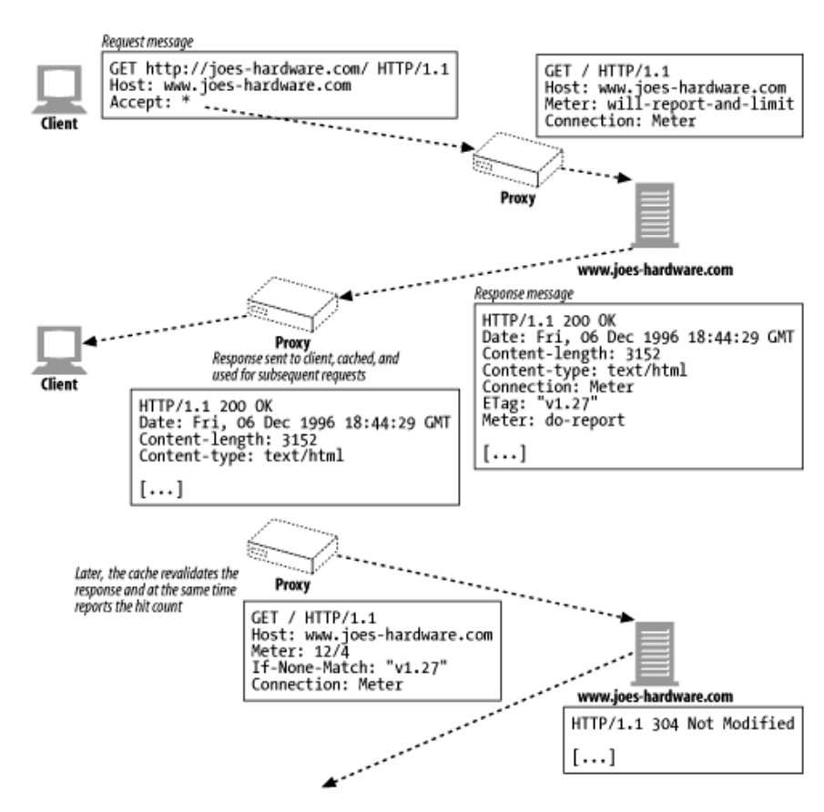

# 로깅과 사용 추적
## 로그 포맷
### 일반 로그 포맷
- remotehost: 요청한 사람
- username
- auth-username: 인증된 요청자의 이름
- timestamp
- request-line
- response-code
- response-size

### 혼합 로그 포맷
- 아파치와 같은 서버들이 지원
- 일반 로그 포맷 +
- Referer: 요청자가 요청한 URL 위치
- User-Agent

### 넷 스케이프 확장 로그 포맷
- proxy-response-code: 트랙잭션이 프록시를 거칠 경우, 서버에서 프록시로의 HTTP 응답 코드
- proxy-response-size
- client-request-size
- proxy-request-size
- client-request-hdr-size
- proxy-response-hdr-size
- proxy-request-hdr-size
- server-response-hdr-size
- proxy-timestamp

### 넷스케이프 확장 2로그 포맷
- 넷스케이프 확장 로그 포맷 +
- route: 프록시가 클라이언트에 요청을 만드는데 사용하는 경로
- client-finish-status-code: 클라이언트의 종료 코드, 프록시로 보낸 요청이 성공적이었는지 표시
- proxy-finish-status-code: 프록시의 종료 상태 코드, 서버로 보낸 요청이 성공적이었는지 표시
- cache-result-code: 캐시 결과 코드, 캐시가 요청에 어떻게 응답했는지 기술

### 스퀴드 프록시 로그 포맷
- timestamp
- time-elapsed: 요청과 응답이 프록시를 통해 오고간 총 시간
- host-ip
- result-code/status
  - result: 프록시가 어떤 일을 햇는지 스퀴드 방식으로 기술
  - status: 프록시가 클라이언트에게 보낸 HTTP 응답 코드
- size
- method
- url
- rfc931-ident: 클라이언트에 인증된 사용자 이름
- hierachy/from
  - hierachy: 프록시가 클라이언트로 요청을 보내면서 거친 경로 
  - from: 프록시가 요청을 만들게한 서버의 이름
- content-type

## 적중 계량하기
### Meter 헤더
- 사용량이나 보고에 관한 지시자 기술 가능
- will-reposrt-and-limit
- wont-report
- wont-limit
- count
- max-uses
- max-reuses
- do-report
- dont-report
- timeout
- wont-ask

캐시 응답을 재검사할 때 적중 횟수를 보고한다.