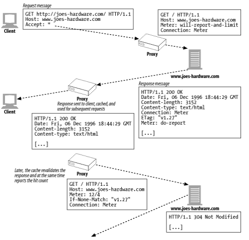

# 21장. 로깅과 사용 추적

## 로그란 무엇인가?

대개 로깅을 하는 이유는 두 가지다.

- 서버나 프락시의 문제를 찾는다.
- 웹 사이트 접근 통계를 낸다.

보통은 트랜잭션의 기본적인 항목들만 로깅한다. 일반적으로 로깅하는 필드는 다음과 같은 것들이다.

- HTTP 메서드
- 클라이언트와 서버의 HTTP 버전
- 요청받은 리소스의 URL
- 응답의 HTTP 상태 코드
- 요청과 응답 메시지의 크기 (모든 엔터티 본문을 포함)
- 트랜잭션이 일어난 시간
- Referer와 User-Agent 헤더 값

## 로그 포맷

> 상용 혹은 오픈 소스 HTTP 애플리케이션은 대부분, 표준 로그 포맷을 한 개 이상 지원한다. 그리고 그 애플리케이션 대부분이 로그 포맷을 설정하고 자체 맞춤 포맷을 만들 수 있는 설정 기능을 제공한다.
> 

**일반 로그 포맷 (Common Log Format)**

**혼합 로그 포맷 (Combined Log Format)**

**넷스케이프 확장 로그 포맷**

**넷스케이프 확장 2 로그 포맷**

**스퀴드(Squid) 프락시 로그 포맷**

## 적중 계량하기

> 캐시로 성능을 향상시키면서도 정확한 접근 통계를 제공할 수 있는 방법이다.
> 

- 적중 계량 규약은 캐시와 서버가 접근 정보를 공유하고, 사용할 수 있는 캐시 리소스의 양을 제어할 수 있는 몇 가지 기초적인 기능에 관한 HTTP 확장을 정의한다.

## 개인 정보 보호에 대해

> 로깅은 관리자와 개발자에게 매우 유용한 도구지만, 로깅을 당하는 사용자들의 인지나 허가가 없으면 로깅이 사생활 침해가 된다는 것을 유념해야 한다.
>