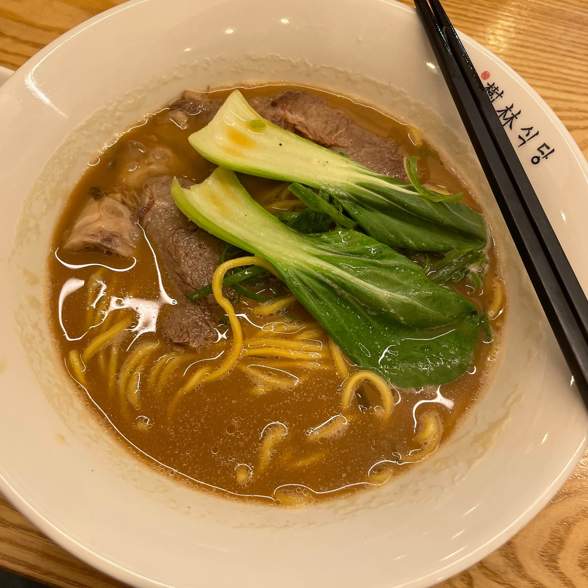
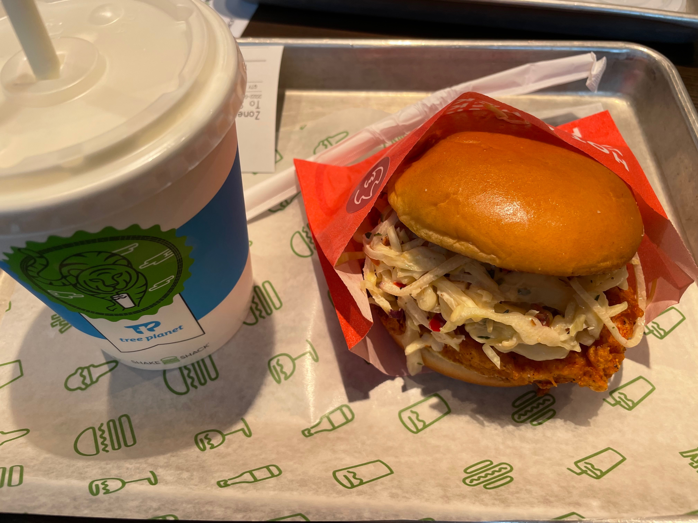
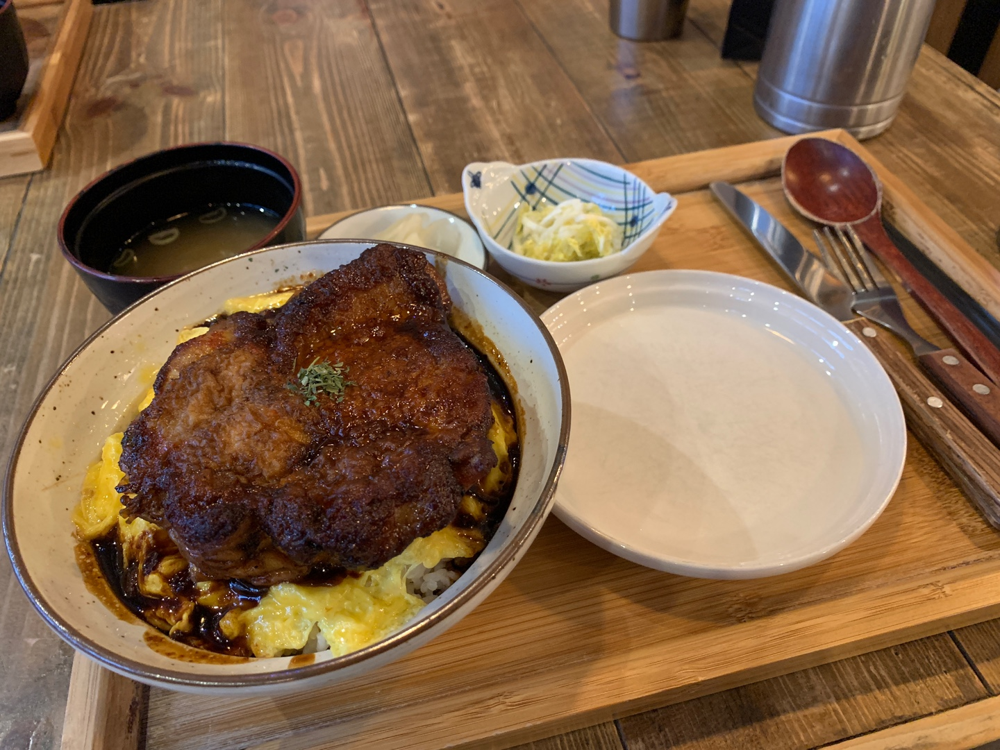
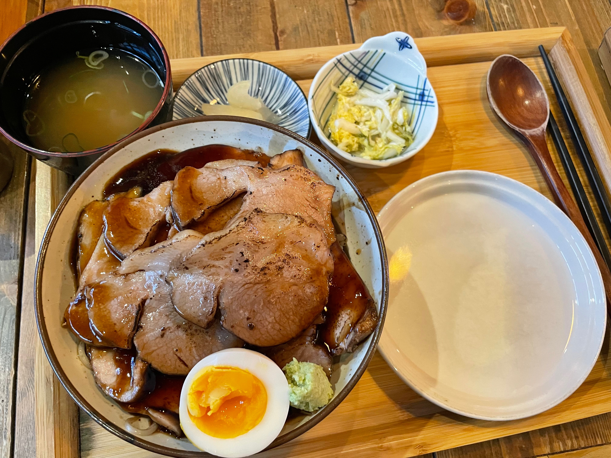

### 2022/04/20

- 수림식당 먹음

- 1 ~ 4 장 리뷰
- HTTP 개요(HTTP의 개념, 스펙, 역할)
- TCP/IP 개념과 그 역할
  - HTTP 는 메시지 그 자체에 불과하다.
- 프록시, 캐시, 게이트웨이의 차이에 대해 생각해봄
- TCP 커넥션은 비용이 많이 든다.
  - 이를 어떻게 해결해왔나?
- HTTP/2 는 HTTP/1.1 의 어떤 문제를 해결했나?

### 2022/04/27
- 쉐이크쉑 먹음

- 5 ~ 6 장 리뷰
- 웹서버의 개념
- 프록시의 개념과 그 역할
- [인터넷은 어떻게 동작하는가?](https://developer.mozilla.org/ko/docs/Learn/Common_questions/How_does_the_Internet_work)
- 라우터란 무엇인가? -> ip 로 목적지까지 찾아갈 수 있는 이유
- traceroute 명령어로 최종 목적지까지 얼마나 많은 라우터를 거치는지 확인해보자
- OPTIONS 메소드는 왜 쓰나?

### 2022/05/11
- 마마된장 먹음
- 7 - 10 장 리뷰
- 캐싱, 게이트 웨이, 프록시, 터널링, HTTP/2.0
- 터널링을 왜 쓰나요?
- 터널링의 종류
- HTTP/2.0 의 특징(1.1 과 다른점)

### 2022/05/18
- 돈코츠 라멘 먹음

- 11, 12, 14 장 리뷰
- 사용자 인증과 보안에 관한 내용
- HTTPS 의 개념과 동작 방식을 이해하자.
- 쿠키의 개념
- OAuth 의 개념과 그 동작 방식

### 2022/05/25
- 이춘봉 치킨 먹음
- 15, 16, 17 장 리뷰
- 어떤 의미인지 알아두었으면 하는 헤더들
  - Content-Type
  - Charset
  - Content-Length
  - Accept-Encoding
- 메시지 인코딩 -> Content-Encoding 헤더
- HTTP에서 엔터티 분몬이란 그저 비트들로 가득 찬 상자에 불과 하다.
- Coded Character Set(utf-8, euc-kr)
- 유니코드란?

### 2022/06/03
- 카이시소소 먹음

- 18, 20, 21 장 리뷰
- 호스팅 서비스
- HTTP/1.1 부터 생긴 Host 헤더의 중요성
- 부하 분산을 위한 리다이렉션 전략
- DNS 리다이렉션 -> nslookup 명령어로 확인
